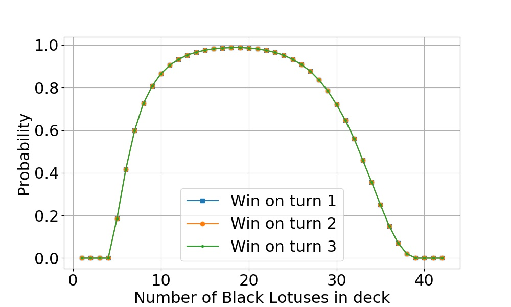
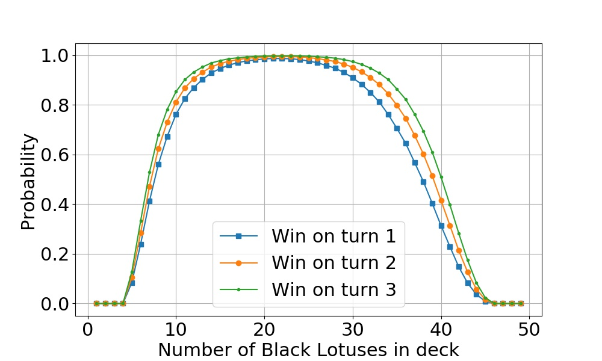
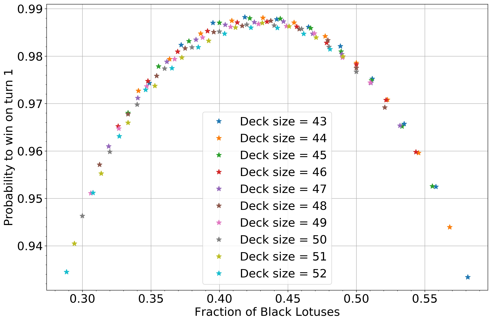

## History

What is the best deck in the history of Magic? How often does it win? Over the 25-year life of Magic: the Gathering, card and set design have improved and bans and restrictions have kept dominating cards at bay. For the most part, the game has achieved a healthy balance between the various decks and archetypes across most of its constructed formats. A major part of the game balance is the deck construction rule that sets the size of the deck at the minimum of 60 cards and limits any one card to a maximum of four copies. But what if those restrictions were lifted?

In the first months after its [release in August of 1993](https://mtg.gamepedia.com/Alpha), that's exactly how Magic was played. In this era of Wild Magic, a deck only had to have a minimum of [40 cards and the number of copies of a single card was not at all limited](http://oldschool-mtg.blogspot.com/2018/03/the-oldest-school-wizards-tournament.html). Because of no limitations, a number of severely degenerate decks quickly arose. Among those were the [Plague Rats](http://gatherer.wizards.com/Pages/Card/Details.aspx?multiverseid=77) deck, the [Lightning Bolt](http://gatherer.wizards.com/Pages/Card/Details.aspx?multiverseid=209) deck, and the [Timetwister](http://gatherer.wizards.com/Pages/Card/Details.aspx?multiverseid=132)-[Fireball](http://gatherer.wizards.com/Pages/Card/Details.aspx?multiverseid=197) deck. Each of these decks relied on multiple (dozens) of copies of a certain card to overwhelm the opponent with synergy and unmatched consistency (see, for example, [The History of Vintage](http://www.eternalcentral.com/schools-of-magic-the-history-of-vintage-chapters-1-2/) by Steve Menendian). However, reportedly the most deadly was the deck consisting of a combination of two cards: the [Wheel of Fortune](http://gatherer.wizards.com/Pages/Card/Details.aspx?multiverseid=231) and the [Black Lotus](http://gatherer.wizards.com/Pages/Card/Details.aspx?multiverseid=3).

*Wheel of Fortune and Black Lotus: the most powerful combo in the history of Magic.*

The way the deck functions is extremely simple. The Black Lotus gives the player three mana to cast a Wheel of Fortune. Both players discard their hands and draw seven new cards. With high probability this gives the player another pair of Lotus and Wheel to continue drawing cards. This goes on until the opponent's deck runs out of cards (presumably after six draw-sevens), while the Lotus-and-Wheel deck is constructed to have more cards than the opponent's. The opponent is then the only player running out of cards and thus loses the game.

The descriptions of the deck I've found mention that it was extremely consistent, winning every match almost every time. However, the exact probability is never mentioned, so it's unknown whether this anecdote means a win probability of 80 %, 90 %, 95 %, or even more. This is of course dependent on the number of Black Lotuses and Wheel of Fortunes in the deck. Presumably, the number was optimized, but different sources quote numbers from anywhere between 20 Wheels + 40 Lotuses to 23 Wheels + 20 Lotuses. Another question is then the optimal number of each card in the deck.

Now surely, if it was already done over 25 years ago, the winning probability and the optimal deck composition could be solved with modern computers and a little bit of programming. And that's exactly what I set out to do.

## Numerical Analysis

Before even starting to write the simulation code, it's useful to make a rough estimate of the expected result. Since exactly one of each card is needed to spin the Wheel, their number in the deck should be quite even. Otherwise the probability of getting at least one of each in the starting hand decreases. However, since any Lotuses in excess of the first can be played on the battlefield and saved for the next hand, the need for drawing Lotuses after the starting hand is statistically lower. Therefore, it's expected that the optimal deck would have a slightly smaller number of Black Lotuses than Wheel of Fortunes. Again, the number is probably not *much* smaller, otherwise the probability of getting none in the starting hand becomes too high.

With that thought experiment in mind as a sanity check, I started working on a short piece of code that is required for the calculation. Although the problem seems mathematically simple enough that an analytical solution might exist, I opted to save my time in favor of the computer's, and wrote a simple Monte Carlo simulation. I implemented a gameplay logic that does the following:
1. Starts with a given randomized deck,
2. Draws seven cards,
3. Plays all available Black Lotuses,
4. Uses one of the Black Lotuses to cast a Wheel of Fortune to draw seven cards,
5. Repeats 3. - 4. until more than 40 cards have been drawn,
6. Records the win/loss and repeats 1. - 5. a large number of times to get a statistically significant estimate for the win percentage.

All of the above is then again repeated for different numbers of Lotuses and Wheels in the deck to find the optimal numbers. The IPython notebook that does all of the above can be found [here](../attachments/Lotus_And_Wheel.ipynb).

*Probability to win on turns 1 - 3 with a deck of 43 cards.*

After a bit of waiting and number crunching, the results started to come in. It turns out that the 90's folklore was correct - with the optimal ratio of cards, this was one tremendously consistent deck. With 43 cards in total, the probability to win on *turn 1 was more than* ~~97 %~~ *98 %*!

On subsequent turns, the winning probability does not go up. The reason is simply that unless the win happens on the first turn, the deck just runs out of cards. So increasing the number of cards should push the win percentage even higher. Trying that hypothesis out with a deck of 50 cards in total indeed shows that the win percentage increases on turns 2 and 3, up to and beyond 99 %!

*Probability to win on turns 1 - 3 with a deck of 50 cards.*

*Probability to win on turn 3 with decks of various sizes illustrated with iso-probability contours.*

Now, of course the results can be generalized by looking at the *fraction* of Black Lotuses in the decks of various sizes instead of their raw number. ~~For the turn 1 win probability, all the curves collapse onto a nice master curve (which gives a warm and fuzzy feeling for the statistical physicist). This shows that the turn 1 win percentage is not dependent on the deck size, as long as the number of Black Lotuses is adjusted accordingly.~~ Actually, there is a small dependence on the deck size: the smaller deck has a higher win probability. I explain this in a future post.

*Probability to win on turn 1 with decks of various sizes, shown as a function of the fraction of Black Lotuses in the deck.*

Finally, as a potential caveat, the simulation naturally assumes a non-responsive opponent. In a real match, of course, the opponent could have an opportunity to disrupt the game plan, particularly if they take the turn first. However, considering the possible answers to a combo win on turn 1 with the [card pool of the fall of '93](https://scryfall.com/sets/lea), this point is not a major concern. Basically, the only way to combat a deck that won on turn 1 with a probability of more than ~~97 %~~ 98 %, was to play a combo deck of the same caliber.

## Conclusion

The Black Lotus and Wheel of Fortune deck of the era of Wild Magic can win on turn one with a probability in excess of ~~97 %~~ 98 %. This can be achieved with an optimal deck containing roughly 43 % of Black Lotuses and 57 % of Wheel of Fortunes.

*Update 14 January 2019: While working on a follow-up article to this post, I discovered an error in the simulation code. While the effect on the numbers is quite small, I have updated the figures with correct ones and revised the numbers. I've left the old values visible in the post for the sake of honesty and future discussion. I will write a post on the topic with more details about the analysis in the near future. Also note that later posts were unaffected by the error.*
