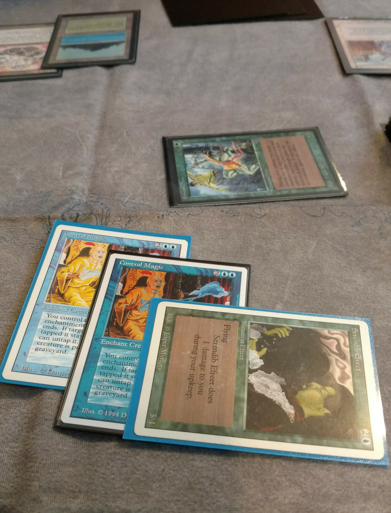
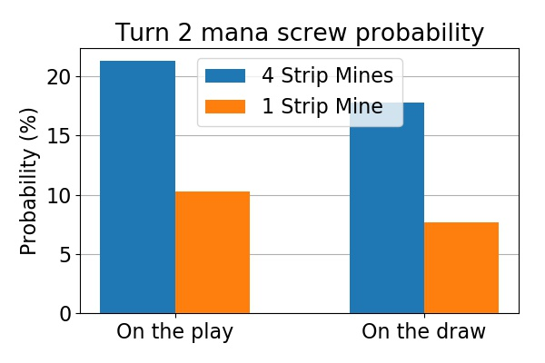
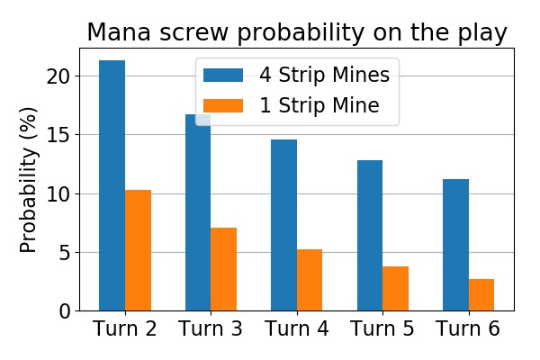

## Towards Music City

Last July I had the opportunity to travel to Nashville and meet up with the local crew to play some fine old school Magic. I had reached out to the Music City crew via Facebook a few weeks before my trip and, to my surprise, Derek from the local old school community arranged a game night among the locals and invited me to join them. Amazing!

I would arrive in Nashville just the night before so I knew all decks revolving around complex board states would be out of question because of the jet lag. I would also stay in Nashville for almost a week after the game night and I didn't want to worry about losing any of the more precious cards in my humble old school collection during the trip. So I wanted to play something simple and preferably mono colored. Also I wanted to play [Counterspells](http://gatherer.wizards.com/Pages/Card/Details.aspx?multiverseid=1196) - of course. So I settled on a mono blue aggro, or tempo, deck.[^1]

*My deck of choice for the Music City old school gathering. Mono blue tempo! Note the singleton Tolaria: incredible tech with the Serendib Djinn.*

I had never played that particular deck before, but I had some experience with the [Delver](http://gatherer.wizards.com/Pages/Card/Details.aspx?multiverseid=226749) decks from the contemporary formats that play out a bit similarly, so I was quite excited to build and test the deck! Basically, the deck has a bunch of cheap creatures like [Flying Men](http://gatherer.wizards.com/Pages/Card/Details.aspx?multiverseid=932), [Lords of Atlantis](http://gatherer.wizards.com/Pages/Card/Details.aspx?multiverseid=1206) and [Serendib Efreets](http://gatherer.wizards.com/Pages/Card/Details.aspx?multiverseid=939), and disruption in the form of counterspells, [Energy Fluxes](http://gatherer.wizards.com/Pages/Card/Details.aspx?multiverseid=1199) and, of course, [Strip Mines](http://gatherer.wizards.com/Pages/Card/Details.aspx?multiverseid=1077).

I briefly tested the deck with a friend at Helsinki before my trip. He played a somewhat controllish, mostly black and blue [Underworld Dreams](http://gatherer.wizards.com/Pages/Card/Details.aspx?multiverseid=1464) brew, and my deck seemed to match his fairly well. I did have some problems with some of his non-creature permanents, so I upped the number of [Boomerangs](http://gatherer.wizards.com/Pages/Card/Details.aspx?multiverseid=1474) in the main deck to four. I also didn't really know what kind of decks to expect in Nashville, so I reasoned this would be a decent catch-all answer.

## The Game Night

So finally, in Nashville, it's Saturday night, and I arrive at the small cafe a couple of miles outside the city center. There, I'm greeted with the friendliest group of Magic-playing individuals I've had the chance to meet. And everyone one of them is an old school aficionado! Awesome!

Over the evening, I played four matches with four different opponents. The first one was against what seemed like a fairly typical unpowered Green-White [Erhnam](http://gatherer.wizards.com/Pages/Card/Details.aspx?multiverseid=945)[Geddon](http://gatherer.wizards.com/Pages/Card/Details.aspx?multiverseid=233), with big creatures, ramp, and land destruction. This was a fairly even match-up that I eventually managed to win, partly because of the faster deck and using my Strip Mines to keep the opponent off white mana sources. Also, it turns out that a [Serendib Djinn](http://gatherer.wizards.com/Pages/Card/Details.aspx?multiverseid=938) is indeed bigger than his [land-dwelling cousin](http://gatherer.wizards.com/Pages/Card/Details.aspx?multiverseid=945).

In the second match, I somewhat knew what to expect since I saw my opponent, Josh, play a couple of games with Derek before I paired against him. Josh was playing a super aggressive and hard hitting Red-Blue-Green Zoo deck. With his powered deck he was able to out-curve mine into bigger creatures, and he used his Strip Mines very effectively to keep me low on blue mana sources: I noticed that I kept having trouble getting Islands into play to cast my Lords, Counterspells and Boomerangs in time. The other thing I noticed is that a twice-[Berserked](http://gatherer.wizards.com/Pages/Card/Details.aspx?multiverseid=141) Erhnam Djinn hits pretty damn hard!

The third match was a real treat. I played against Brennan who was wielding yet another ErhnamGeddon deck. But, boy, was this one packing a punch! Fully powered, bustling with gorgeous Alpha cards and complete with a 1994 [Summer edition](https://www.magiclibrarities.net/728-rarities-summer-magic-cards-english-cards-index.html) [Control Magic](http://gatherer.wizards.com/Pages/Card/Details.aspx?multiverseid=1194)... and all this played on a beautiful [Khalsa-Brain playmat](http://www.kbgames.com/). My fish got their behinds kicked so hard that the whooping was probably heard on the other side of the Atlantic. And I enjoyed every minute of it! Being a total gentleman, Brennan even allowed a small victory in one game, before crushing the Atlanteans and their Efreet friends after a memorable exchange of Control Magics. I didn't realize it at the time, but him capturing my Revised Serendib was [the first time he got to cast that Summer Control Magic](https://musiccityoldschoolmtg.wordpress.com/2018/07/31/the-wind-in-your-sails/). Some odd pieces of Magic history coming together right there.

*Fighting over air superiority with Control Magics. Eventually ended in the opponent's favor due to a Disenchant.*

On the fourth match I was really starting to feel the fatigue from the travel and time-difference. I got to play with Sonny, who had a really sweet mono red [Atog](http://gatherer.wizards.com/Pages/Card/Details.aspx?multiverseid=1058) variant with [Howling Mines](http://gatherer.wizards.com/Pages/Card/Details.aspx?multiverseid=18), [Winter Orbs](http://gatherer.wizards.com/Pages/Card/Details.aspx?multiverseid=46) and [Relic Barriers](http://gatherer.wizards.com/Pages/Card/Details.aspx?multiverseid=1419). Against such an artifact-centric deck my main deck Energy Fluxes got to do a lot of work and won me the first game. After sideboarding I brought in the rest of the Energy Fluxes and all the [Blue Elemental Blasts](http://gatherer.wizards.com/Pages/Card/Details.aspx?multiverseid=97). I knew my opponent would bring in their [red counterparts](http://gatherer.wizards.com/Pages/Card/Details.aspx?multiverseid=217). He was able to keep my blue mana sources down at one Island for a long time with his Strip Mines in both games that followed, which definitely hurt my game plan. I'm also quite sure that my lax playing also cost me a game (let's blame it on the jet lag instead of my inexperience, shall we...). For example, I remember holding an Energy Flux in my hand for a turn too long because I was afraid of his Red Elemental Blasts and waiting for another Island to hold up a Blue Blast of my own. This eventually gave my opponent the chance to develop his board just enough to take the game.

Despite my less-than-stellar 1-3 record for the night, I had a [blast](http://gatherer.wizards.com/Pages/Card/Details.aspx?multiverseid=719). I really enjoyed playing the deck, but most of all, I enjoyed meeting the people and talking about Magic, the 90's, the US, Nashville, and all other things with them. What a great night!

## The Question of Strip Mines

A couple of months after my trip to Nashville I recalled my experiences with the deck. I realized that in several games I had been stuck with spells in my hand that I couldn't cast. In other words, I'd been mana screwed. It felt surprising to me, since this should not have happened with a mono colored deck running a low [mana curve](https://mtg.gamepedia.com/Mana_curve) and 24 lands.

In particular, I had had trouble with spells costing two blue mana, like the Lord of Atlantis. Thinking about it, I realized that I had been playing with 3 Islands less than I would have in a Swedish old school deck. Also, the opponents had been very efficiently targeting my Islands with their Strip Mines.

So I wondered if the probability of getting mana screwed in this 4 Strip Mine environment was actually that much higher. It was time to fire up the Python simulations again...

## Numerical Analysis

To investigate the probability of getting "mana screwed", I wrote a [Python simulation](../attachments/Mono_blue_mana_screw.ipynb) and ran it for the Eternal Central version of the deck (shown in the picture above) and the Swedish version of the deck. The latter is exactly the same as the former, with the exception that 3 Strip Mines are replaced by Islands.

Before going to the results, it's important to make clear what I mean by being "mana screwed" in this context. In this case, I was interested in the situations where I would have a spell in hand that I could not cast because of lack of available blue mana sources. In particular I will be interested in whether I can make the important turn two play of a Lord of Atlantis, a Counterspell, or a Boomerang. Therefore, I require two things:
1. I have a spell in hand whose mana cost is UU (two blue mana).
2. I only have one Island in play.

I should also note that the above definition differs from what, e.g., [Frank Karsten would typically use in his calculations](https://www.channelfireball.com/articles/how-many-colored-mana-sources-do-you-need-to-consistently-cast-your-spells-a-guilds-of-ravnica-update/). While I fully recommend his articles to everyone, I think his methodology would not be applicable to the present case without some modifications. Essentially, he is seeking to answer a slightly different question.

But, back to the problem at hand. I set up the simulation in a way similar to the [Black Lotus and Wheel Fortune calculation](../2018-11-23-the-lotus-and-the-wheel) I wrote about previously. However, in this case I am also creating a deck for the opponent to take into the account their Strip Mines. The logic of the simulation is as follows:
1. In my deck, there are 16 Islands, 8 colorless lands, 12 spells with mana cost of UU, and 24 other cards.
2. In the opponent's deck, there are 4 Strip Mines, and 56 other cards.
3. Both players start with 7 cards.
4. I mulligan if I have less than 2 lands, or less than 1 Island in the starting hand. If I have less than 5 cards in hand, I do not mulligan. The opponent does not mulligan.
5. Players draw a card at the start of their turn, except for the starting player.
6. During my turn, I play an Island if I have at least one in hand.
7. During the opponent's turn, if I have an Island in play and they have a Strip Mine in hand, they play and activate it to destroy one of my Islands.
8. After each of my turns, I check whether I would have enough mana to cast a spell that costs UU, and whether I have such a spell in hand. If I have the spell but not enough mana, I am considered to be "mana screwed" on that turn.
9. The above game is played for a fixed number of turns (for example, 6).
10. The steps 1.-9. are repeated many times, and the results averaged, to get a statistically significant estimate for the probability of being "mana screwed" on a particular turn.

I ran the simulation four times - twice for the above numbers to account for being both on the draw and on the play, and twice more for a Swedish version of the deck, where I merely replaced three of the Strip Mines in both decks with Islands.

*Probability to have a UU spell in hand and being unable to cast it on turn two; EC vs Swedish rules.*

*Probability to have a UU spell in hand and being unable to cast it on turns 2-6 when starting on the play; EC vs Swedish rules.*

The results are shown in the two figures above. To summarize: the difference is huge! With the addition of 3 Strip Mines to both decks, the probability to have a spell costing UU, and being unable to cast it on turn 2, jumps from about 10 % to 21 %! On the draw, the probabilities are slightly lower (8 % vs 18 %), but the difference is almost as high.

Additionally, under EC rules the probability to remain unable to cast the UU spells until turn 4 is almost 15 %. That is, assuming 3 games per match, there would be on the average one game every two matches where those spells would remain stuck in my hand until at least turn 4. That's simple horrible! Especially, compared to the Swedish rules, where the probability would be just 5 %, or roughly once in 7 matches.

So my impression on getting stuck with uncastable spells on that evening in Nashville is definitely backed up by the numbers. In retrospect, my late decision to include four Boomerangs in the main deck just made the problem worse. It would have been probably a better idea to even include a couple of more Islands and spells that can operate on just one blue mana source.

## Conclusions

Allowing four Strip Mines instead of just one definitely makes a difference. In the case of the mono blue aggro deck, the probability to get stuck with uncastable spells in hand on the early turns increases by about 10 %. This is a tremendous difference.

The results definitely call for further analysis, for example regarding the mulligan strategy. It is clear that mulliganing land-light hands more aggressively helps with the mana screw problem. However, its cost on the [card advantage](https://mtg.gamepedia.com/Card_advantage) via the smaller starting hand should be evaluated.

### Footnotes

[^1]: I actually brought another deck with me also, an artifact ramp deck with Su-Chi's, Juggernauts, Triskelions and Copy Artifacts. This one was also mono blue. Although I eventually decided not to play this second deck that evening, I thought coming to Music City with Mono Blues was somewhat funny.
