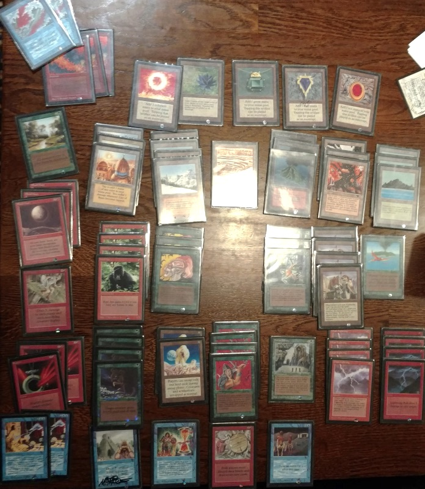
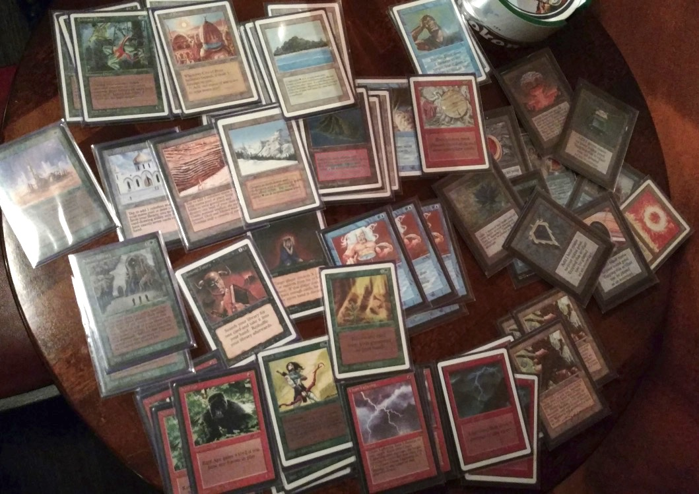
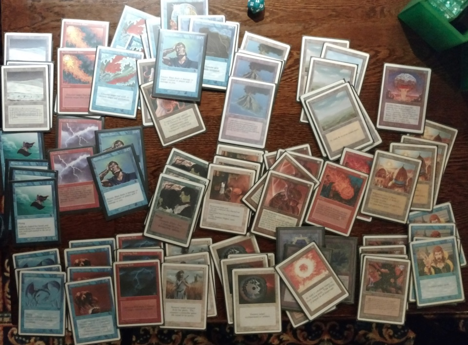
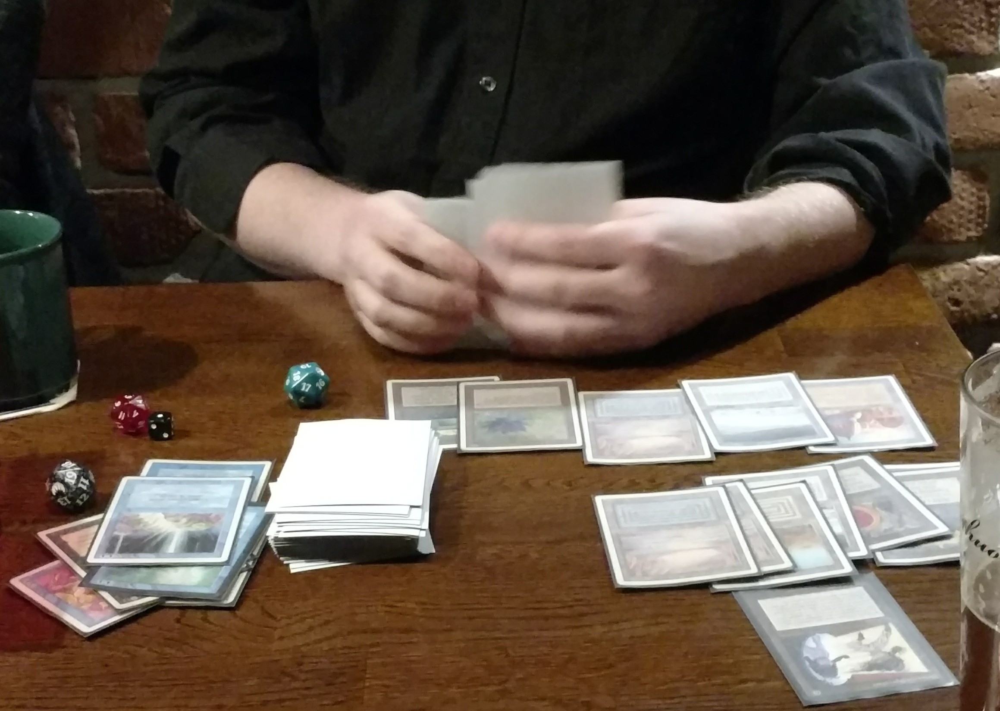
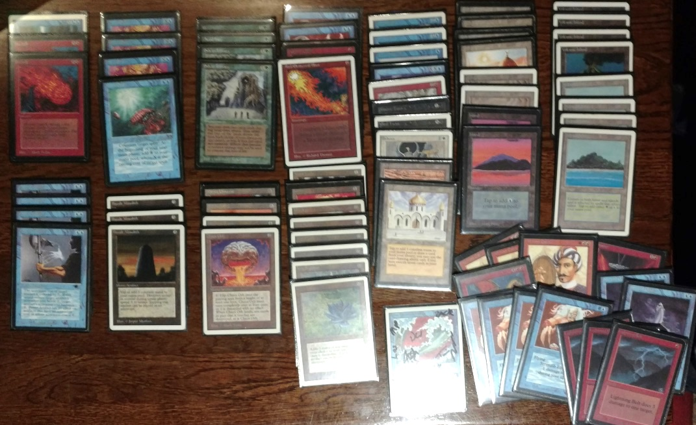
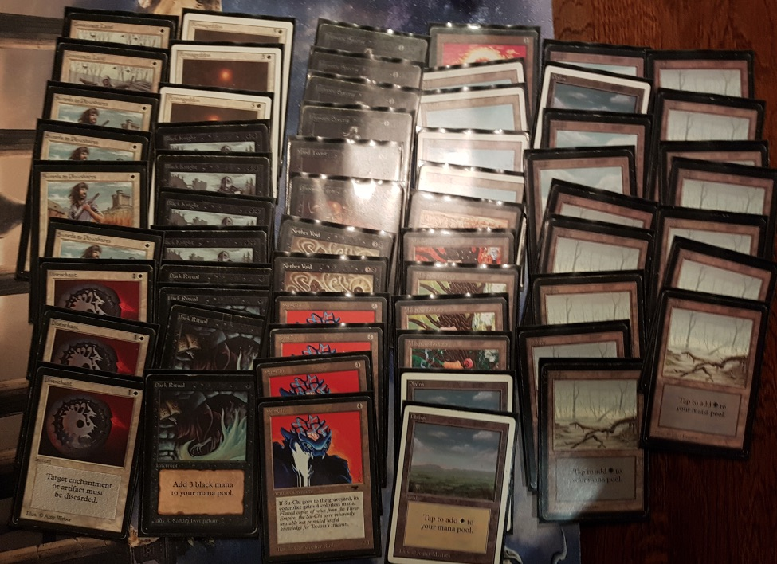
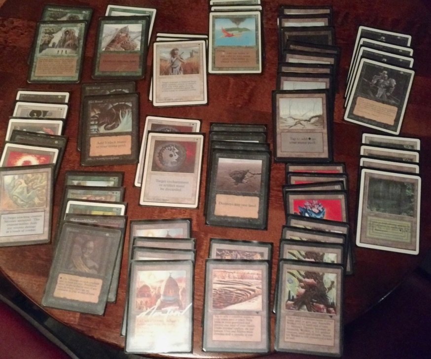
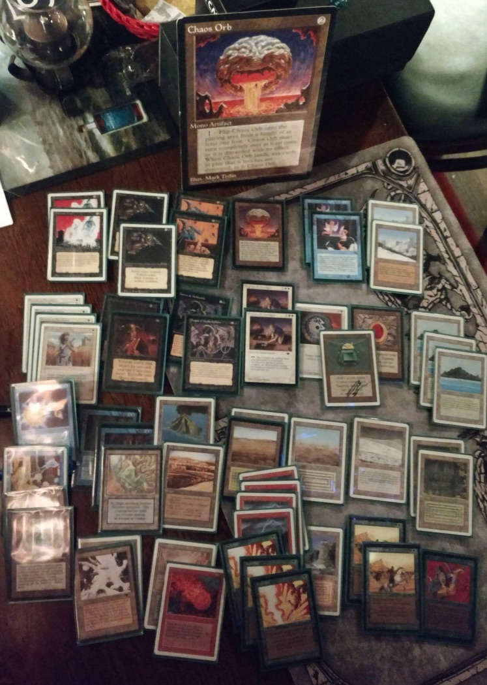
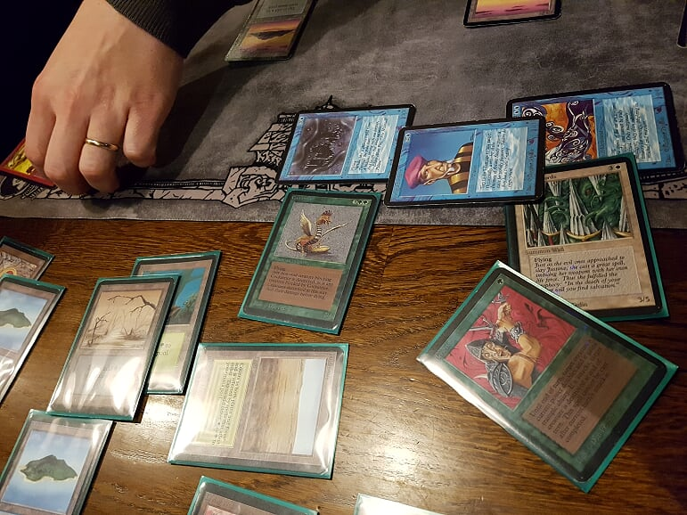

## Kaamos Cup 2018

As the days grew shorter and the nights got darker, the old school players at the Helsinki area decided to get to together the last time before the holidays. To make the event a little bit more special than usual, we decided to organize a small tournament as a way to finish the year. So, on the 11th of December, we gathered at a local pub to compete on the very first [Kaamos](https://en.wiktionary.org/wiki/kaamos) Cup!

We extended the invitation to as many regulars and non-regulars as we could, and in the end nine players came together for the tournament. This was actually the most people we've had attend our gaming nights so far. And we were especially happy to see several new players join the old school community.

We played with the [Swedish Old School set and banned/restricted list](http://oldschool-mtg.blogspot.com/p/banrestriction.html). However, to accommodate participation by all interested players, we allowed all reprints with the original (or Revised edition) art, plus a maximum of ten proxies. We have discussed the reprint and proxy policies a few times before and everyone has been in favor of allowing both. In the small scene that is just beginning to grow, it is very important to allow new players to join the community without having to acquire the original versions of each card. And yet, many of us restrict ourselves to playing Swedish-legal decks by choice. To each their own!

*Prize pool for the evening. One card for everyone, plus an extra for the most fun deck.*

Everyone had been invited to bring an old-school card of small monetary value to the tournament, out of which we formed the prize pool. Each card was signed by all the participants and everyone would get a card to bring home from the tournament.

## The Games

For this evening, I wanted a rather fast deck. Typically I would enjoy playing a more controlling deck, but I was a bit afraid that the unavoidable control mirror match would take too much time, with all the small organizing tasks in between. So I decided on building a Power Monolith deck. The basic idea of the deck is to assemble the [Power Artifact](http://gatherer.wizards.com/Pages/Card/Details.aspx?multiverseid=1043) & [Basalt Monolith](http://gatherer.wizards.com/Pages/Card/Details.aspx?multiverseid=2) combo as quickly as possible, and then find a [Fireball](http://gatherer.wizards.com/Pages/Card/Details.aspx?multiverseid=197) to finish the game with. The deck can quite often win during the first three or four turns (even on the first!), so it's really fast to play. The downside is that the deck is really linear and non-interactive. Often the matches come down to just a damage race with the opponent. However, to spice up the deck, I built a transformative [Ali from Cairo](http://gatherer.wizards.com/Pages/Card/Details.aspx?multiverseid=957) and [Serendib Efreet](http://gatherer.wizards.com/Pages/Card/Details.aspx?multiverseid=939) sideboard. For sure not the most effective plan, but hey, maybe I could just snatch a win or two with the surprise factor.

*Kaamos Cup 2018 duels underway!*

We played four rounds of [Swiss](https://en.wikipedia.org/wiki/Swiss-system_tournament) for the actual tournament. In the first round I faced Mikko. A player I hadn't met before, I had no idea what to expect. I lost the die roll, so Mikko starts with a couple of Moxen, a [Lotus](http://gatherer.wizards.com/Pages/Card/Details.aspx?multiverseid=3), a land, and a [Twister](http://gatherer.wizards.com/Pages/Card/Details.aspx?multiverseid=132). OK, here we go... I did get a decent second hand, but fairly soon realized Mikko was playing some sort of [the Deck](http://www.wak-wak.se/9394decks/the-deck) variant. He kept my attempts at bay with his counterspells and finished me off with a Fireball for 15. In the second game, I mulliganed three times a hand with no turn 1 play, all the way down to four cards. It was a really lopsided game, with Mikko [Mind Twisting](http://gatherer.wizards.com/Pages/Card/Details.aspx?multiverseid=366) the rest of my cards and finishing with [Mishra's Factories](http://gatherer.wizards.com/Pages/Card/Details.aspx?multiverseid=1072) in a small number of turns.

In the second round I got a [Bye](https://blogs.magicjudges.org/rulestips/2012/04/what-a-bye-means-for-you/) so I got to watch others play and bother them with signing the prize cards. On the third round, I played with Antti. I had played with him a few times before, so I was expecting some type of midrangy black deck, splashing other colors for good measure. We've had some really great games before, mostly because his deck will do one thing in the first game and completely different in the second. Not to mention, he is a terrific player. I managed to combo off twice in the match, with Antti taking the game in between. He tried to harass me with his [Hypnotic Specters](http://gatherer.wizards.com/Pages/Card/Details.aspx?multiverseid=363), [Nether Voids](http://gatherer.wizards.com/Pages/Card/Details.aspx?multiverseid=1453) and [Underworld Dreams](http://gatherer.wizards.com/Pages/Card/Details.aspx?multiverseid=1464), but this time I was just a bit faster.

On to the fourth and final round, and I was facing Joni, another newcomer to the group. He was playing something aggressive, and apparently quite effectively, with a 3-0 record so far. He starts with a [Kird Ape](http://gatherer.wizards.com/Pages/Card/Details.aspx?multiverseid=962), and we are off to the races. It turns out he is playing a beautiful, fully powered red-green-blue aggro deck with four [Berserks](http://gatherer.wizards.com/Pages/Card/Details.aspx?multiverseid=436). We both try to race to the finish before the other, and finally Joni ends up taking the match 2-1, and finishing the tournament with four wins. Well done!

## The Results

So, the official part of the tournament was over. Some of us would stay to play more games, but it was time to tally up the results. Round-by-round, the results were:

| Round 1 | | Round 2 | |
| -- | -- | -- | -- |
| Joni - Martti | 2-0 | Joni - Erkka | 2-0 |
| Mikko - Timo | 2-0 | Antti - Mikko | 1-2 |
| Erkka - Mika | 2-0 | Martti - Hannu | 1-2 |
| Hannu - Kalle | 0-2 | Kalle - Mika | 2-1 |

| Round 3 | | Round 4 | |
| -- | -- | -- | -- |
| Hannu - Erkka | 1-1-1[^1] | Martti - Antti | 2-1 |
| Antti - Timo | 1-2 | Hannu - Mika | 2-0 |
| Joni - Mika | 2-0 | Joni - Timo | 2-1 |
| Mikko - Kalle | 1-2 | Erkka - Kalle | 0-2 |

And the individual records were:

| Player | Deck | Record |
| -- | -- | -- |
| Joni | GR Berserk Aggro | 4-0 |
| Kalle | Arabian Aggro | 4-0 |
| Hannu | UWR Unstable Aggro | 2-1-1|
| Mikko | The Deck | 2-2 |
| Timo | Power Monolith | 2-2 |
| Martti | Black-White Mana Denial | 2-2 |
| Erkka | Black-Green-White Land Destruction | 1-2-1 |
| Antti | Underworld Mana Denial| 1-3 |
| Mika | Dancing Orbs[^2] | 0-4 |

The top two players, Joni and Kalle, were both newcomers to the group! How cool is that! Interestingly, they both played very similar decks, with Joni playing the hyper-aggressive list with Berserks, Juggernauts and Giant Growths, and Kalle playing the more traditional Arabian Aggro. Hannu, another relatively new member of the group took the third place with an aggressive flyer deck and a well-timed Psionic Blast.

Then, there was the classical control deck (Mikko) and the glass-cannon combo deck (myself). What's more interesting is the rest of the field. A total of three players (33 %) had decided to build a mana denial deck! That's really old school! I didn't even realize that so many were playing with land destruction since I only played with Antti during the tournament. But I do remember somebody else making a comment about "the damned land destruction" during the evening...

Finally, last but definitely not least, was Mika's completely stupendous and awesome Chaos Orb combo deck! Unfortunately, I don't think he got to fire off the combo during the tournament, but I hope he returns with the deck later.

## The Decks

*Green-Red Berserk aggro by Joni. 4 - 0.*

*Arabian aggro by Kalle. 4 - 0.*

*Blue-White-Red Unstable aggro by Hannu. 2 - 1 - 1, with a Psionic Blast draw.*

*"The deck with not enough Tomes" (in his own words) by Mikko. 2 - 2.*

*Power Monolith by Timo. 2 - 2.*

*Black-White mana denial by Martti. 2 - 2.*

*Black-Green-White land destruction by Erkka. 1 - 2 - 1.*

*Underworld mana denial by Antti. 1 - 3.*

*Dancing Orbs combo by Mika. 0 - 4. Can you figure out the combo? Hint: look closely at the picture, it's really difficult to miss.*

## After-event Alpha

Almost as an afterthought, we sat down at the end of the table with Mika to play with our alpha-only decks. Such a glorious and fun format! There is really something special about the old cards. Both the artistic and the mechanistic designs of the original Magic set are truly unmatched.[^3]

*Blocking blue flyers with Berserk Walls and pinging with Tims and Orcs. Photo courtesy of Antti.*

We dueled a fair number of games with our alpha decks, Mika playing with an impressive green-white-black midrange deck, and me playing with a more straightforward blue-red burn deck. Although Mika definitely had the sweetest cards and the most badass moves (ever seen a Chaos Orb do a 1080 flip?), I think I took most of the games with the more streamlined deck. However, with these cards and these people, winning and losing were completely beside the point.

## Conclusions

Awesome times were had, new friends were made, and many orbs were flipped. Many thanks to everybody who participated in the games and special thanks to Erkka and Antti for booking the place and coordinating the games during the evening.

See you all next year for Kaamos Cup 2019!

### Footnotes

[^1]: Rather than losing the game, Hannu finished both of the players with a Psionic Blast, resulting in a draw.
[^2]: Mika had the most fun / original deck. And the biggest Orb.
[^3]: At least until I can convince someone to play 60-card 4th Edition with me.
