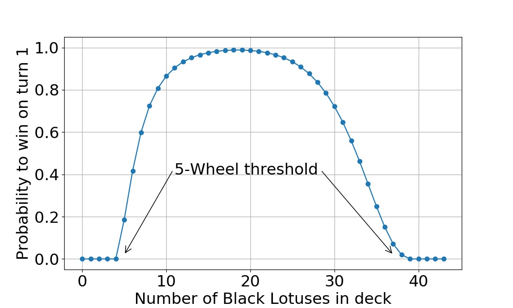

## Back to square one

Over the Christmas holidays, I started writing a new MTG simulation tool on C++. I wanted to improve the performance of the Python script I had used on the [first post](../2018-11-23-the-lotus-and-the-wheel) on this blog, and to facilitate simulating games with more elaborate decks. I will write about C++ later, but now I'm going back to the [Wheel of Fortune](http://gatherer.wizards.com/Pages/Card/Details.aspx?multiverseid=231) and [Black Lotus](http://gatherer.wizards.com/Pages/Card/Details.aspx?multiverseid=3) deck for a bit. If you haven't already, you may wish to check out the [previous post](../2018-11-23-the-lotus-and-the-wheel) first, at least for the historical context.

Honestly, I was actually planning on writing about something else before revisiting that particular scenario, but as I was doing some test calculations with the C++ code and comparing to the old results, I noticed that the numbers didn't match. At first I assumed I had made an error in the new C++ code. But then I went back and looked at the old results more closely, and while the numbers were mostly reasonable, some of the finer details did not make sense. So, to find out what the problem was, I took out an IPython notebook and did the full probabilistic analysis for the turn 1 win probability.

## The hypergeometric distribution

The essential part in calculating the win probability for the Lotus and Wheel deck is estimating the probability to draw a given number of Black Lotuses (and, conversely, Wheel of Fortunes) within both the the starting hand (8 cards) and within the hand replenished by the Wheel of Fortune (7 cards). Taking the number of cards in the deck as well as the deck composition as given, the probability is described by the [hypergeometric distribution](https://en.wikipedia.org/wiki/Hypergeometric_distribution). This distribution is well known to many Magic: the Gathering players, and is often used to estimate, for instance, the [number of land cards one should include in the deck](https://www.channelfireball.com/articles/how-many-lands-do-you-need-to-consistently-hit-your-land-drops/).

In this case, the hypergeometric distribution can be used to calculate the probability to be able to cast five Wheel of Fortunes, thereby [milling out](https://mtg.gamepedia.com/Mill) the opponent's deck and winning the game.

To calculate the winning probability, I wrote a [short code](../attachments/Lotus_and_Wheel_Hypergeometric.ipynb) in Python that uses the hypergeometric distribution implemented in [Scipy](https://docs.scipy.org/doc/scipy/reference/generated/scipy.stats.hypergeom.html) to calculate the card draw probabilities, and then employs a [recursive function][1] to branch through all the possible combinations of cards drawn via the Wheel of Fortunes. This recursive branching is done until the branch terminates either because the necessary number of Wheel of Fortunes has been cast (a winning scenario) or no more can be cast (a losing scenario). The latter may occur either because the new hand yields no Wheels or because the available Black Lotuses run out.

*Turn 1 win probability with a deck of 43 cards. Note that winning on turn 1 is impossible unless the deck contains at least 5 Black Lotuses and 5 Wheel of Fortunes.*

For the deck of 43 cards in total, the turn one win probabilities are shown above. **The maximum win probability is 98.818 %, obtained with 19 Black Lotuses and 24 Wheel of Fortunes in the deck.** The deck with 18 Black Lotuses has an almost equal win probability, 98.815 %. Note that these results are exact (within numerical accuracy). There are no approximations and no Monte Carlo uncertainties. They are also somewhat higher than what I originally presented (between 97 % and 98 %).

The 43-card deck is also the optimal size. If the number of cards in the deck is increased, the win probability goes down, albeit just a little (see the figure below). This can be explained as follows. Because the cards are drawn [without replacement](https://en.wikipedia.org/wiki/Simple_random_sample), drawing several of one type increases the odds of drawing the other type. This works in our favor because we need to draw at least one of both card types to get a new draw.[^1] This effect of "deck thinning" is stronger when the overall deck size is smaller. Hence, the probability to win decreases with increasing deck size.

*Turn 1 win probability with for various deck sizes and compositions.*

It is also worth mentioning that, with the optimal deck, the biggest hurdle is getting at least one Black Lotus in the opening hand to get the engine going. The probability to miss a Lotus entirely in the first 8 cards is about 0.55 %. Each subsequent Wheel then only has a 0.15 % chance to fail, on the average.

## More Monte Carlo

Since I now had the exact results for the turn one win probability, I of course wanted to test my new C++ Monte Carlo code. I ran the 43-card deck simulations and got exactly the same results as above. For 100 million simulation runs with the optimal deck, I got the win probability of (98.818 +/- 0.001) %. So, the C++ code was good.

For a while, I stared down at the Python implementation to see what had gone wrong. Eventually I found the bug, fixed it, and recomputed the results. I've updated the figures and values to the [initial post](../2018-11-23-the-lotus-and-the-wheel).

One final thing I'd like to mention is that there is an interesting interplay between two competing factors for win probabilities at later turns. As mentioned in the earlier post, the winning probability on turns 2 and 3, for example, increases with deck size. This is because there is the possibility for one (turn 2) or two (turn 3) extra draws that can help in assembling the Lotus & Wheel combo. But, as explained above, with larger deck size, deck thinning is less helpful. These two factors, the deck thinning and the extra draws, then result in a local optimum deck size. This is shown as the local maximum in the turn 3 win probability graph below. The winning probability at that maximum, by the way, is more than 99.8 %.

*Probability to win on turn 3 with decks of various sizes.*

## Conclusions

1. The Black Lotus and Wheel of Fortune deck can win on turn one with a probability of 98.818 %. This is achieved with 19 Black Lotuses and 24 Wheel of Fortunes in the deck.

2. Don't trust unvalidated code.

## Puzzle

So, what actually went wrong with the Python simulation? Well, rather than telling right away, I think this is a perfect opportunity for a small puzzle - a mind twister of sorts!

You can go back to [this IPython notebook](../attachments/Lotus_And_Wheel.ipynb) or, you may open the [slightly more readable version](../attachments/lotus_and_wheel_puzzle.py) that contains the relevant functions (it's the 'play_games' function that gets called from the notebook). If you can figure out what went wrong in the simulation, leave a comment below. In addition to bragging rights, I'll give out an actual [Mind Twist](http://gatherer.wizards.com/Pages/Card/Details.aspx?multiverseid=1167) to the first person to get it right. Without giving too much away, I'll say that although the error is a bit subtle, it's actually quite a fundamental mistake. When you see it, it's almost embarrassingly obvious.

*A Mind Twist for the best Mind Twister.*

[1]: https://en.wikipedia.org/wiki/Recursion_(computer_science)

### Footnotes 

[^1]: At least in the opening hand. Any excess Black Lotuses are played and kept on the battlefield to be available on subsequently drawn hands.
