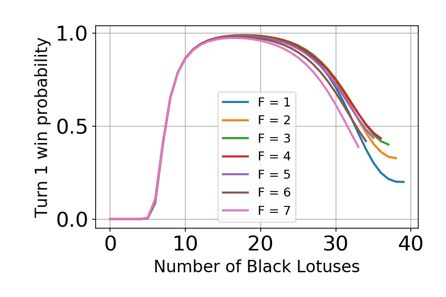
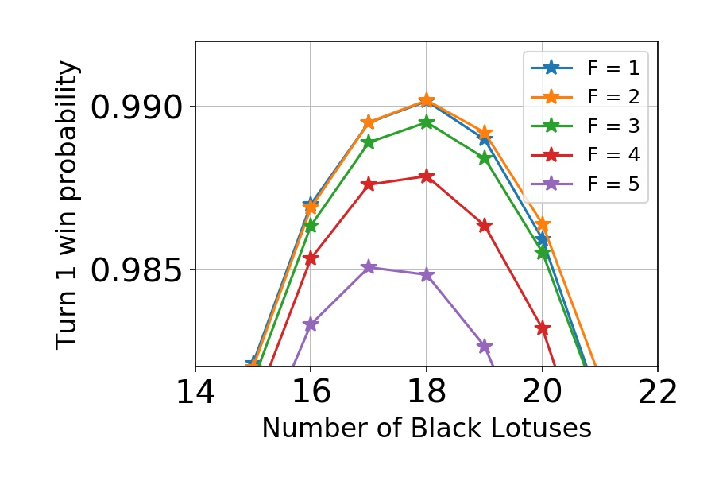
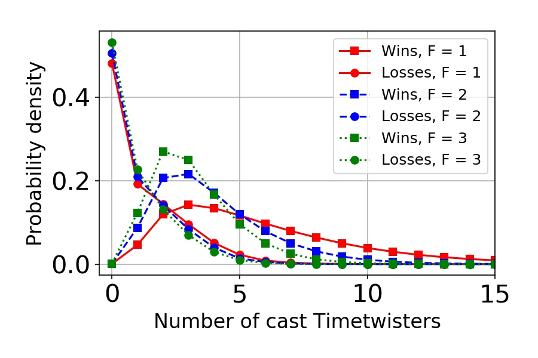
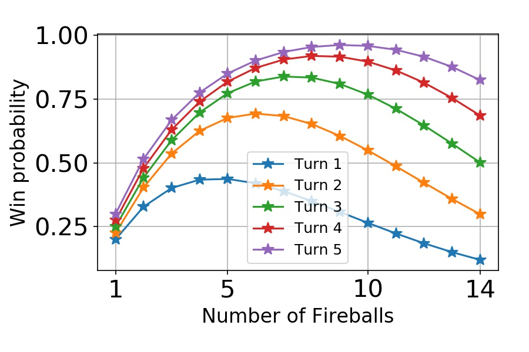

## Prologue

What is the best deck in the history of Magic? That is the question I asked [in the first post on this blog](../2018-11-23-the-lotus-and-the-wheel) and later continued [in another post](../2019-01-15-the-lotus-and-the-wheel-part2). In those posts I investigated the winning probability of a deck from the unregulated and unbalanced childhood of Magic. The deck consisted solely of two cards: the [Black Lotus](http://gatherer.wizards.com/Pages/Card/Details.aspx?multiverseid=3) and the [Wheel of Fortune](http://gatherer.wizards.com/Pages/Card/Details.aspx?multiverseid=231). I did the analysis of the deck by running a large number of Monte Carlo calculations with simple heuristics to simulate the player actions, and afterwards with [hypergeometric calculations](../2019-01-15-the-lotus-and_wheel_part2). I concluded that the first-turn win probability with the optimized deck was 98.818 %, and the turn 3 win probability was more then 99.8 %. So surely, the folklore from the infant time of Magic was right and this was the best deck. Case closed.

Well, not so fast. A few weeks after the first post, I happened to briefly discuss with Marc Lanigra the Timetwister-based variant of the deck. This is the deck that Stephen Menendian calls the [Twist of Fire](http://www.vintagemagic.com/blog/old-school-magic-chapter-11-the-untold-history-of-combo-in-old-school/). The deck plays about one half Black Lotuses, one half [Timetwisters](http://gatherer.wizards.com/Pages/Card/Details.aspx?multiverseid=132) and at least one [Fireball](http://gatherer.wizards.com/Pages/Card/Details.aspx?multiverseid=197). The idea is to use the Lotuses and Twisters to accumulate mana and repeatedly refill the hand until sufficient amount of mana is available to cast a game-finishing Fireball. The engine is very similar to the Wheel of Fortune variant. So it was quite obvious that the deck would have a similarly high win percentage, presumably in the high 90's. However, I was quite certain that it would be lower than with the Wheel of Fortune. Why? Because the the Lotus and Wheel is a two-card combo, but the Timetwister variant needs to find the singular Fireball in addition to repeatedly churning the draw and mana engine.

Then, Marc Lanigra mentioned that he has run simulations of the deck and got a 98 % win probability with a variant having 2 Fireballs. Marc is recognized as a person who [knows his Timetwisters](http://www.magiclibrarities.net/468-rarities-vintagelegacy-championship-oversized-unique-cards-english-cards-index.html), so I definitely had to check this out myself. And so I wrote the simulation code in Python.

The problem was that code was really slow. The inherent uncertainty in the Monte Carlo simulations made it difficult to compare the two decks with results that were so close. In order to reliably answer the question I would need to simulate a lot more games to bring the statistical uncertainty down to less than a hundredth of a percent. And my Python script was not going to do it - it was simply too slow.

With a sigh, I realized it was time to get serious with the simulation algorithm.

## Bringing out the big guns

*Tech talk warning. If you're not interested in computer simulations and code performance optimization, you can just skip this chapter and go straight to the results.*

In Monte Carlo simulations, [the statistical error typically goes down as the inverse square root of the number of simulations](https://en.wikipedia.org/wiki/Monte_Carlo_integration). So, to squeeze the error down to one tenth, I needed to run a hundred times more simulations. I also needed the simulation to be short enough so that I could explore different parameters such as deck composition (number of Fireballs, Timetwisters and Black Lotuses) and heuristics parameters (for example, whether to sacrifice the Lotus for 3 mana or keep it on the battlefield). To do this, I needed to make the simulation code faster. A lot faster.

My initial Python implementation of the simulation was based on using integer [Numpy](http://www.numpy.org/) arrays to hold the deck and hand contents, moving cards from one to the other by resizing the arrays, and individual simulations running inside a [for loop](https://en.wikipedia.org/wiki/For_loop). So, memory allocations and deallocations inside a loop. In Python. A recipe for disaster.

Rather than trying to refactor the Python code to make it faster, I decided to scrap it altogether and move to an actual high-performance language: C++ [^1]. Over the Christmas break, I rewrote the Python code in C++ and compiled it. I ran it, and the simulation was more than 20 times faster! Alright!

Of course, I didn't stop there. I turned on the compiler optimization and did a bit of [profiling](https://en.wikibooks.org/wiki/Introduction_to_Software_Engineering/Testing/Profiling), replaced the standard library implementation of the deck shuffling function with the [Fisher-Yates algorithm](https://en.wikipedia.org/wiki/Fisher%E2%80%93Yates_shuffle)[^2], swapped the [random number generator](https://en.wikipedia.org/wiki/Mersenne_Twister) (rng) with a [faster one](http://www.pcg-random.org/), and even replaced the [std::vector containers](https://en.cppreference.com/w/cpp/container/vector) with custom containers for the deck and the hand cards[^3]. Although the performance of the std::vector is OK [as long as the card addition and removal is done at the end of the container](https://baptiste-wicht.com/posts/2012/12/cpp-benchmark-vector-list-deque.html), the memory for the contents is reserved at the [heap](https://stackoverflow.com/questions/79923/what-and-where-are-the-stack-and-heap), while the custom ones I created use the [stack](https://blogs.magicjudges.org/rulestips/2011/04/last-in-first-out-how-the-stack-works/). The stack memory is typically faster to access, and in this case the performance improvement on the whole simulation was a further 20 %. Finally, I made the code run in parallel using the [multithreading functionalities](https://solarianprogrammer.com/2012/10/17/cpp-11-async-tutorial/) available in the standard library since C++11,  [std::async](https://en.cppreference.com/w/cpp/thread/async) and [std::future](https://en.cppreference.com/w/cpp/thread/future).

*Run times with the different code versions for 100 000 simulation runs in milliseconds. Measured on a mid-2012 Macbook Pro (2,5 GHz Intel dual-core i5).*

| Version | Time |
| -- | -- |
| Python | 126 000 ms |
| C++ | 5500 ms |
| + clang++ -O2 optimization | 1750 ms |
| + Fisher-Yates algorithm | 1050 ms |
| + PCG32_fast rng | 750 ms |
| + custom containers | 590 ms |
| + hyperthreading on 2 cores | 200 ms |

The run times for one hundred thousand simulations with each incremental improvement are shown in the table above. After all the improvements, the C++ code finally ran **more than 600 times faster**[^4] than the original Python simulation. Wow! Now we were back in business!

## The Twist of Fire

With the new simulation tool, I was able to go to ridiculous accuracy in the Monte Carlo simulations. I was basically able to do parameter exploration with a similar accuracy that I would use for the final calculations with the previous Python code. But before going into the results, let's lay out the assumptions and heuristics of the simulation:

1. The deck consists of 40 cards in total. There can be any number of Black Lotuses, Timetwisters and Fireballs, granted that their total number is 40.
2. The game begins with drawing 8 cards.
3. All the Black Lotuses in hand are played and sacrificed for 3 blue mana. The exception to this is if there is enough mana in the pool that a lethal fireball could be cast. In this case one Black Lotus is left on the battlefield to supply the potentially needed red mana.
4. Win condition is checked: if there is a Fireball in hand and enough mana available, to cast it for X = 20 or more, the game is won.
5. After playing and sacrificing the Lotuses, a Timetwister is played if possible. This amounts to shuffling all the cards back into the deck except for one Timetwister and drawing a new hand of 7 cards.
6. Steps 3. - 5. are repeated until the game is won or continuing is not possible either due to running out of mana or not drawing a new Timetwister.

The steps above are repeated many times to get a large statistical sample to calculate the average turn one win probability and other quantities.

I should mention that the algorithm has a bit of freedom. For example, the choice of when the Lotuses are sacrificed for mana can be adjusted. I ran the simulations with different heuristic rules and the one above resulted in the highest win percentage. In addition, it would be possible to cast a Fireball for less than X = 20 and then continue with the Timetwister. This is an option I did not try out, because it seems that mana lost in casting the Fireball mid-game would only hinder the chances of keeping the engine rolling without substantially helping with finding the mana for the final lethal Fireball. But since I only explored a subset of possible strategies, whatever results I get should be considered as a lower limit for the achievable win probabilities.

## Results

First, I wanted to obtain the turn one win probability with the optimized deck. I ran the simulations over a range of parameters, with 10 million independent samples each. This narrowed down the parameters to a certain range. I increased the accuracy of the simulations, eventually running 10 billion (1010) simulations on the final two candidates to solve the optimal deck. The turn one win probabilities with the most relevant decks are shown in the two figure below.

*The turn 1 win probability with various deck compositions. F indicates the number of Fireballs in the deck.*

*The turn 1 win probability with various deck compositions, zoomed in to display the peak.*

**The optimal deck has 18 Black Lotuses, 20 Timetwisters, and 2 Fireballs. The turn one win probability with that deck is at least (99.0193 +/- 0.0001) %.**[^5] The next best deck, with 18 Black Lotuses, 21 Timetwisters and 1 Fireball, has a win probability of (99.0168 +/- 0.0001) %.

The turn one win probability is indeed higher than for the [Lotus and Wheel deck](../2019-01-15-the-lotus-and_wheel_part2), if only by 0.2 %! Do note that although the difference is tiny, it is well beyond the statistical uncertainty. In fact, even the minuscule difference between the one and two Fireball versions sets them 25 [standard deviations](https://en.wikipedia.org/wiki/Standard_error) apart. Considering that [announcing the discovery of a new fundamental particle](https://arxiv.org/abs/1207.7214) can be done [at the significance level of five sigma](https://medium.com/@chris.m.pease/the-higgs-boson-and-5-sigma-eec238b43f93), we are quite safe.

So, the Twist of Fire is an extraordinary deck. But why is it so good? In particular, how do we explain the fact that it is even better than the Wheel of Fortune deck. After all, it is a three-card combo, while the Wheel deck is a two-card combo. To find out, lets look at the number of Timetwisters that are required to be cast to win the game. In the figure below, this is shown as a [probability distribution](https://en.wikipedia.org/wiki/Probability_density_function) (a [histogram](https://en.wikipedia.org/wiki/Histogram), if you will) of the number of Timetwisters cast in a given game.

*The probability densities of the number of cast Timetwisters in the winning and losing games, with various numbers of Fireballs (F) in the deck. The number of Black Lotuses = 18. Note that the win and loss curves are not in proportion to each other. Both are normalized separately.*

The figure tells mainly two things. First, most of the losses occur when no Timetwisters were cast. This is similar to the [earlier result with the Wheel deck](../2019-01-15-the-lotus-and_wheel_part2), that the most common way to fail is to not find at least Lotus and Twister in the opening hand. Second, the distributions of the winning games show that typically less than five Twisters are cast in a game. In fact, the *average* number is about 3.9 Timetwisters for the deck with two Fireballs. Contrasting this to the number of required Wheel of Fortunes (5) shows why the Timetwister gets ahead. Although the deck needs to produce the separate win condition even after the sufficient amount of mana has been generated, it only needs to churn out the draw-seven *four times on the average*, in many cases even less. This is a clear advantage over the Wheel deck, which always requires at least five draw-sevens to finish the game.

Although it is not self-evident why the need to find the Fireball is more than offset by the more efficient Timetwister engine, the numbers speak for themselves. In terms of win probability, the Twist of Fire is a better deck than the Lotus and Wheel deck.[^6]

## Twisterless Twist of Fire

What would the Twist of Fire deck be without one of its namesake cards. Not too bad, it turns out. Just for fun, I calculated the win probability for the deck with *zero* Timetwisters. Here I'm defining "a win" quite simply as the probability of drawing at least seven Black Lotuses and at least one Fireball. This is purely a combinatorial problem and the numbers come straight out of the [hypergeometric distribution](https://en.wikipedia.org/wiki/Hypergeometric_distribution). The results are shown below.

*The win probability using a deck with only Black Lotuses and Fireballs.*

Even without the engine, the win percentages are quite respectful: 43 % on turn 1, 69 % on turn 2, and 83 % on turn 3. This of course assumes a [goldfish opponent](https://mtg.gamepedia.com/Goldfishing). It would be interesting to know how this compares to [other combo decks](http://www.vintagemagic.com/blog/old-school-magic-chapter-11-the-untold-history-of-combo-in-old-school/), such as the 93/94 [Power Monolith](http://www.wak-wak.se/9394decks/power-monolith), or even Vintage decks like [Paradoxical Storm](http://www.starcitygames.com/articles/37199_Building-The-Perfect-Paradoxical-Outcome.html). Certain builds of the latter, according to [this article by Reid Duke](https://www.channelfireball.com/articles/vintage-paradoxical-storm/), would have somewhat lower or similar win probabilities if undisrupted. But, having no experience with the deck and no data to back it up, I'll leave it up to the reader to judge if that is the case.

## Conclusions

**The Twist of Fire is a hyper-effective combo deck. The optimal version of the deck has 18 Black Lotuses, 20 Timetwisters, and 2 Fireballs. It has a turn one win probability of more than 99 %.**

By the numbers, the deck beats the Wheel of Fortune variant by a small margin. But most importantly, it is completely immune to the biggest weakness of the Lotus and Wheel deck: the size of the opponent's library. This clearly makes the Twist of Fire a winner over the two decks in terms of pure [spike](https://magic.wizards.com/en/articles/archive/making-magic/timmy-johnny-and-spike-2013-12-03). However, it is not difficult to see why either deck could have been considered as "the best" or "most degenerate" in its era. The 0.2 % difference in win percentage makes no practical difference, and either will win a conventional deck almost every time unless the deck is specifically built to counter the particular combo deck. Without detailed calculations, the creator of either deck could have considered their creation the best deck possible at the time.

It is also interesting to note that while the general idea of the decks was certainly known, the numbers may have been slightly off. In his excellent series, [History of Vintage](http://www.eternalcentral.com/tag/history-of-vintage/), Stephen Menendian accounts these decks as having "18 Timetwister, 21 Black Lotus, and 1 Fireball" (the Twist of Fire deck) and "30 Wheel of Fortune and 60 Black Lotus" (the Big Wheel deck). Again, much of the information has been lost over the years, and even originally it would have been in many cases hearsay and anecdotal rather than evidential. Different players would have used different versions of the deck, and conceivably their choices would have been restricted by card availability. Whether somebody optimized the deck contents back in the day and arrived at the same numbers as I did would be interesting to know. I think it is certainly possible, but we may never know for sure.

In an upcoming article, I will take a look at the Braingeyser variant of the Timetwister decks. This was already foreshadowed by the title image of this post but, as it turned out, this one got already quite lengthy even without the Braingeyser.

### Footnotes

[^1]: Yes, while C++ is the crown prince in high-performance computing, C is the king and Fortran the old emperor. But I've grown to dislike C in contrast to C++ in terms of usability, and I see enough Fortran in my day job not to touch it for fun.

[^2]: Daniel Lemire has an interesting [blog post](https://lemire.me/blog/2016/10/10/a-case-study-in-the-performance-cost-of-abstraction-cs-stdshuffle/) on the performance of the C++'s std::shuffle.

[^3]: The custom containers were basically statically allocated arrays wrapped inside a class that handles the book-keeping and re-implements the std::vector's emplace_back, pop_back, erase, and shuffle functions. An interesting realization was that the hand container does not care about the order the cards, so removing elements from that container can be done very efficiently.

[^4]: Sure, the final factor of 3 due to parallel processing is in a way trivial. This kind of problem parallelizes just as well by scripting and running separate processes with different random number generator seeds. The scripting and post-processing will get cumbersome, though, and considering the effort that would go into all that, the speed-up is in practice very real.

[^5]: This is the same conclusion regarding the number of Fireballs that Marc Lanigra mentioned. Also, according to his simulations, the win percentage was at least 98 %, which is consistent with my results.

[^6]: Yes, also in terms of the turn 3 win probability. Even though the heuristics are wildly suboptimal for continuing after the first turn, the third turn win probability is still greater than 99.8 %.
