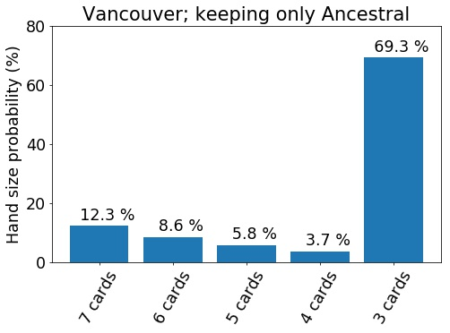

## Re-doing a mulligan

The Wizards of the Coast [recently]((https://magic.wizards.com/en/articles/archive/competitive-gaming/mythic-championship-ii-format-and-london-test-2019-02-21)) proposed a change to the [mulligan][1] rule, which they are going to test in an upcoming tournament in London. I wrote about the change and its potential implications for Old School Magic: the Gathering a few weeks ago. Basically, the London mulligan rule would allow the player to mulligan more aggressively towards certain cards or card combinations. Therefore it looks like the combo decks of 93/94 could receive a significant boost from the new rule. If you are interested in the details or if you wish to refresh your memory on the differences between the current and the London mulligan rules, you may have a look at [the previous post](../2019-03-01-london-mulligan).

After posting the analysis, I received a couple of good comments from observant readers. [Svante Landgraf](https://endofturndrawacard.wordpress.com/) suggested that I take a look at the probabilities of drawing back to (roughly) seven cards via [Ancestral Recall](http://gatherer.wizards.com/Pages/Card/Details.aspx?multiverseid=95), [Timetwister](http://gatherer.wizards.com/Pages/Card/Details.aspx?multiverseid=132) or [Wheel of Fortune](http://gatherer.wizards.com/Pages/Card/Details.aspx?multiverseid=231). He also suggested that for Power Monolith, looking at the full 3-card combo (including the [Fireball](http://gatherer.wizards.com/Pages/Card/Details.aspx?multiverseid=197)) makes more sense, since the outlets for the infinite colorless mana from the [Power Artifact](http://gatherer.wizards.com/Pages/Card/Details.aspx?multiverseid=1043) - [Basalt Monolith](http://gatherer.wizards.com/Pages/Card/Details.aspx?multiverseid=2) combo are few. Additionally, Bill Schriver also suggested adding [Balance](http://gatherer.wizards.com/Pages/Card/Details.aspx?multiverseid=234) to the analysis, as it is often played in the deck and could represent a brutal line of play after mulliganing to just a couple of cards.

I had already done most of the analysis that had been suggested, although I hadn't written it down in the previous post. But then I reconsidered some of the simplifications I had done, especially related to availability of different colors of mana. I had also treated the [Demonic Tutor](http://gatherer.wizards.com/Pages/Card/Details.aspx?multiverseid=60) in a very simplistic way. I felt that the results could be skewed because of my assumptions. I also had no way to evaluate the magnitude of the error introduced by the approximations, which is rather troublesome. So I did some really tedious changes to the code. These were basically to get the tutoring probabilities correct and to correctly calculate the possibilities to generate specific colors of mana with given card combinations.

I'll discuss the main results after a brief discussion on mathematics of drawing certain card combinations. If nothing else, at least I hope to somehow convey the tediousness of the problem.

## Probability of drawing a certain combination

As an example, I'll consider the probability of getting a hand that allows casting a turn 1 Ancestral Recall. I'm doing the analysis with a deck that is similar to the one shown in the picture below - a sort of control variant of the Power Monolith playing white instead of green. If you're interested in a different, even more combo oriented build, you may, for instance, check out the [End of turn, draw a card](https://endofturndrawacard.wordpress.com/2018/02/13/building-power-monolith/) blog. I'm putting the exact list of cards I considered in the calculations in footnotes.[^1] It's representative, if not completely canonical.

*An example of an old school Power Monolith deck. Picture shamelessly stolen from [Wak-Wak](http://www.wak-wak.se/). They are one of the best websites for getting acquainted with the different deck archetypes and innovations in 93/94 - do check them out if you haven't already.*

The simplest way to get a turn 1 Ancestral is of course to draw one in the starting hand, along with a blue mana source. In the deck, there are a total of 60 cards, 1 Ancestral, and 21 blue mana sources. The probability to draw the aforementioned hand can be found by enumerating all the possible card [combinations](https://medium.com/i-math/combinations-permutations-fa7ac680f0ac) that meet the criterion. The number of these combinations is divided by all the possible card combinations to get the associated probability.

Both of these numbers can be calculated [using basic combinatorics](https://en.wikipedia.org/wiki/Combination), resulting in the [binomial coefficient](https://en.wikipedia.org/wiki/Binomial_coefficient). For example, there are
\\[C_\\textrm{all} = {60 \\choose 7} = 386206920, \\]
that is, about 386 million different unique ways to choose a seven-card starting hand out of a 60-card deck. The number of hands having exactly one blue mana source and one Ancestral, is
\\[C_\\textrm{Ancestral & 1 blue} = {1 \\choose 1}  {21 \\choose 1} {38 \\choose 5} = 12090897, \\]
or, about 12 million. In the above equation the three terms correspond to choosing 1 Ancestral out of the single one in the deck, 1 blue mana source out of the available 21, and then choosing the remaining 5 cards out of the 38 cards that are neither the Ancestral nor a blue mana source.

But we need the probability of drawing any number of blue sources greater than zero. So we need to take the sum over having any number of blue mana sources starting from 1 and up to 6. This is
\\[C_\\textrm{Ancestral & at least 1 blue} =  \\sum_{k=1}^{6} {1 \\choose 1}  {21 \\choose k} {38 \\choose 7-1-k} = 42296793,\\]
about 42 million. The probability is then that divided by 386 million,
\\[P_\\textrm{Ancestral & at least 1 blue} \\approx 10.9~\% .\\]

When one adds the possibility to use Demonic Tutor to search the [library](https://mtg.gamepedia.com/Library) for the missing piece of the combination, the calculation immediately becomes more complicated. Or, at least, more tedious. One has to consider the different ways of being able to generate first the one black and one generic mana to cast the Tutor, and subsequently the blue mana to cast the Ancestral Recall. Here the Tutor can grab either the Ancestral or the mana source from the library. In addition, one needs to consider the fact that only one land can be played per turn. So if the black mana for the tutor comes from any of the eight lands capable of producing black mana, then the only way to cast the Ancestral will be either from the [Mox Sapphire](http://gatherer.wizards.com/Pages/Card/Details.aspx?multiverseid=36) or from the Black Lotus. Conversely, if the black mana comes out of the [Mox Jet](http://gatherer.wizards.com/Pages/Card/Details.aspx?multiverseid=33) or the Black Lotus, then the blue one can be from any of the 21 or 20 (sans Black Lotus) sources.

The principle remains the same: identify all the possible combinations, sum them up and divide by the total number of 7-card hands. In practice this is a problem of being meticulous enough to account for all the combinations and writing them down correctly, while also avoiding double counting any of them. I actually only did this for the Ancestral and Tutor into Ancestral. I used that calculation to verify my Monte Carlo code, where I did the same calculation using a  different approach.

In the Monte Carlo code, I would actually draw a sample hand, evaluate it by looking at the possibility of casting the Tutor (if that was present in the hand) and subtract the used mana. Then I would see if it was possible to cast the Ancestral by tutoring for more mana sources (if the Ancestral was in hand), or if there was a free blue source in hand so that the Tutor could be used to get the spell instead. The output of this hand evaluation is basically a true or false value, indicating whether casting the Ancestral with the sampled card combination was possible or not.

Needless to say, this approach also results in some quite horrible programming logic. In the end, I was able get the same number from both approaches, which makes me somewhat confident that numbers are technically correct. Technically meaning that it is of course possible that I overlooked some line of play that would have allowed casting the Ancestral. But I am quite sure that if such lines exist, they will be intricate and complicated enough to that their effect on the overall probability will be small.

Based on the calculations, the probability to draw a seven-card hand that allows casting Ancestral Recall on turn 1 is
\\[P_\\textrm{Turn 1 Ancestral} \\approx 12.3~\% .\\]

## Probability of mulliganing into a certain combination

The question really isn't about the probability of immediately drawing certain cards in the first seven-card hand. It is about not having drawn the cards, choosing to mulligan (i.e., re-draw the hand), possibly several times, in order to improve the odds of getting the desired cards.

### The London Mulligan

With the proposed London mulligan, one always re-draws seven cards. It is only after the hand is kept that one discards down to fewer cards. Therefore the probability of drawing a combo on the re-draw is the same in the previous hands. Of course, once one discards down to the allowed size, it is possible that the hand size is smaller than the number of cards that are being sought after. In that case, the chance of getting the combo with further mulliganing is zero.

Ignoring the discard for now, the probability of getting a certain combo depends on how many times one is willing to mulligan. If one is willing to mulligan only to seven cards (not at all), the probability is the same as drawing the combo in the initial seven cards:
\\[P_{M,7} = P_7.\\]
Here \\(P_n\\) is the probability to have the desired cards within a n-card hand drawn just once, and \\(P_{M,n}\\) is the probability to have the cards in any of the hands that one has seen while mulliganing down to \\(n\\) cards.

To get the general probability, consider what happens when one draws the first hand and then chooses whether to mulligan or not. If the combination is already in the hand (probability of \\(P_7 = P_{M,7}\\)), one does not mulligan. Otherwise one does. So the probability of mulliganing down to 6 is \\(1-P_{M,7}\\). With the new hand, the probability to get the combination, *taking into account the probability of mulliganing down to 6 at all*, is \\(P_7  (1-P_{M,7}) \\). Therefore, the probability of having the cards within the first hand or the second, is
\\[ P_{M,6} =  P_{M,7} + P_7  (1-P_{M,7}). \\]
In general,
\\[ P_{M,n} =  P_{M,n+1} + P_7  (1-P_{M,n+1}). \\]

For the turn 1 Ancestral, \\(P_7 \\equiv P_{M,7} \\approx 12.3~\% \\). By increasing the willingness to mulligan down to less cards, the probability increases as (using the equation above) \\(P_{M,6} \\approx 23~\% \\), \\(P_{M,5} \\approx 32~\% \\), \\(P_{M,4} \\approx 41~\% \\), \\(P_{M,3} \\approx 48~\% \\).[^2]

### The Vancouver Mulligan

With the Vancouver mulligan rule, the rule that is currently in use, one always draws one less card in the new hand. The calculation above is modified so that the general equation for the probability to have a keepable hand is
\\[ P_{M,n} =  P_{M,n+1} + P_n  (1-P_{M,n+1}). \\]
The difference to the London mulligan is that the \\( P_7 \\) is replaced by \\( P_n \\), the probability to have the sought-after combination in a hand of \\( n \\) cards. This reduces the probability to draw into a turn one Ancestral, so that the probabilities are \\(P_7 \\equiv P_{M,7} \\approx 12.3~\% \\), \\(P_{M,6} \\approx 21~\% \\), \\(P_{M,5} \\approx 27~\% \\), \\(P_{M,4} \\approx 30~\% \\), \\(P_{M,3} \\approx 33~\% \\).

## The effect of the mulligan strategy

### Keeping only Ancestral Recall

Another way to look at the outcome of the mulligans is to look at what kinds of hands remain after choosing to keep the cards. This is of course dependent on the *mulligan strategy*. What I'm calling the mulligan strategy is the set of rules and conditions that lead to the decision of whether a certain hand is keepable or not. The decision would depend on which cards have been drawn, how many of them are going to be kept and, of course, what type of playing strategy is going to be executed against the particular opponent. Here I am mainly only considering the first two, leaving the actual game play decision out of the analysis by only looking at what happens on the first turn.

In the discussion above, the mulligan strategies were very simple: a hand was keepable only if it had a turn-one-castable Ancestral Recall or, if the hand size limit was met. This kind of strategy is of course unrealistic and suboptimal, but illustrates a point.

Let's first look at how the hand looks in terms of number of cards. The distributions are shown in the figures below. Under the Vancouver rule, one ends up with just three cards in hand 69 % of the time. With the London rule, the chance is 59 %. So it seems there's significantly less risk involved in an aggressive mulligan strategy with the proposed rule.

*The hand size distribution for the strategy of keeping turn one Ancestral and mulliganing down to 3 cards at most. Result for both the London mulligan rule (upper figure) and the current Vancouver mulligan rule (lower figure) are shown.*

At the same time, the starting hand quality is significantly improved under the London mulligan rule, as shown below. The probability of getting turn one Ancestral is 48 % vs. 33 % with the Vancouver rule (as already mentioned). Significantly, the probability of ending with an almost unplayable hand is much lower: the probability to have a starting hand with no mana sources whatsoever is only 1 %, whereas with the current rule it's more than 13 %.

*The card distribution for the strategy of keeping turn one Ancestral and mulliganing down to 3 cards at most. The different combinations are: "2-combo": 2 cards of the Basalt Monolith - Power Artifact - Fireball - castable Tutor combo + 2 mana sources; "3-combo": 3 cards of the combo + 2 mana sources; "Draw spell": turn 1 castable Ancestral Recall, Wheel of Fortune or Timetwister; "Ancestral": turn 1 castable Ancestral Recall; "Balance": turn 1 castable Balance leaving opponent to discard down to one or zero cards in hand; "Other": none of the previous ones; "No mana": no mana sources in hand.*

### A more realistic yet aggressive strategy

Instead of keeping only the hands that allow Ancestral Recall to be cast on the first turn, a more realistic strategy has several keepable combinations. A minor concern among the community has been whether the new mulligan rule would lead to high probability of unfair starting hands, resulting in essential non-games. To examine this, I'm expanding the set of keepable hands to include the 3-piece combo & two mana sources, turn 1 castable Wheels, Twisters and Ancestrals, and disruptive Balances. The latter is defined as a hand that allows the player to cast a Balance on turn one with just one or no cards remaining in hand - effectively Mind Twisting the opponent on turn one.

In this strategy, a hand of 3 cards is always kept.

The results from this strategy are shown below. The number of cards in the starting hand is again much higher in the London mulligan case; 40 % of the starting hands begin with 3 cards in hand, whereas with the current rule the number is almost 60 %. Clearly, in both cases the strategy is too aggressive, but much less so under the new rule.

*The hand size distributions for the aggressive mulligan strategy.*

Looking at the compositions of the starting hands, the London mulligan rule again results in much better outcomes. 53 % of the time, one is able to start with a first turn Wheel, Twister or Ancestral. With the current rule, the probability is much lower at 38 %. Similarly the chance to start with the full combo is significantly higher (7 % vs 5 %), and the probability to have the disruptive Balance on turn one is 3.2 % vs 0.9 %. The numbers also show that the aggressive strategy is much more risky with the current rule: 11.2 % of the hands end up having no mana at all. For the London rule, the chance of that happening is only 0.7 %.

*The card distributions for the aggressive mulligan strategy.*

### The role of the Demonic Tutor

Out of curiosity, I also ran the numbers with the Demonic Tutor absent from the deck. The starting hand combinations for this variation of the aggressive strategy are shown below. The effect of the Tutor is actually fairly minor in bare numbers: the probability of the desired outcomes are lower by only 2 - 3 % each. But of course, putting this in perspective shows how goof the Demonic Tutor actually is. If switching one card improves a probability by 2 %, upgrading *all* the cards in the deck in a similar manner would improve the chance by more than 100 %. Obviously this cannot happen, but it shows that the Demonic Tutor is much more effective than the average card in the deck.[^3]

*The card distributions for the aggressive mulligan strategy without the Demonic Tutor.*

## Conclusions

The analysis presented here gives a small glimpse on how the London mulligan rule could change the Old School 93/94 format. It seems that the boost to combo decks as would be significant, but in all likelihood tolerable. The London rule would definitely allow more aggressive mulliganing with a decent chance to bounce back via powerful card draw spells of the format. Given the new rule, players would surely adapt their strategies to take advantage of the new lines of play.

A more dramatic change could be the increased disparity between powered and unpowered decks. With the London mulligan rule it would be much easier and less risky to mulligan to a starting hand that allows very powerful turn one plays. This may not be problem for equally matched decks, but for an unpowered deck that has a more even card quality in the deck, it would be much more difficult to take advantage of the new rule. This would widen the gap between powered and unpowered decks and potentially increase the barrier to entry to the format.

[1]: https://en.wikipedia.org/wiki/Mulligan_(games)

### Footnotes

[^1]: The deck I considered consisted of: 4 Power Artifact, 4 Basalt Monolith, 4 Fireball, 1 Demonic Tutor, 1 Black Lotus, 1 of each Moxen, 1 Sol Ring, 3 Island (to replace colorless lands), 4 Tundra, 4 Volcanic Island, 4 Underground Sea, 4 City of Brass, 1 Ancestral Recall, 1 Wheel of Fortune, 1 Timetwister, 1 Balance, and 17 other cards. While the 17 cards are certainly very relevant to actual gameplay, for the calculation of probabilities considered here they were assumed to have no impact. Specifically, this rules out cards such as Transmute Artifact, Sylvan Library, Fellwar Stone, etc., among the 17 cards. The deck therefore had 4 of each combo piece, a Demonic Tutor, and 26 mana sources, out of which 19 were lands.

[^2]: In reality the probability is a little bit lower for the hands with very few cards (say, less than 4). This is because the above calculation only takes into account the re-draw of seven cards, omitting the final discard. Some of the combinations would actually require one to retain more cards than is allowed by the mulligan rule. The probabilities from Monte Carlo calculations, including the discard, are the same as mentioned in the text, except for \\(P_{M,3} \\approx 47~\% \\).

[^3]: Of course, the most effective way to improve, say, the probability of getting a Wheel of Fortune in the starting hand, is to increase the number of *Wheel of Fortunes* in the deck. This has been talked about in length in the previous posts on the blog.
