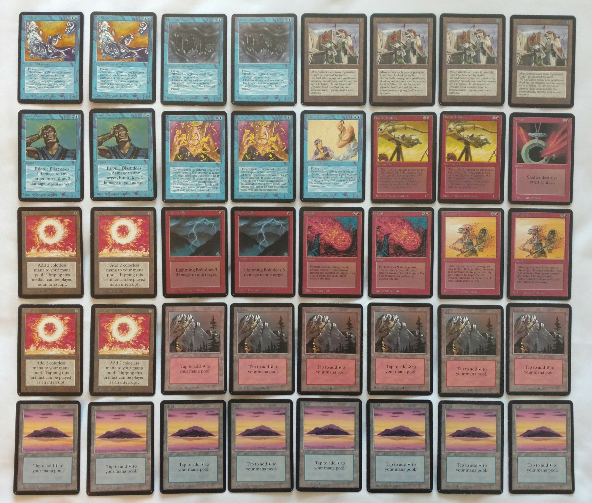

## Across the sea

In the [land of the Norsemen](https://en.wikipedia.org/wiki/Sweden), across the western sea, on the night of [the first full moon after the equinox](https://en.wikipedia.org/wiki/Computus), there would be a [gathering of powerful wizards](../attachments/wizardstournament2.txt). Word of the upcoming festivities had reached the shores of Finland already many moons before. Thus, [during the dark winter months](../2018-12-17-kaamoscup), three [Finnish wise men](https://en.wikipedia.org/wiki/V%C3%A4in%C3%A4m%C3%B6inen) met and made a pact to travel west and challenge the sorcerers of foreign lands in the arts of [ancient Magic](http://oldschool-mtg.blogspot.com/). And so, on the eve of the gathering, we boarded the [flying machines](https://en.wikipedia.org/wiki/Airplane) and traveled to the land of [Beowulf](https://en.wikipedia.org/wiki/Beowulf), [minstrels of old](https://en.wikipedia.org/wiki/ABBA) and [social democracy.](https://www.hollywoodreporter.com/review/raspberry-boat-refugee-film-review-773709)

After finding our establishment and searching the [aether](http://www.facebook.com) for traces of wizardly energies, we heard whispers of a group of conjurers having gathered somewhere underground, below the streets of Gothenburg. With the help of a [divining spell](http://maps.google.com) we found our way to the correct location, which turned out to be a [drinking establishment](http://www.ggbar.se). Immediately inside, we were greeted by a tiny [mustached dwarf](https://en.wikipedia.org/wiki/Mario), whom we followed down the stairs into the cellar.

*Mika, myself, and Kalle slinging spells and fighting for air superiority amongst other wizards who were competing for the mastery of the Ice Age.*

Shortly, we dug out our spellbooks from our bags and started sparring. We engaged in several friendly battles during the evening and honed our strategies and discussed the selection of spells each of us would be bringing to the main event. The day was drawing to a close, and we finished the evening in a three-way free-for-all battle before the establishment closed and we retired for the night.

## The Wizards' Tournament

The next morning, we woke up with the sun (or perhaps just slightly after...) and enjoyed a delicious breakfast. Heartened by this feast, we set out to explore the city and it's nooks and corners. We stumbled upon a store that almost seemed to radiate with magical energies. Inside we found a local wizard, a powerful artificer who called himself Jakob. He had partnered with other craftsmen and artists to create powerful charms and tokens, which he was to sell at the wizards' gathering. We would later acquire such a bag of tokens, which we shared amongst ourselves to spread the charms across the various regions of Finland.

*Some of the tokens created by Jakob the artificer.*

Following the whispers in the aether, we eventually found our way to the [Rotary Pub](http://rotarypub.se/). As we prepared to enter the battlegrounds, we were greeted by yet another mustached man - Mg. No doubt a powerful wizard himself, Mg graciously showed us around the tournament arena, soon to disappear out of sight, presumably to greet other arriving guests and to prepare for the battles ahead. No matter, though, Mg had left us right next to the beer and ale taps. We were in fact feeling a little thirsty form the day's travels.

Having secured ourselves our pints, we moved to the area where the battles would take place. It was a hall with a high ceiling and a small balcony overlooking the battlegrounds. I quickly reminded myself of the selection of spells I had prepared for the upcoming duels. Artifacts, creatures of air and spells of fire and lightning would be my selection. How they would measure up to the other wizards, I would have to wait and see.

*My selection of spells for the Wizards' Tournament.*

As I was still memorizing my spells, three figures appeared on the balcony above. The tournament was about to start. The three wizards announced that there would be six duels to fight for each of the participants, followed by additional elimination rounds for the best of the competitors to determine the master wizard. I also heard that the winds of aether favored the wizards who had not bound their spellbooks in protective covers. This was surprising but pleasant news for me, as it would allow me gain the initiative against each of my opponents.

And so, with a gesture from the three figures, the battles were on.

### First duel

In the first duel, I met a friendly traveling wizard named Patrick. He had arrived to the city from the [Western Isles](https://en.wikipedia.org/wiki/England) where he made his home, although he was born under the former empire of the Sun King. Very fittingly, he was the master of magics of the forests and seas. In our first battle, he summoned the [elves](https://gatherer.wizards.com/Pages/Card/Details.aspx?multiverseid=166) and [creatures](https://gatherer.wizards.com/Pages/Card/Details.aspx?multiverseid=155) of the forest, while I conjured the [orcs](https://gatherer.wizards.com/Pages/Card/Details.aspx?multiverseid=213) of the mountains and [fiery magics](https://gatherer.wizards.com/Pages/Card/Details.aspx?multiverseid=197) upon his army. It was a long and a hard-fought battle, which I barely managed to win.

The second challenge started in a similar fashion to the first, until a mighty spirit from Arabia answered my call. The mighty Mahamoti Djinn entered the battlefield to secure the victory for me. But alas, my opponent was a devious sorcerer that enchanted the Djinn and [charmed](https://gatherer.wizards.com/Pages/Card/Details.aspx?multiverseid=100) him to fight by his side instead! I could not defeat his army lead by the Djinn and quickly lost the battle.

As the third and final battle between me and Patrick started, I was wary of his mind controlling magic. But as the winds of magic are fickle, I quickly overpowered his army with my spells and [war machines](https://gatherer.wizards.com/Pages/Card/Details.aspx?multiverseid=26). Maybe it was luck, or perhaps Patrick had exhausted his connection to the aether in the preceding battle. Either way, the lands would not grant him the magical powers that he desired, and I was able walk out of the duel victorious.

### Second duel

Relieved after winning the first match, I greeted my second opponent. He introduced himself as Leo. A wizard from the [Helvetian mountains](https://en.wikipedia.org/wiki/Switzerland), he was attuned with all manner of magics and wielded powerful spells and artifacts. Immediately, as I was considering the next strategic move, he [attacked my mind](https://gatherer.wizards.com/Pages/Card/Details.aspx?multiverseid=71) with his spells. To my good fortune, his attack distracts me only for a moment, and I proceed to [shatter](https://gatherer.wizards.com/Pages/Card/Details.aspx?multiverseid=221) his [artifacts](https://gatherer.wizards.com/Pages/Card/Details.aspx?multiverseid=33) and drive away his army of [birds](https://gatherer.wizards.com/Pages/Card/Details.aspx?multiverseid=142) with fire and lightning. Eventually I manage win the first duel with spells of [destruction](https://gatherer.wizards.com/Pages/Card/Details.aspx?multiverseid=188) of my own.

Our second battle goes on for a long while, each of us measuring the other one's capabilities and spells, answering and countering each move. Finally, Leo draws on the magic of the forests, [feeds his spell with his own life energy](https://gatherer.wizards.com/Pages/Card/Details.aspx?multiverseid=144), and casts a tremendous fireball. I am defeated and astounded by this show of force.

Perhaps I was a little bit dismayed by the skill my opposing wizard had shown, or maybe the strain of the long battles were getting on nerves. Either way, I chose to begin the third duel aggressively and quickly summoned a Juggernaut to lead the attack. Unfortunately, Leo was in favor of the gods and, as soon as he saw me drop my defenses, he again conjured a fireball fueled by his own life energy. And the battle was over almost before it even started.

### Third duel

After the baffling end to the second duel, I was glad to see a familiar face in the crowd of wizards. I had met and chatted with Guillaume the Conjurer the previous night, at the pub of the mustached dwarf.

I must admit that my memories of the duel with Guillaume are a blur. Maybe the aethers and fumes of the Rotary Pub were getting to me. Nevertheless, I do remember that Guillaume fought with the endurance of an ox and the cunning of a fox, drawing on the energies of the plains and oceans of his homeland, the fabled Ke-bek. I tried to fight with all the fervor I could muster, having my spells countered and answered at almost every turn. With his mighty magics, Quillaume even convinced several of my orcs to leave the life of warfare and take up the [peaceful life of a farmer](https://gatherer.wizards.com/Pages/Card/Details.aspx?multiverseid=271). Such a humiliation!

By some miracle, I did manage to turn the tide and win two battles out of three, leaving me with two won duels and a lost one.

### Fourth duel

Feeling slightly more confident yet somewhat exhausted after the duel with Guillaume, I prepared to meet my next opponent. He turned out to be a wise and powerful wizard from the land famous of its [artificers](https://en.wikipedia.org/wiki/Leonardo_da_Vinci), [poets](https://en.wikipedia.org/wiki/Dante_Alighieri), and [scientists](https://en.wikipedia.org/wiki/Enrico_Fermi). Valerio, like Guillaume, was a wizard drawing his power from plains and islands, but in his arsenal he had many powerful war machines and artifacts, some of which [had the ability to come to life in the middle of the fiercest combat](https://gatherer.wizards.com/Pages/Card/Details.aspx?multiverseid=24).

*Sometimes the duel with Valerio was as if looking into a mirror.*

It seemed that dueling Valerio was an uphill battle, but I was able to hold my own. I won the first encounter, but lost the second to the [mind control tricks](https://gatherer.wizards.com/Pages/Card/Details.aspx?multiverseid=100) of the blue mage. We traded blows and spells until in the third and final showdown, where I felt I had the victory in my grasp. Valerio's artifacts had me clinging to life by the skin of my teeth, but I had managed to summon powerful [creatures of air](https://gatherer.wizards.com/Pages/Card/Details.aspx?multiverseid=94) to block the advance of his contraptions and gain the upper hand. But then Valerio revealed his true colors as a mage of law, and cast a [powerful spell of Balance](https://gatherer.wizards.com/Pages/Card/Details.aspx?multiverseid=234), which made my army vanish into thin air. I had only a few moments to stop the attack of his living statues, but was unable to do that. And so I lost the fourth duel.

### Fifth duel

Battered but not beaten, I found my next opponent. I was delighted to see that it would be Scott, another wizard from the Isles of the Britons. The good humor and aura of familiarity of the mage was deceiving, however. Immediately at the start of our duel he summoned a ferocious army of [orcs](https://gatherer.wizards.com/Pages/Card/Details.aspx?multiverseid=213), [vampires](https://gatherer.wizards.com/Pages/Card/Details.aspx?multiverseid=83) and [gargoyles](https://gatherer.wizards.com/Pages/Card/Details.aspx?multiverseid=203). I had absolutely no chance.

We refocused our magical energies to engage into a second battle. This time we fought hard, slinging spells and making our armies bash against one another. After a long a bloody battle, I was eventually victorious.

As the gods had smiled upon Scott in our first battle, they smiled upon me in our third. They sent the Air Elementals to do my bidding, and soon it was over. Victorious a third time, I would be heading to the sixth and final duel.

### Sixth duel

A sat across Olof, a local wizard, for my final duel. As I would learn, he wielded powerful blue magic and had recruited many magical and mechanical beings to fight for him. Our first battle was a long and hard one. I would take the offensive and try to wear him out of countermagic to land my final blow. And I almost succeeded. Olof had used up almost all of the spells in his spellbook, when I, perhaps hastily, drew all the power from my lands to cast a magnificent fireball. Olof's quick reflexes saved him: he quickly launched [mental attacks](https://gatherer.wizards.com/Pages/Card/Details.aspx?multiverseid=122) against me, and ordered his [magical creature](https://gatherer.wizards.com/Pages/Card/Details.aspx?multiverseid=99), which had taken the form of my Orcish Artilleries, to attack me. Taken completely by surprise, I had no choice but to succumb to this counterattack.

The last battle with Olof was much quicker. Although I managed to counter a powerful spell that would have replenished his spell reserve, his war machines, artifacts, and mind controlling magic really gave me no chance of winning in the end. I believe I fought well, but in the end I was bested by a superior wizard.

### Aftermath

End so ended my tournament of wizards. Exhausted, I rejoined my Finnish friends and Olof to purchase something they called *pizza* from a nearby tavern. Certainly, with the full moon lighting the path back, it was even better than a [pochard's egg](http://www.gutenberg.org/cache/epub/5186/pg5186.txt) baked by a lakeside.

Returning to the tournament, I heard from my friends rumors of incredible powerful wizards they had met, with strange spells and alien strategies.

There was the master of elves, who whipped his elven armies into savage rage and overpowered his enemies like the berserkers of old.

There was the master of lightning who would summon the fury of a thousand lightning storms upon you.

There was the master of law, who would equalize and negate every inch of headway you made, tire you out and finally beat you.

And then there was the dark sorcerer from a faraway land, who would twist time itself, walk along the temporal passageways as we would on regular streets and hallways, and used powerful artifacts and trinkets to summon the knowledge of his ancestors. It was said that this master of time and space was unbeatable, completely beyond the reach of mortal men.

We arrived at the scene just as the battle between two wizards was unfolding. It was a battle between Brian the Bringer of Chaos from the New World and Richard of Many Spells from the Isle of Britons. The victor of the duel would proceed to the final match with the dark sorcerer. As the [Chaos Orbs](https://gatherer.wizards.com/Pages/Card/Details.aspx?multiverseid=391850) conjured by Brian brought destruction upon Richard's lands and artifacts, he ordered his army to spread out. The atmosphere grew tense as the armies filled the battlefield as far as the eye could see. An army of wasps summoned by Richard was consumed in a ball of fire, and their queen along with the hive was eaten by an [orb of chaos](https://gatherer.wizards.com/Pages/Card/Details.aspx?multiverseid=391850) guided by Brian's steady hand. Brian sent his war machines on a flanking attack at the far side of the battlefield, but they were destroyed by Richard's magic. In the end, the battle ended not with a bang but with a whimper. As Brian's spellbook dwindled in size, the anticipation within the spectators for a fireball spell grew higher and higher. But as the last page from the book was turned, it became clear that this time Brian could not defeat Richard. He had already lost the page containing his other fireball spell in a wager before the last battle.

And so it was Richard of Many Spells that would go on to challenge Stephen the Sorcerer.

As much as the battle between Brian and Richard had been a climax of the tournament, the last duel was simply a show of force. An alpha male asserting his dominance.

Stephen drew his power from [many talismans](https://gatherer.wizards.com/Pages/Card/Details.aspx?multiverseid=36), of which mere mortals such as myself could only dream of. With a single wave of a hand, he would cast more spells than I could in the course of a whole day; he would make the sand in the hourglass fall upwards and sideways; he would walk through time; and when the time came, he would defeat his opponent by making them see horrible visions of the past, driving them mad. He truly was unbeatable.

## Next time

Looking back at the Wizards' Tournament, I feel deep gratitude toward the organizers for arranging the tournament and steering it towards the absolute success that it was. I feel thankful for having met such a wonderful group of people and also grateful that my opponents did not crush me too severely. The matches were throughly enjoyable, whether I won or lost - and I got the feeling that the person on the opposite side of the table was feeling the same. For the next time - and I do hope there will be a next time - I wouldn't change a thing.

Well, actually, perhaps I would bring a couple of [Red Blasts](https://gatherer.wizards.com/Pages/Card/Details.aspx?multiverseid=217) with me next time.
