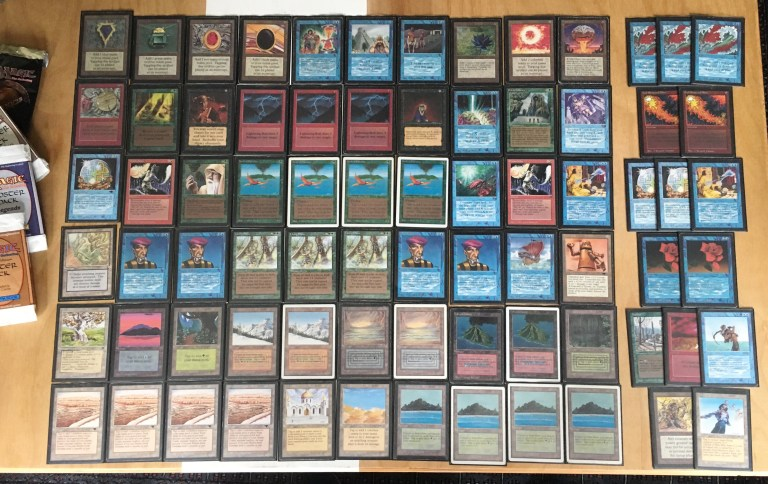
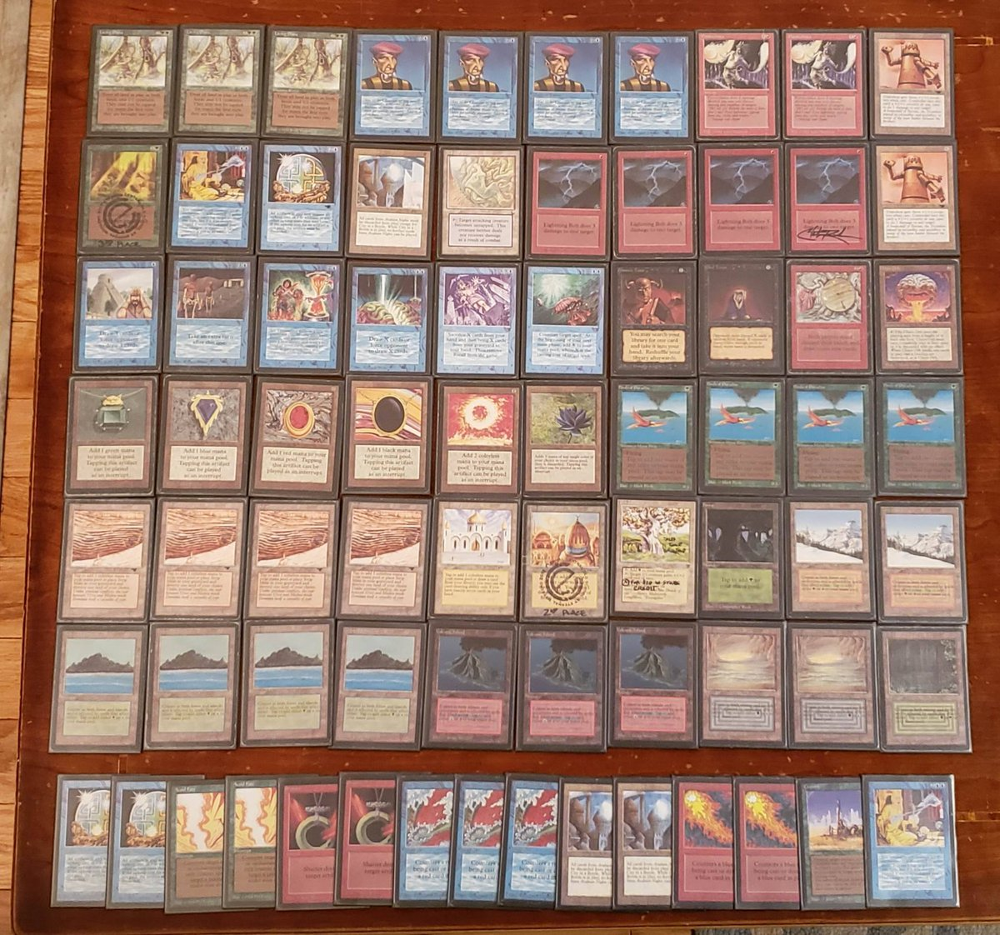
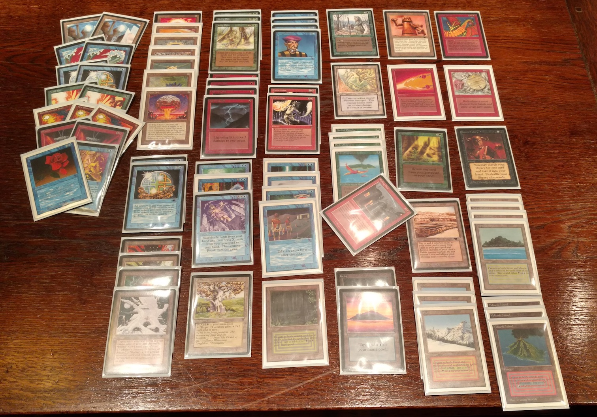
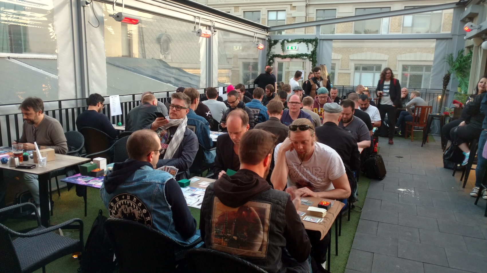
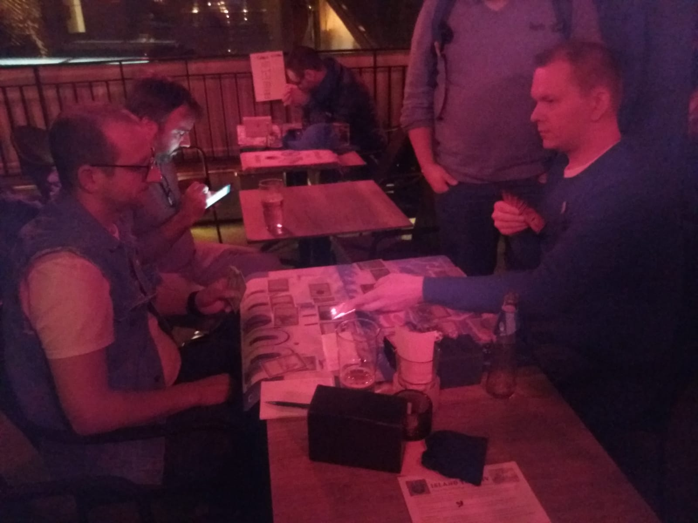

## Getting ready for the Urborg Feast

It was the day after the [Wizards' Tournament](../2019-04-25-wizards-tournament-2) at Gothenburg. We had been playing Magic for the past two days already, and admittedly the previous night's alpha tournament had been the main event of the week for us - or at least that is what we thought. The [eleventh n00bcon](http://www.n00bcon.com/) would take place at the Rotary Pub a couple of kilometers south, but none of our group had managed to get the invitation. So when I had heard a few months earlier that Christian Reinhard was organizing a side event for all of us without a slot at the main tournament, I was incredible excited and immediately registered us for the Urborg Feast. And what a tournament it turned out to be!

## Choosing the deck

I had been researching for a proper deck for several months. I had tried a few options locally, and about a month before the tournament, I had settled on two alternatives: an artifact toolbox with the Guardian Beast & Chaos Orb combo, and a Blue/White aggro-control deck with Savannah Lions and Serendib Efreets. I did some final testing and goldfishing, pitting one deck against the other. Although I really liked the artifact toolbox deck, my version of it was horrible against the aggro deck. It was simply too slow and clunky.  As the previous year's N00bcon had been won by a Blue/White aggro deck, I was expecting a good amount of similar decks in the tournament. I imagined playing the whole tournament against these fast and lean decks with my unwieldy artifact monstrosity. It felt that each match would be a grind; a lot of labour for very little fun. So the artifact deck had to go.

I was left with the Blue-White aggro deck, which, while powerful and quite fun to play, seemed too far into the spike end of the spectrum. So, I started to rethink my approach. I had for a good while wanted to play the [Living Plane](https://gatherer.wizards.com/Pages/Card/Details.aspx?multiverseid=1533). The idea of the deck is to, after casting Living Plane, to use creature destruction spells on the opponents lands and to eventually overwhelm him with your own lands. I had seen some deck lists with the [Drop of Honey](https://gatherer.wizards.com/Pages/Card/Details.aspx?multiverseid=944) as the other combo piece, but unfortunately I didn't have any of those. I had been playing around with the idea of using Prodigal Sorcerers and burn spells such as Lightning Bolts, Fireballs and Pyrotechnics instead as the other half of the lock. But I always thought that the deck would end up being too janky to actually succeed in a larger tournament. Until one evening, browsing the wonderful world of the internet I found these recent pictures:

*Living Plane by Eliot Davidoff [(source)](http://alltingsconsidered.com/2018/08/30/episode-27-eliot-davidoff-old-school-players-ball/).*

*Living Plane by Bryan Manolakos [(source)](https://twitter.com/bryanmanolakos/status/1079202213711544320).*

Apparently, Eliot Davidoff had first played his Living Plane deck in the [Old School Player's Ball 2018](https://www.eternalcentral.com/ospb2018/) to a seventh place after the swiss, and Bryan Manolakos, inspired by Eliot, had afterwards played his slightly tuned version to a 4-1 finish. This encouraged me to put the deck together and try it out before the tournament. I only got to play a couple of games, but the deck seemed to be an actual thing. And it was really fun to play!

*Easy Livin' - the deck I played at the Urborg Feast.*

Now that I had chosen a more fringe deck, I wanted to make a point about not trying to [spike](https://magic.wizards.com/en/articles/archive/making-magic/timmy-johnny-and-spike-2013-12-03) the tournament. So I decided to cut the [Library of Alexandria](https://gatherer.wizards.com/Pages/Card/Details.aspx?multiverseid=990) and [Mind Twist](https://gatherer.wizards.com/Pages/Card/Details.aspx?multiverseid=668) completely from the deck and the sideboard. After all, there would be a lot of old school gentlemen (people who agree to play without those two cards) at the tournament.

I must admit that I did include two [City in a Bottles](https://gatherer.wizards.com/Pages/Card/Details.aspx?multiverseid=904) and four [Energy Fluxes](https://gatherer.wizards.com/Pages/Card/Details.aspx?multiverseid=1038) in the 75 - if someone was going to be the spike in the tournament with a Blue-Red or Blue-White aggro, or one of the Atog decks, I wouldn't give them a completely free win.

## The Urborg Feast

On the day of the tournament, the sun was shining and it was exceptionally warm for the time of year. After the long winter, I was actually feeling a bit sad to spend such a great day indoors. But as we arrived at the pub and were pointed to join the others upstairs, we found out that there was a an open air bar at the pub - and that's where the tournament was! What a wonderful place to spend a day playing cards!

*The Urborg Feast - sunshine, card games and good times.*

We registered, played a practice game and a half, and chatted with some of the other players. But very soon it was time to start. And so, as Christian posted the pairings, I searched my table and sat down for the first match.

### Round 1

My first opponent for the day was Jan Eid, a local player. On the first game, I kept a hand, which would have been more typical for a Reg-Green aggro: a lot of ramp in the form of [Moxen](https://gatherer.wizards.com/Pages/Card/Details.aspx?multiverseid=633) and [Birds](https://gatherer.wizards.com/Pages/Card/Details.aspx?multiverseid=739), along with a couple of [Lightning Bolts](https://gatherer.wizards.com/Pages/Card/Details.aspx?multiverseid=806). At least the hand would be good against early game aggressive creatures, I thought. I play my birds, and pass the turn. The Jan goes into [Ritual](https://gatherer.wizards.com/Pages/Card/Details.aspx?multiverseid=651) and [Underworld Dreams](https://gatherer.wizards.com/Pages/Card/Details.aspx?multiverseid=1464). Oh dear, here we go.

Jan soon resolves a [Timetwister](https://gatherer.wizards.com/Pages/Card/Details.aspx?multiverseid=729), and, honestly having nothing better to do, I shoot the two Lightning Bolts at his direction. At this point, we were fairly even on life, but the situation was not looking that brilliant for me. Luckily, Jan's Twister draws me a [Demonic Tutor](https://gatherer.wizards.com/Pages/Card/Details.aspx?multiverseid=657). I consult the horned devil and with his advice, I cast the mighty [Shivan Dragon](https://gatherer.wizards.com/Pages/Card/Details.aspx?multiverseid=517) on the next turn. Jan does not have an answer in time, and I win the first game.

The next game, I sideboarded out my creature removal, but there was not much to bring in. Jan starts with a [Black Vise](https://gatherer.wizards.com/Pages/Card/Details.aspx?multiverseid=601), and in a couple of turns surprises me with a [Blood Moon](https://gatherer.wizards.com/Pages/Card/Details.aspx?multiverseid=1784)! I manage to cast a [Living Plane](https://gatherer.wizards.com/Pages/Card/Details.aspx?multiverseid=1533), which yields some raised eyebrows and careful reading of the card from my opponent. Alas, just a moment later, Jan [Mind Twists](https://gatherer.wizards.com/Pages/Card/Details.aspx?multiverseid=668) my hand away, including an [Ancestral Recall](https://gatherer.wizards.com/Pages/Card/Details.aspx?multiverseid=692) and two Bolts, which I am unable to launch at that moment. It's a drawn out, long game, that Jan eventually takes by attacking me with his lands. Talk about tasting one's own medicine.

In the third game I am again on the play. I draw a mediocre starting hand that I believe will not be able to defeat Jan's Underworld Dreams and Black Vises. So I mulligan, and draw six. I look at the cards in my hand: Volcanic Island, Mox Emerald, Mox Ruby, Birds of Paradise, Sol Ring and, Shivan Dragon! I almost jump up from my seat in excitement, but let out a slight harrumph instead. I start by playing all of my mana, shrug, and say "go". Jan eyeballs my battlefield for a few seconds before drawing his card for the turn. He plays a Ritual and an Underworld Dreams and passes the turn. I untap, draw a card, and tap my mana sources and cast the Shivan Dragon. After that, the game is over in three turns. Turn two Shivan is a tough play to beat. 1 - 0 for me.

### Round 2

On the second round, I am paired against Stone "Stein" Rock. He is playing what seems to be the classical Blue-Red aggro-control deck. Quite soon he plays a [Serendib Efreet](https://gatherer.wizards.com/Pages/Card/Details.aspx?multiverseid=939), but I land a [Maze of Ith](https://gatherer.wizards.com/Pages/Card/Details.aspx?multiverseid=1824). The Maze keeps his Efreet at bay, while his [Mishra's Factories](https://gatherer.wizards.com/Pages/Card/Details.aspx?multiverseid=1072) are effectively countered by my [Strip Mine](https://gatherer.wizards.com/Pages/Card/Details.aspx?multiverseid=1077) and my own Factories. The damage from his Efreet and my [Prodigal Sorcerers](https://gatherer.wizards.com/Pages/Card/Details.aspx?multiverseid=121) slowly ads up until his defeat becomes inevitable.

For the second game, I side in the two City in a Bottles and some [Red Elemental Blasts](https://gatherer.wizards.com/Pages/Card/Details.aspx?multiverseid=217) while taking out the Timetwister, [Wheel of Fortune](https://gatherer.wizards.com/Pages/Card/Details.aspx?multiverseid=828), [Fork](https://gatherer.wizards.com/Pages/Card/Details.aspx?multiverseid=797) and the [Tracker](https://gatherer.wizards.com/Pages/Card/Details.aspx?multiverseid=1779). I mulligan once to get a City in a Bottle in my starting hand. Stein's hand is apparently full of either Efreets or [Flying Men](https://gatherer.wizards.com/Pages/Card/Details.aspx?multiverseid=932), because for the longest time he only plays lands. I cast a Living Plane and blast his lands away with some [fireworks](https://gatherer.wizards.com/Pages/Card/Details.aspx?multiverseid=1587) and, eventually, I win by attacking with my lands and finishing with burn spells. 2-0 for me.

### Round 3

After the second round I texted home that the tournament has been great fun so far and I've been doing surprisingly well. I remember that at that point I felt that with whatever happened in the rest of the games, I had already had great success in winning two rounds already with my janky yet gentlemanly deck.

In any case, I went on to face Martin Skovgaard in the third round. He is playing an interesting variant of the Blue-White control with [Azure Drakes](https://gatherer.wizards.com/Pages/Card/Details.aspx?multiverseid=1472) and [Meekstones](https://gatherer.wizards.com/Pages/Card/Details.aspx?multiverseid=628). The first game is a long one, where we trade removal for the other one's creatures several times. My lone surviving Sorcerer pings Martin for a several turns until I am able to make my Shivan Dragon stick on the battlefield. With the Dragon looming overhead, a [Time Walk](https://gatherer.wizards.com/Pages/Card/Details.aspx?multiverseid=728) prompts my opponent to pick up his cards from the table.

The second game also turned into a long, tiresome battle. My creatures got removed and enchantments destroyed many times over. Eventually Martin casts a [Serra Angel](https://gatherer.wizards.com/Pages/Card/Details.aspx?multiverseid=270) that wins him the game.

The third game went to time without either of us having a realistic chance to win within the allotted extra turns. We have already finished and I'm actually quite content with the draw, when Martin comes back to talk to me. He and Christian propose that we could throw a die to determine the winner instead of taking the draw - as Christian says, at least the winner could have a chance to go all the way to the top 8. I'm initially perhaps a bit reluctant to leave the result to chance, but Martin especially seems keen to try his luck. So I agree to the die roll.

Martin picks up the die, gives it a good shake, and tosses it on the table. 1. I can't help but laugh at my good fortune as I also pick up the die and throw it - 2! Often it's not necessary to be good, just better than your counterpart. This time, just being a tiny bit luckier was all that was needed. 3-0.

### Round 4

By the time I was starting the fourth round, it seemed that people were getting interested in the deck I was playing, as more and more people were gathering around the table to spectate. I'm sure part of it was just playing at the top tables at this point, but I genuinely think that the games were interesting to watch. At times, the deck I played allowed for quite intricate lines of play, and some really epic turns. But more on that later.

On the fourth round, I played with Daniel Imfeld. Like the previous opponents, he was a thoroughly nice person. He was also a very skillful player and I enjoyed our games a lot. Even more than with the other opponents, it seemed that our turns were a constant puzzle, on both sides of the table. The first game is again a long one, where I capture his Serendib Efreet in the Maze of Ith and slowly ping him with my Sorcerers until I get the eventual win.

The second game was epic. A long battle, where I cast Living Plane at least twice. One time, I have the Living Plane on the table with several lands and a [Black Lotus](https://gatherer.wizards.com/Pages/Card/Details.aspx?multiverseid=600). At this point, Daniel knows that I am playing Pyrotechnics in my deck. I sack the Lotus for red-red-red, prompting Daniel to activate his [Chaos Orb](https://gatherer.wizards.com/Pages/Card/Details.aspx?multiverseid=603) to destroy my Living Plane. I then continue to tap down three lands and cast a Shivan Dragon. Daniel seems momentarily quite defeated by this turn of events. However, in his favor I have to say that I was actually also holding the Pyrotechnics in my hand. But, before I get to celebrate the victory, Daniel sends my dragon to lands unknown with his [Swords to Plowshares](https://gatherer.wizards.com/Pages/Card/Details.aspx?multiverseid=869).

The time is running out and we start our extra turns. Both of us have amassed huge amounts of lands and other mana sources on the battlefield, but all the threats have been neutralized. On the last of my turns, it seems that there is very little chance for either of us to win from that board state, so I decide (against better judgment, most likely) to spice things up. I start casting Timetwisters and Wheel of Fortunes, launching whatever burn I manage to get with each new draw directly at Daniel. Finally, I cast a lethal Pyrotechnics that gets countered by Daniel, after which I have just enough mana to [Regrowth](https://gatherer.wizards.com/Pages/Card/Details.aspx?multiverseid=767) a Lightning Bolt and cast it for the win. 4-0.

### Round 5

As the fifth round was starting, the sun had already set and it was starting to get cold. I was actually feeling quite chilly, perhaps due to being in the sun the whole day, and perhaps partly because of the excitement. Maybe it was this physical distraction, or just the fatigue from playing intensively for so many hours, but my luck was about to turn.

I sat across the table from Christian Reinhard, the organizer of the tournament. I actually had no idea what kind of deck he was playing - turns out Troll Disco. The first game, I was definitely playing too conservatively in the beginning. I remember that I had the chance to cast a Living Plane and Pyrotechnics in quite an early stage of the game. But, I was staring at the pair of blue mana sources that Christian kept untapped for a bit too long and lost the window of opportunity. Eventually I did cast the Living Plane - when Christian had one of his [Disks]() in play. This was a meditated, if not calculated, risk that did not pay off well. I believed I was in a better position to recover from the total annihilation that ensued, but it was in fact Christian that got the faster restart and won the game.

On the second game, I was pretty much the underdog. I was already down to 4 or 5 life, and Christian had his Sedge Troll and several Factories out against my three Sorcerers. I tutored for the Shivan, hoping to finish the game quickly. But, as the dragon was about to enter the table, it got countered by a [Blue Elemental Blast](https://gatherer.wizards.com/Pages/Card/Details.aspx?multiverseid=694). As Christian later pointed out, tutoring for a Living Plane might have been the correct play at that point. It would have locked him out of his lands, at least. Without seeing the complete game state its impossible to know for sure after the fact. In any case, the Shivan did not save me this time. 4-1 for me.

### Round 6

On the sixth round, I sat across Jesper Eising. He is an awesome magic artist, an old school afficionado, and a terrific person to boot. Unfortunately, the games against him were the least interesting in the whole tournament. I basically got steamrolled.

In the first game, I mulligan into a sketchy hand, but keep it because it has some early interaction in the form of Lightning Bolts. Unfortunately, unknown to me, Jesper is playing artifact aggro. Pretty soon a [Triskelion](https://gatherer.wizards.com/Pages/Card/Details.aspx?multiverseid=1029) hits the table. By now I've got three bolts in my hand, but only one red mana source. Then, next turn, a [Tawnos's Coffin](https://gatherer.wizards.com/Pages/Card/Details.aspx?multiverseid=1024) comes in. Oh dear... Eventually Jesper grows the Triskelion into an 18/18 (killing one of my Birds in the meantime) and shoots me for lethal.

In the second game, I am again forced to mulligan aggressively. I manage to play an Energy Flux, but that quickly gets [Disenchanted](https://gatherer.wizards.com/Pages/Card/Details.aspx?multiverseid=847). I play another one, but that alone is not enough to stop Jesper's attacking [Su-Chis](https://gatherer.wizards.com/Pages/Card/Details.aspx?multiverseid=1022). 4-2.

Although I had lost the last two matches, I was very happy with the results and even happier with how exciting the games had been. And quite honestly, I was ready to relax and watch the games of the top 8 players.

### Top 8

So I went to hear the top 8 be announced. Obviously there was a fair amount at stake here. The winner of the swiss portion of the tournament would go directly to the top 8 of N00bcon, the main tournament that was being played in parallel at the Rotary Pub. And the winner was... Jesper Eising! Well deserved, I thought. At the second place was Christian Reinhard. At least I had lost to the best two in the tournament, so I was feeling a bit better about those matches, too.

As I was giving applause to the people in the top 8, I suddenly heard Christian shout out my name. Come again? I was in the top 8! Incredible! The games would go on!

In the semi-semifinals, I again met Daniel. Just as last time, we played two long, but interesting games. The details of those late-night games are a blur, but I remember that in the first game, I eventually won after casting a Timetwister, [Control Magiccing]() the Serra Angel Daniel drew off my Twister, casting a Time Walk, attacking with the Serra and my Factories, and finishing it all off with two Lightning Bolts. The second game I eventually won after a long grind by attacking twice with a Shivan Dragon and pumping it with lands and Birds. 2-0 in games and on to the semifinals.

*The top 8 matches were played in the glow of infrared heaters.*

In the semifinals, I met Martin. The same guy that lost the die roll against me in the third round of the tournament. That's justice in my book!

Sadly, I got a little bit more of justice than I would have liked. In the first game I struggled with mana, and what removal I could cast got countered. So Martin's Drakes and Factories beat me over several turns. In the second game Martin had an active [Library]() for several turns before I happened to draw a Strip Mine. Soon after he cast a Timetwister, tutored for a Mind Twist, forcing me to discard a hand full of lethal burn. Once again, his Factories and Drakes came at me until I was defeated.

Martin eventually beat Christian in the finals - a well deserved victory. Martin played very well and almost lost his place at the top 8 because of the unlucky die roll. Which of course, in the end, could have been a blessing in disguise.

## Conclusions

What a magnificent tournament it was! And to finish in the top 4 among almost 50 players was simply awesome. Granted, a fair bit of luck was involved, but the deck I played seems to be the real deal. Some of the success was due to successful metagame evaluation - the deck seems really strong against the Blue-Red and Blue-White aggro decks. It would have been interesting to play against an Atog deck, just to see what kind of matchup that would have been. I imagine it would not be terrible.

As for the deck itself, there are several changes that I would make after seeing it in action.
- Add Fireball, take out Fork. The Fork, with its RR mana cost was pretty much useless. I did add it half-jokingly for its awesomeness factor, but I think having the opportunity to cast a huge Fireball would easily top that. For effectiveness, Fireball is clearly better.
- Add Sylvan Library, take out Tracker. The Tracker is more fun(ny) than useful, and Sylvan Library seems very good in many matchups. And it's an interesting card.
- Add a second [Falling Star](https://gatherer.wizards.com/Pages/Card/Details.aspx?multiverseid=1571), replacing a Pyrotechnics, or perhaps put it into the sideboard. With the [rules change](http://oldschool-mtg.blogspot.com/2019/05/banned-restricted-update-2019.html), Falling Star is even better than before. Plus, I still haven't destroyed lands with the Falling Star in an actual tournament.
- Take out the [Pendelhaven](https://gatherer.wizards.com/Pages/Card/Details.aspx?multiverseid=1703) in favor of a basic [Forest](https://gatherer.wizards.com/Pages/Card/Details.aspx?multiverseid=588). The small advantage from the occasional activation of the Pendelhaven does not seem worth it, when even a single Forest might save the game against Blood Moon.

Additionally, I could consider swapping the Triskelion for a second Shivan Dragon. The dragon was simply that good. Also taking out the Energy Fluxes in favor of Shatters could be considered. The Energy Fluxes are no good against Mishra's Factories, which seemed to be a bit of a problem at times.

As one last remark, the Living Plane deck was incredibly fun to play. It can go in so many directions and once it gets rolling, it creates really epic board states and plays. It does suffer a bit from playing four colors but, perhaps, the [new London mulligan rule](https://magic.wizards.com/en/articles/archive/news/london-mulligan-2019-06-03) will alleviate that problem. Whether or not the deck benefits from the mulligan rule change in relation to other decks, I do not know. But honestly, that is beside the point. The main reason to play this deck is for fun, and I suspect the London mulligan rule can only make this deck more enjoyable to play.
