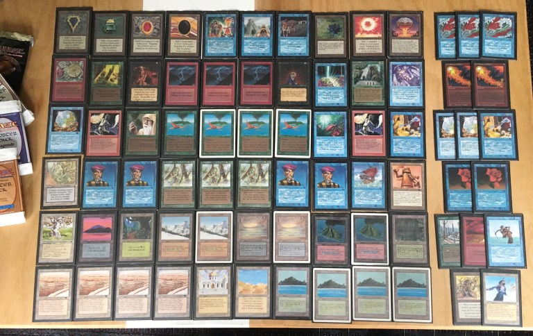

## Getting ready for the Urborg Feast

It was the day after the [Wizards' Tournament](../2019-04-25-wizards-tournament-2) at Gothenburg. We had been playing Magic for the past two days already, and admittedly the previous night's alpha tournament had been the main event of the week for us - or at least that is what we thought. The [eleventh n00bcon](http://www.n00bcon.com/) would take place at the Rotary Pub a couple of kilometers south, but none of our group had managed to get the invitation. So when I had heard a few months earlier that Christian Reinhard was organizing a side event for all of us without a slot at the main tournament, I was incredible excited and immediately registered us for the Urborg Feast. And what a tournament it turned out to be!

But before discussing the tournament itself, I'll take a step back to the weeks before the tournament.

## Choosing the deck

I had been researching for a proper deck for several months. I had tried a few options locally, and about a month before the tournament, I had settled on two alternatives: an artifact toolbox with the Guardian Beast & Chaos Orb combo, and a Blue/White aggro-control deck with Savannah Lions and Serendib Efreets. I did some final testing and goldfishing, pitting one deck against the other. Although I really liked the artifact toolbox deck, my version of it was horrible against the aggro deck. It was simply too slow and clunky.  As the previous year's N00bcon had been won by a Blue/White aggro deck, I was expecting a good amount of similar decks in the tournament. I imagined playing the whole tournament against these fast and lean decks with my unwieldy artifact monstrosity. It felt that each match would be a grind; a lot of labour for very little fun. So the artifact deck had to go.

I was left with the Blue-White aggro deck, which, while powerful and quite fun to play, seemed too far into the spike end of the spectrum. So, I started to rethink my approach. I had for a good while wanted to play a Living Plane deck. I had seen some deck lists with the Drop of Honey as the other combo piece, but unfortunately I didn't have any of those. I had been playing around with the idea of using Prodigal Sorcerers and burn spells such as Lightning Bolts, Fireballs and Pyrotechnics instead as the other half of the lock. But I always thought that the deck would end up being too janky to actually succeed in a larger tournament. Until one evening, browsing the wonderful world of the internet I found these recent pictures:

*Living Plane by Eliot Davidoff [(source)](http://alltingsconsidered.com/2018/08/30/episode-27-eliot-davidoff-old-school-players-ball/).*

*Living Plane by Bryan Manolakos [(source)](https://twitter.com/bryanmanolakos/status/1079202213711544320).*

Apparently, Eliot Davidoff had first played his Living Plane deck in the [Old School Player's Ball 2018](https://www.eternalcentral.com/ospb2018/) to a seventh place after the swiss, and Bryan Manolakos, inspired by Eliot, had afterwards played his slightly tuned version to a 4-1 finish. This encouraged me to put the deck together and try it out before the tournament. I only got to play a couple of games, but the deck seemed to be an actual thing. And it was really fun to play!

*Easy Livin' - the deck I played at the Urborg Feast.*

Now that I had chosen a more fringe deck, I wanted to make a point about not trying to [spike](https://magic.wizards.com/en/articles/archive/making-magic/timmy-johnny-and-spike-2013-12-03) the tournament. So I decided to cut the Library of Alexandria and Mind Twist completely from the deck and the sideboard. After all, there would be a lot of old school gentlemen (people who agree to play without those two cards) at the tournament.

I must admit that I did include two City in a Bottle and four energy fluxes in the 75 - if someone was going to be the spike in the tournament with a Blue-Red or Blue-White aggro, or one of the Atog decks, I wouldn't give the a completely free win.

## The Urborg Feast

On the day of the tournament, the sun was shining and it was exceptionally warm for the time of year. After the long winter, I was actually feeling a bit sad to spend such a great day indoors. But as we arrived at the pub and were pointed to join the others upstairs, we found out that there was a an open air bar at the pub - and that's where the tournament was! What a wonderful place to spend a day playing cards!

We registered, played a practice game and a half, and chatted with some of the other players. But very soon it was time to start. And so, as Christian posted the pairings, I searched my table and sat down for the first match.

### Round 1

My first opponent for the day was Jan Eid, a local player. On the first game, I kept a hand, which would have been more typical for a Reg-Green aggro: a lot of ramp in the form of [Moxen](https://gatherer.wizards.com/Pages/Card/Details.aspx?multiverseid=633) and [Birds](https://gatherer.wizards.com/Pages/Card/Details.aspx?multiverseid=739), along with a couple of [Lightning Bolts](https://gatherer.wizards.com/Pages/Card/Details.aspx?multiverseid=806). At least the hand would be good against early game aggressive creatures, I thought. I play my birds, and pass the turn. The Jan goes into [Ritual](https://gatherer.wizards.com/Pages/Card/Details.aspx?multiverseid=651) and [Underworld Dreams](https://gatherer.wizards.com/Pages/Card/Details.aspx?multiverseid=1464). Oh dear, here we go.

Jan soon resolves a [Timetwister](https://gatherer.wizards.com/Pages/Card/Details.aspx?multiverseid=729), and, honestly having nothing better to do, I shoot the two Lightning Bolts at his direction. At this point, we were fairly even on life, but the situation was not looking that brilliant for me. Luckily, Jan's Twister draws me a [Demonic Tutor](https://gatherer.wizards.com/Pages/Card/Details.aspx?multiverseid=657). I consult the horned devil and with his advice, I cast the mighty [Shivan Dragon](https://gatherer.wizards.com/Pages/Card/Details.aspx?multiverseid=517) on the next turn. Jan does not have an answer in time, and I win the first game.

The next game, I sideboarded out my creature removal, but there not much to bring in. Jan starts with a [Black Vise](https://gatherer.wizards.com/Pages/Card/Details.aspx?multiverseid=601), and in a couple of turns surprises me with a [Blood Moon](https://gatherer.wizards.com/Pages/Card/Details.aspx?multiverseid=1784)! I manage to cast a [Living Plane](https://gatherer.wizards.com/Pages/Card/Details.aspx?multiverseid=1533), which yields some raised eyebrows and careful reading of the card from my opponent. Alas, just a moment later [Mind Twists](https://gatherer.wizards.com/Pages/Card/Details.aspx?multiverseid=668) my hand away, including an [Ancestral Recall](https://gatherer.wizards.com/Pages/Card/Details.aspx?multiverseid=692) and two Bolts, which I am unable to launch at that moment. It's a drawn out, long game, that Jan eventually takes by attacking me with his lands. Talk about tasting one's own medicine.

In the third game I am again on the play. I draw a mediocre starting hand that I believe will not be able to defeat Jan's Underworld Dreams and Black Vises. So I mulligan, and draw six. I look at the cards in my hand: Volcanic Island, Mox Emerald, Mox Ruby, Birds of Paradise, Sol Ring and, Shivan Dragon! I almost jump up from my seat in excitement, but let out a slight harrumph instead. I start by playing all of my mana, shrug, and say "go". Jan eyeballs my battlefield for a few seconds before drawing his card for the turn. He plays a Ritual and an Underworld Dreams and passes the turn. I untap, draw a card, and tap my mana sources and cast the Shivan Dragon. After that, the game is over in three turns. 1 - 0.

### Round 2
