# KaamosCup II

[KaamosCup II](../2019-08-18-announcing-kaamoscup-2) is finally in the books! Following last year's [KaamosCup 2018](../2018-12-17-kaamoscup), we organized the second Old School tournament in what, I suppose, now has a become a tournament series! On November 2, 15 wizards gathered into a pub in Helsinki to sling spells and drive away the [coming darkness](https://en.wikipedia.org/wiki/Polar_night), at least for one night.

We had players from several of Finland's largest cities and also two special guests from across the border, Saint Petersburg. Viacheslav and Elena had contacted me via messenger several months before the tournament and we were extremely happy that they could make it to our small tournament. In addition to them, we had players from Turku, Jyväskylä and Pori, as well as locals from Helsinki and Espoo. Out of the 15 players, 5 were returning players from KaamosCup 2018. So we were able to attract 10 new players! Some of them were new acquaintances, some of them I'd played with previously over the past years. And sure enough, we were glad to welcome both old and new faces. And, as it always seems to turn out among the Old School crowd, everybody was more than friendly and enjoyed playing the games with the beautiful old cards.

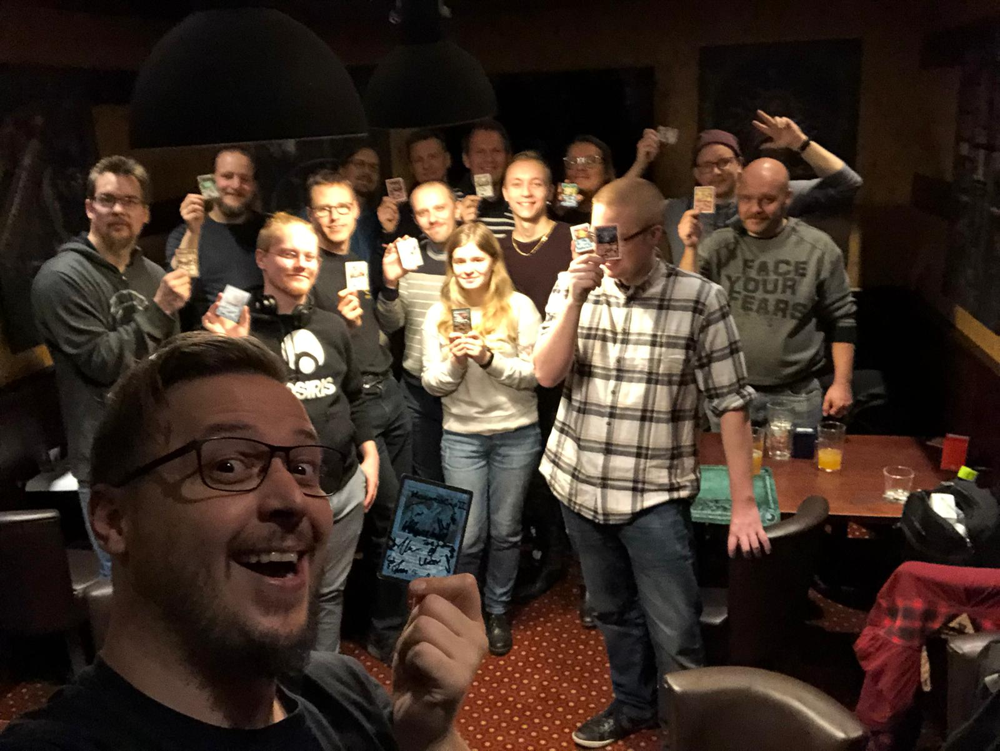

*The participants of KaamosCup II, with the best unpowered player Erkka proudly holding his well deserved Merfolk.*

## Games

We played a main tournament of 93/94 Old School with the gentlemen's addendum, as well as an after-event of 93/94 60-card Highlander (for the rules, see [here](../2019-08-18-announcing-kaamoscup-2)). In this post I'm mostly going to write about the main event, as the highlander part was mostly freeform, with a handful of people battling against each other without any organized match structure.

In previous 93/94 tournaments, I had played the Living Plane combo twice (at the Urborg Feast in Gothenburg and at the Ivory Cup IV in Stockholm). I really liked the deck and even had decent success with it. However, while the deck is really fun, it can also be really slow to play. And those knowing me, they will be well aware that I'm not the fastest player by any stretch, with any deck. So, for the KaamosCup II, I wanted to play something potentially a lot faster and more linear, just to make some time for all the organizer stuff.

At the same time, I also wanted to try something a little bit different. I had thought about playing the Blue-White Aggro, which had been successful in N00bcon X, but that felt a bit ordinary, even dull. The other option I had considered was the Atog, which has done well in many tournament, but again that felt as way too far on spike end of the spectrum. So, why not mix the two? The Atog deck, despite it's name, relies mostly on removal, burn, and damage-dealing artifacts. If you keep the artifacts, replace Shatters with Disenchants, the red burn with Savannah Lions and Swords to Plowshares, and Atogs with Serra Angels (almost the same casting cost, right...) that's surely something that could work, right? And vice versa, take the Counterspells out of the Blue-White Aggro and replace them with the artifacts, and you've got a deck.

Mind you, I was not actually trying to optimize the Atog deck or the Lion deck. Quite the opposite. I was pretty sure that the bastardized version I had put together would be overall worse than either of its parents, but at least it would be different. And, true to my habits, this tournament would be the first I'm playing the deck, so I was sure there would be *learning opportunities* ahead.

We played a total of four rounds of swiss as the main tournament. We had asked each participant to bring an old school legal card for a prize pool, out of which the tournament prizes would be handed out. Basically, everybody brings one, everyone gets one. We didn't think playing a top 4 or 8 would add anything to the casual atmosphere of the tournament, and in fact would just delay the highlander games that would start after the main event.

I started the tournament playing against Jami, a newcomer to the Helsinki old school scene, who was playing a super aggressive mono red Goblin deck. He was wielding a lot of burn (obviously Detonates, too) and very few artifacts or enchantments, which made some of my main deck card choices a bit suspect. As in, all of my pinging artifacts and Disenchants. I remember that the first game was pretty close, but I managed to get the win by a few life points thanks to my bigger creatures. For the second game, I sideboarded out some of the less useful stuff in favor of more Serra's, Blue Elemental Blasts, COP: Red, etc., for a relatively easy win.

The second game I played against Valtteri, also a new local acquaintance. Awesome to start the tournament by meeting the new local players! Valtteri was playing another very aggressive deck, the Mark Rosewater-esque Blue-Green Berserk Aggro. I had a relatively slow start in the first game, and simply couldn't keep up with the assault. Again, I sided out some of the artifacts (which by now seemed to start look quite the burden in the main deck), and put in all the creature removal and the two City in a Bottle. The second game was kind of evenly matched for a long while, but eventually I outmatched my opponents deck. In the third game, I started with a completely absurd hand, and proceeded to play two Moxen, a Sol Ring and a land into Time Walk and Timetwister. It wasn't long until I overpower-nine'd my opponent, I guess ultimately casting a couple of Serra Angels. Sometimes you end up on the better side of the variance, and with the fully powered old school decks that upswing from the mean can be huge. But that's really one of the special characteristics of old school.

On the third match, I was facing Hannu, an old friend I've known since elementary school and who recently got back into Old School. He was playing a very controlling Blue-White Flyers deck. It should have been a decent matchup with all of my control deck hate, but I eventually lost the match 1-2. We had two very interesting games, one of which I won and the other one I lost. Hannu was able to counter my Armageddon, which probably would have been lethal. I really wished I'd had one or two more in the side, or even in the main deck. One of the oversights one makes when entering a tournament without testing the deck first. The third game, I got a horrible draw and got steamrolled very shortly by Hannu's Serra Angel.

For the fourth and final match, I faced Jyri, another newcomer to the present Old School scene. But he was playing a fully powered the Deck, and I think had some background in competitive magic from back in the days. At least he seemed to be a very competent player. I won our first game after a fairly long exchange of threats and answers by depleting Jyri of Counterspells before casting my Armageddon. That resulted in an immediate scoop on his part. The second game was also a very drawn out exchange, with Jyri prolonging the game by finding answers to my threats just in time. I had made a slight judgment error concerning his based on the first game. I saw that he was playing several Serra Angels in the main deck, and did not see any red spells. Therefore I sided in two Control Magics (while siding out Swords to Plowshares) instead of Blue Elemental Blasts. I probably would have won the second game if I had brought in the Blue Elemental Blasts instead, as I was sitting with two useless Control Magics in my hand while Jyri finished me with Fireball-Regrowth-Fireball. After the two long games we did not have time for a third one, so we ended up in a draw.

So, 2-1-1 after four games. The wins were against unpowered aggro decks, and losses/ties against Blue-White-based control decks. I think a better player definitely could have won either of those matches with the deck I had, but I was very happy with how it turned out. I had wished to encounter some of the Black midrange decks I expected the locals to bring to tournament, as they are always extremely fun and challenging to play against. They did in fact bring those decks (see Martti's, Erkka's, and Antti's decks) but I just didn't get paired with any of them. Next time, I think we may need more rounds.

## Results

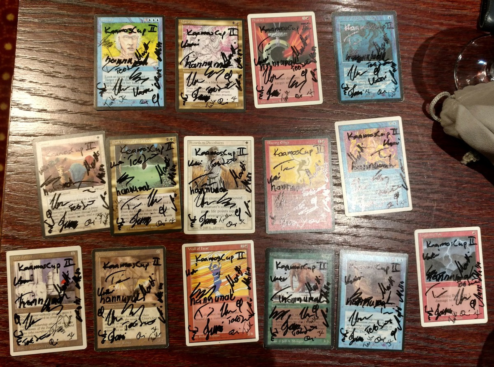

*The KaamosCup II prize pool.*

After the four rounds, we tallied the scores and gathered around the table with the prizes. But before starting to hand them out, we needed to figure out the order. You see, at KaamosCup II, to emphasize the casualness of the tournament, we handed out two special prizes first. The first pick from the prize pool would go to the most creative deck (also otherwise known as the crowd favorite) while the second pick would go to the best unpowered deck.

It was quite straightforward to determine the best unpowered deck. A quick raise of hands and consultation of the score card revealed that Erkka, with his Dead Guy Ale pile had finished *second* in the whole tournament without using a single power 9 card in his deck. Well done!

The decision of the most creative deck would go to a vote after two candidates had been nominated. These were Jami's Goblins and Martti's Erhnam Void (or the "pile where tried to put in as many beta cards as I could", as he also explained). The players presented their decks and described the though process that had gone into creating them. The participants voted for their favorite one and Martti's Erhnam Void narrowly beat Jami's goblin by a 7 to 5 vote. So, congrats to Martti's Erhnam Void for being the crowd favorite!

Martti would pick his prize first (I think he got a Dead Heart of the Wood to match his deck's colors), followed by Erkka (who got a Beta Merfolk of the Pearl Trident). We then honored our international visitors Elena and Viacheslav by giving them the next picks. I think they got at least a War Mammoth to go home with. Then we proceeded to pick the rest of the prizes in the order of finish.

Hannu was to only one to go undefeated and got a well deserved first place in the tournament. Congratulations to Hannu! He got a nice Lightning Bolt for winning the tournament.

For my 6th place finish (hey, it's in the top 8, right!) I chose an Arabian Nights Camel. It will no doubt prove to be a vital part of my future banding weenie deck.

The final standings of the tournament are below:

| Player | Points | Deck | Remarks |
| -- | -- | -- | -- |
| Hannu | 10 | Blue-White Flyers | |
| Erkka | 9 | Dead Guy Ale | Best Unpowered |
| Tero | 9 | Pink Weenie | |
| Tuukka | 8 | Titania's 'Geddon | |
| Jyri | 8 | The Deck | |
| Timo | 7 | Patriot Aggro | Worst Fully Powered# |
| Antti | 7 | Netherworld Dreams| |
| Ville | 6 | 5 Color Mahamoti Control | |
| Valtteri | 6 | Blue-Green Berserk Aggro | |
| Jami | 6 | Mono Red Goblins | Best Mono-Colored# |
| Olli | 4 | Mono White| |
| Jarno | 3 | Mono Black | |
| Elena | 3 | Erhnam Burn 'em | |
| Martti | 3 | Erhnam Void| Crowd Favorite |
| Viacheslvav | 3 | Dead Guy Ale | |

*# We didn't actually have awards for these categories, but perhaps we should.*

## Decks

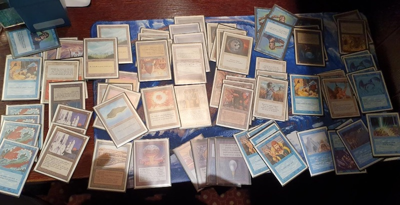

*Hannu: Blue-White Flyers.*

---

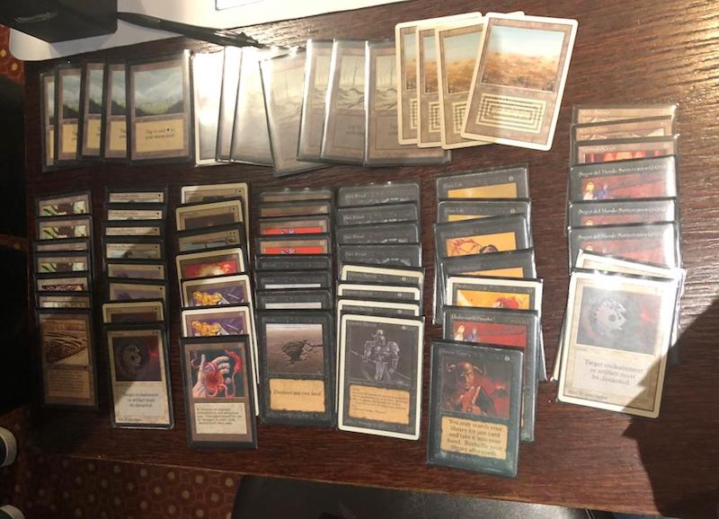

*Erkka: Dead Guy Ale.*

---

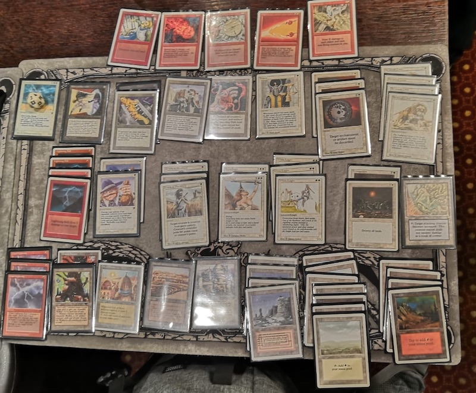

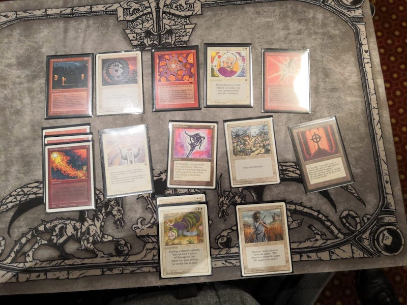

*Tero: Pink Weenie.*

---

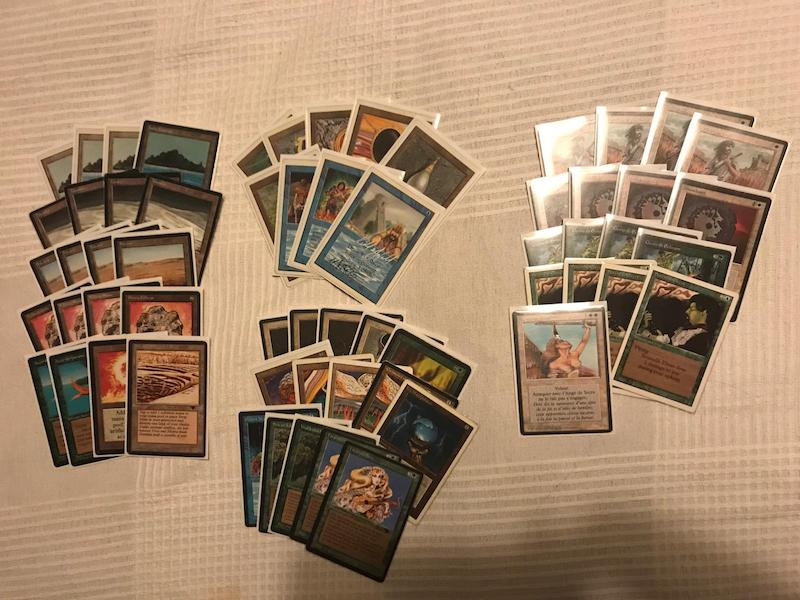

*Tuukka: Titania's 'Geddon.*

---

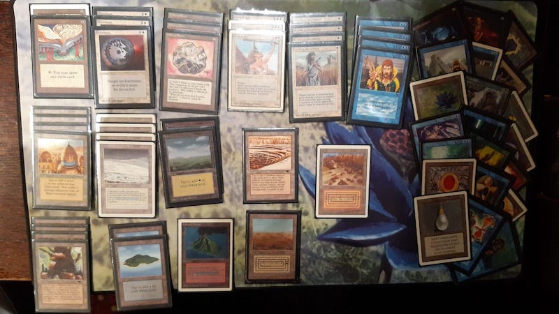

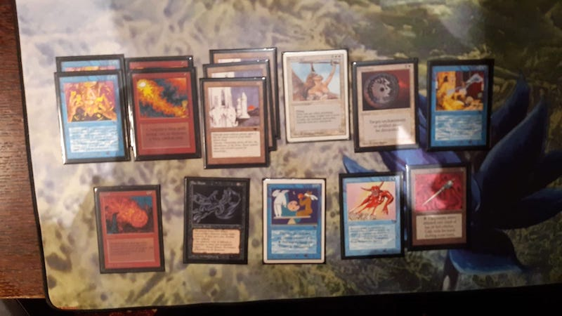

*Jyri: The Deck.*

---

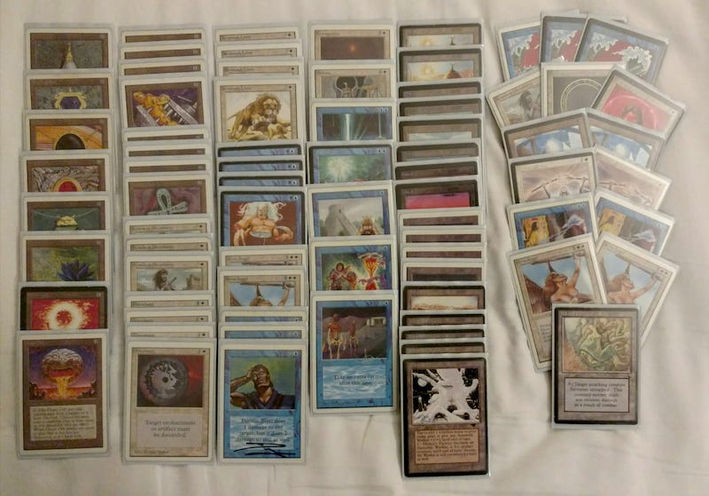

*Timo: Patriot Aggro.*

---

*Antti: Netherworld Dreams.*

---

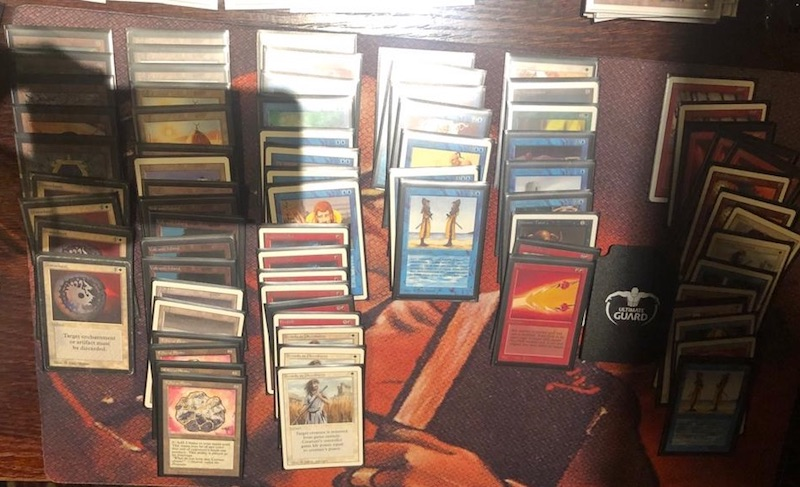

*Ville: 5 Color Mahamoti Control.*

---

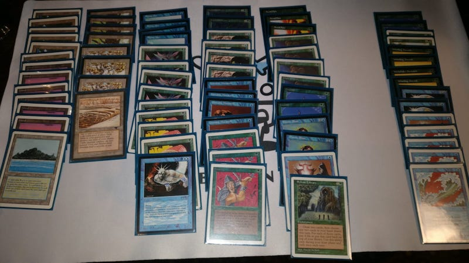

*Valtteri: Blue-Green Berserk Aggro.*

---

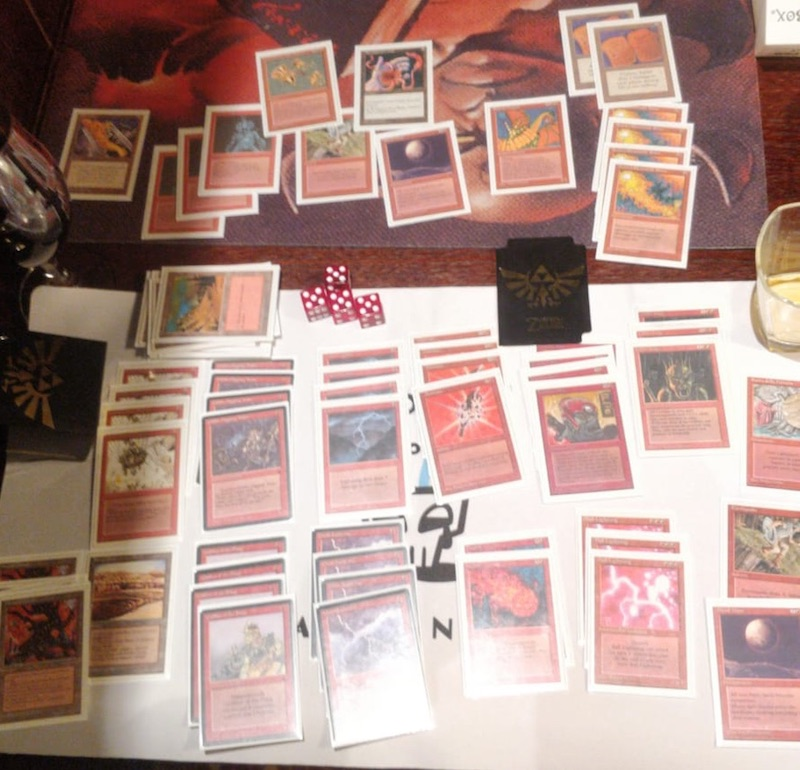

*Jami: Mono Red Goblins.*

---

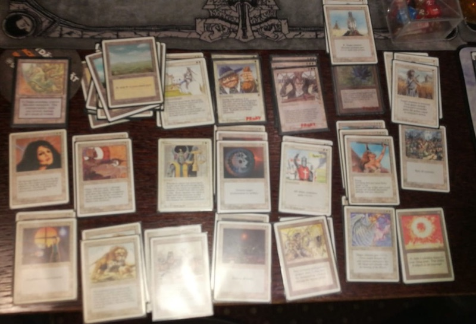

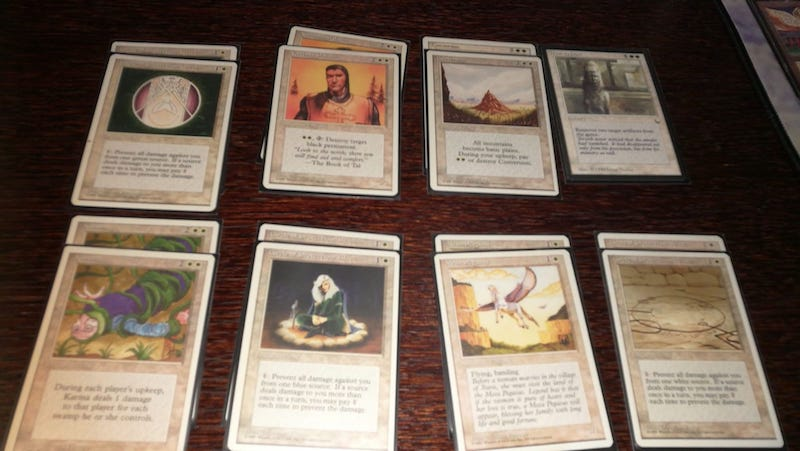

*Olli: Mono White.*

---

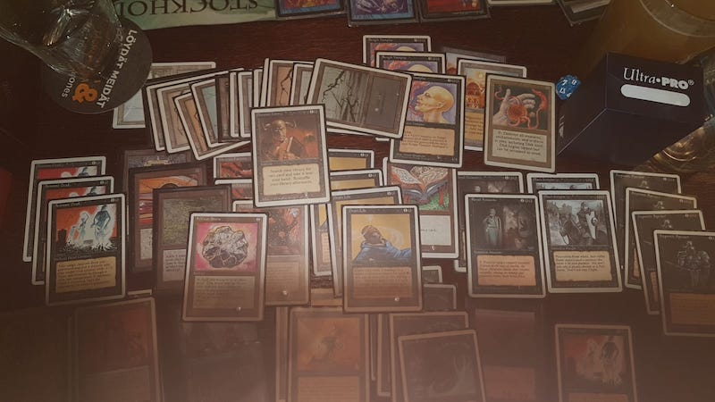

*Jarno: Mono Black.*

---

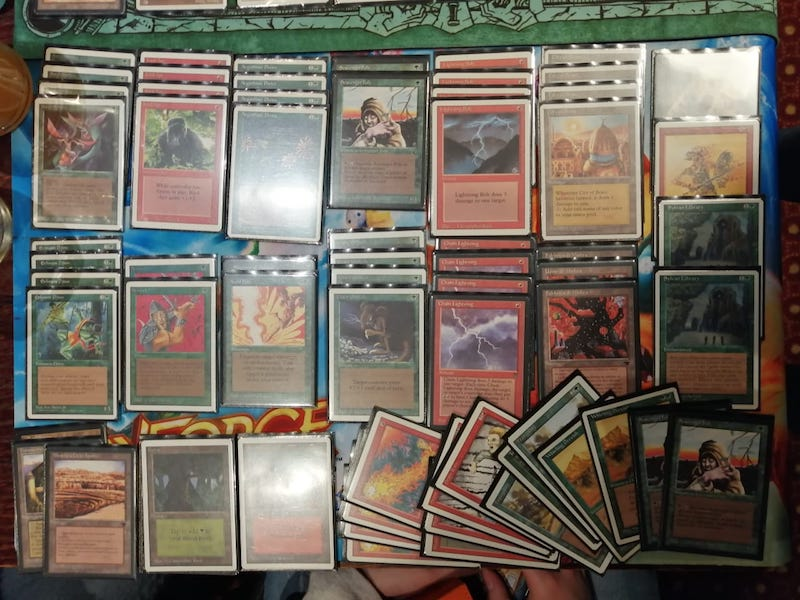

*Elena: Erhnam Burn 'em.*

---

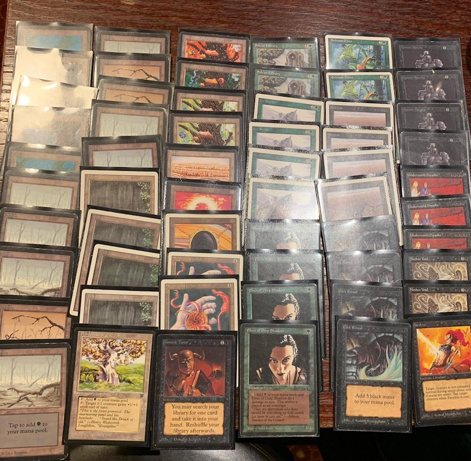

*Martti: Erhnam Void.*

---

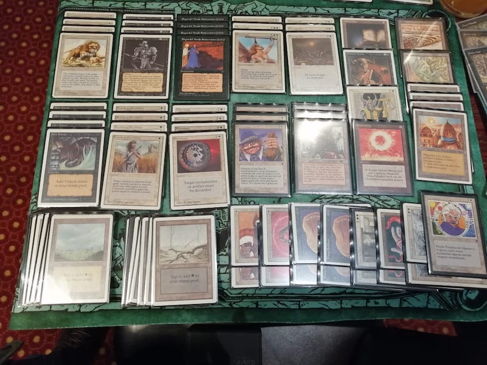

*Viacheslav: Dead Guy Ale.*

## Highlander afterparty

After the main tournament, we played casual games of [60-card 93/94 Highlander](../2019-08-18-announcing-kaamoscup-2). I think we had five players with Highlander decks (myself, Tero, Hannu, Tuukka and Jyri). I had put together a rather durdly sacrifice-themed control deck with cards such as [Preacher](https://gatherer.wizards.com/Pages/Card/Details.aspx?multiverseid=1816), [Old Man of the Sea](https://gatherer.wizards.com/Pages/Card/Details.aspx?multiverseid=937), [Diamond Valley](https://gatherer.wizards.com/Pages/Card/Details.aspx?multiverseid=987), [Fallen Angel](https://gatherer.wizards.com/Pages/Card/Details.aspx?multiverseid=1437), and a lot of removal.

*93/94 Highlander with the main event winner Hannu.*

I played with all the other players, winning some games and losing some. I managed to fire of some of my convoluted prison combos a few times, which of course ended up with me winning those games. Other times I got run over by faster decks (especially Jyri's War Mammoth...). One memorable victory involves me taking Tuukka's [Cyclopean Tomb](https://gatherer.wizards.com/Pages/Card/Details.aspx?multiverseid=608) (which is an absolute house in the format!) with a [Steal Artifact](https://gatherer.wizards.com/Pages/Card/Details.aspx?multiverseid=726). This kept me in the game and we ended up going to a top-deck battle for quite a long time. I think my deck had a higher threat density (or perhaps I just got more lucky) and eventually I drew into enough threats to win the game.

93/94 Highlander seems to be quite a fun format, and I will definitely want to play more games and brew more decks. A huge part of the format seems to be coming up with new decks, as complete deck lists are pretty much non-existent in the internet. Which is a great change from almost all other formats! I do think, though, that Highlander it would benefit much from a wider card pool. Perhaps next time we could try including Fallen Empires, Homelands, Ice Age, and perhaps Alliances. Or maybe the new [Scryings expansion](http://oldschool-mtg.blogspot.com/2019/11/scryings.html) that is currently in its spoiler season.

## Conclusions

Huge thanks to all the participants! We grew from last years 9 players to 15, thanks to both the regulars faithfully participating and also people spreading the word to new participants. Special thanks to Viacheslav and Elena for making the trek across to border to our tournament.

I'm certain there will be KaamosCup III. I hope to see all of you there again next year!
