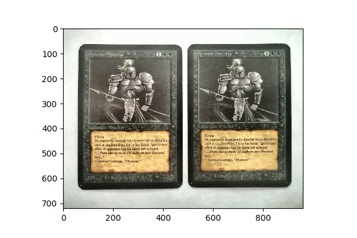
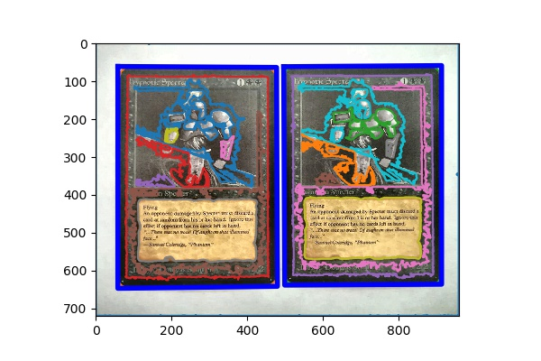

# How to detect and recognize MTG cards with Python?

Happy new year!

The second half of last year was very busy time for me personally, with few updates to this blog. Despite the lack of posts, I've had several bigger and smaller projects brewing under the lid. I'll kick off the year by sharing one of them: Magic Card Detector, a Python program that detects and identifies MTG cards from images.

Already about a year ago, as I was working on the simulations of the [Black Lotus and Timetwister decks](../2019-02-11-the-braintwist), I got the idea to do MTG card detection and identification from images. There are of course several apps out there that already do that, but I was interested in knowing *how* they do that. I was vaguely familiar with some of the object recognition techniques but not enough to know where to start besides heading over to the modern equivalent of AltaVista.

After a bit of review, it seemed that the card detection algorithms broadly fall into two categories: the classical computer vision algorithms based on mechanistic rules and, the more fashionable approach of using deep neural networks for detecting and classifying the cards. You may find examples of the former [here](https://github.com/EdjeElectronics/OpenCV-Playing-Card-Detector), [here](https://arnab.org/blog/so-i-suck-24-automating-card-games-using-opencv-and-python), and [here](https://github.com/hj3yoo/mtg_card_detector) and, conversely, examples of neural network based detection methods [here](https://towardsdatascience.com/detecting-set-cards-using-transfer-learning-b297dcf3a564), [here](https://www.tooploox.com/blog/card-detection-using-yolo-on-android), [here](https://www.youtube.com/watch?v=pnntrewH0xg), and [here](https://hackaday.io/project/27639-rain-man-20-blackjack-robot/log/97907-machine-learning-object-detector-isnt-as-effective-as-i-hoped-it-would-be).

The main practical issue the deep learning based detectors have is the need for extensive amount of training data. Compared to the regular (poker) playing cards, the number of classes (different cards) in MTG is massive. Even if I were to restrict my work to, let's say, the cards from the Alpha edition, there would still be almost 300 different cards. I don't even want to guess what the number of labeled images would have to be to train the network to recognize all of them. Thousands would probably not be enough. Of course, there would be ways around this - like using the network only in the card detection and not in the recognition step, or generating synthetic training data - but I'm getting slightly ahead of myself.

Due to practical concerns, I then chose the less fashionable, classical approach. I spent quite a bit of time delving deeper into the different approaches before I even started coding myself. And after I started the actual programming, I tried several of the approaches found on the tutorials, blog posts and github repositories, and elsewhere on the internet.

As is often the case, the nice and clean examples found on blogs turn out to not work very well in the general setting - when the camera angle is not directly above the card, the background is not uniform color, the contrast between the card and the background is not optimal, the lightning conditions in the photos vary, etc. So it turned out that I had to combine approaches from several sources and invent some of my own in the process. In the end, I got the card recognition program to work quite robustly and reliably. I tried at least a couple of different approaches for most of the steps, choosing the one (or ones) that work best. Here, I'll only describe what in my opinion works best, leaving out the multitude of less successful trials.

The basic structure of the card recognition algorithm consists of the three steps:
1. Image pre-processing
2. Card segmentation (detection and cropping)
3. Card recognition (classification, identification)

I'll describe each of the steps using an image of two Alpha Hypnotic Specters (which I blatantly stole off the internet, obviously) as an example.

## Pre-processing

Before handing over the image to the segmentation and recognition algorithms, certain preprocessing steps are needed to improve the results. First, the image is resized to a maximum size of 1000 pixels on the longer edge. This improves the computation time for very large images.

*The original image of two Alpha edition Hypnotic Specters before any pre-processing steps.*

After resizing the image, it still needs to be normalized so that different lighting conditions and exposures can be processed with the segmentation algorithm. For this purpose, I use the [contrast limited adaptive histogram equalization (CLAHE)](https://en.wikipedia.org/wiki/Adaptive_histogram_equalization) available via [OpenCV](https://docs.opencv.org/4.2.0/d0/de3/tutorial_py_intro.html). The adjustment includes [conversion to the LAB color space and back](http://amroamroamro.github.io/mexopencv/opencv/clahe_demo_gui.html) to preserve the perceived colors as close as possible.

*The image after histogram equalization. The contrast is slightly enhanced and, most importantly, adjusted to match the reference images.*

## Segmentation

After the image has been prepared in pre-processing, it is ready for the image segmentation step. At this stage, the parts of the image potentially containing a Magic card are detected. Actual card identification takes place later.

The segmentation starts by searching the image for contours - lines and borders of objects in the image. The hope is that one of these contours contains the card or, at least, most of it. To find the contours, the image is first [thresholded](https://docs.opencv.org/3.4/d7/d4d/tutorial_py_thresholding.html) to drastically improve the contrast and convert the image to black and white. The resulting image is then given to [OpenCV's contour finding method](https://docs.opencv.org/3.4/d4/d73/tutorial_py_contours_begin.html).

*The image with the contours added on top. Only the twenty longest contours are shown.*

The contours of the image are then further processed to remove very small contours, irregularly shaped or extremely elongated contours, etc. Basically, everything that is very unlikely to contain a card shape is discarded.

Then, for each remaining contour, the [convex hull](https://docs.opencv.org/3.4/d7/d1d/tutorial_hull.html) of the contour is computed. This is the first step in finding the bounding box for the contour. The convex hull is then further simplified to convert rounded corners into sharp corners. This is done by a custom algorithm that results in points being removed from the convex hull so that the approximate contour contains the original contour and is also convex. The main reason to do this is to drastically reduce the number of points in the contour.

The remaining contour is then given to another custom algorithm that generates from the contour all its bounding quadrilaterals. Out of these four-point polygons, the one with the smallest area is chosen as the bounding box (quadrilateral) for the contour.

*The image with the bounding quadrilaterals of the two largest contours.*

The part of the image within the bounding quadrilateral (the segment) is then transformed into a rectangular shape using a [four-point perspective transform](https://github.com/EdjeElectronics/OpenCV-Playing-Card-Detector). This is done so that the segment can be eventually compared to the reference card images, which are given in the bird's-eye view.

*One of the segmented card candidates after perspective transform and extraction from the main image.*

Each image will contain several of these segments, which at this point remain unrecognized *card candidates*. In the next step, the segments are given to the segment classifier, which tries to recognize the candidates. This is done starting with the segment that has the largest area, progressing down towards smaller segments. Again, there is internal logic to cut off the recognition after certain size has been reached to prevent unnecessary calculations.

## Recognition

The recognition of the card candidates is done by calculating the [perceptual hash](https://www.phash.org/) for the segment and comparing that to the database of pre-calculated hashes of all the Alpha edition cards. It would be possible to compute the hash on the fly, but pre-hashing the reference set significantly improves the performance while running the detector.

The hash difference is calculated between the candidate and each of the reference cards. Small difference implies good match between the images. The smallest difference is compared to the average of the other differences. If the distance from the mean is greater than four standard deviations, the candidate is considered as recognized. This distance normalized by four times the standard deviation is used as the candidate's recognition score.

*Perceptive hash differences to all Alpha cards. The smallest difference is with the hash corresponding to the Hypnotic Specter. The mean and the standard deviation of the hash differences (excluding the smallest one) are drawn in solid and dashed lines. The value four standard deviations below the mean is also shown as the dotted line.*

It often happens that the segmentation algorithm will produce several candidates that receive a recognition score greater than one. In such cases, all of the candidates that have significant overlap are re-evaluated. The one with the highest score is retained, while all the other ones are discarded as duplicates. This prevents the algorithm from recognizing the same card more than once.

Finally, the remaining recognized segments are labeled on the original image and their bounding quadrilaterals are drawn on the image.

*Finally, the recognized Hypnotic Specters with their bounding quadrilaterals and text labels.*

## More examples

I've tried out the algorithm on about a hundred images I've either taken myself or downloaded off the internet (unfortunately I've lost the references to the images - most of them are from the Alpha 40 Facebook group). I'm including some of the more interesting ones here.

The algorithm works quite nicely in most situations. It can, for example, recognize cards on textured backgrounds (the image of the Dragon Whelp below), cards in sleeves and cases (Counterspell in the BGS case), several cards in one image (picture of my Wizards' Tournament II Blue-Red counterburn deck), and cards photographed in a an extremely tilted angle (the last three images below). It can also recognize cards in difficult lightning conditions (the Instill Energy partially obscured by a shadow), as well as signed cards and cards with small objects placed on them (the image with the black cards and dice) - most of the time. Sometimes the object can obscure the image in such a way that the hash is sufficiently altered so that the recognition algorithm does not produce a positive identification. There would be ways to improve this, of course.

## Conclusions

The Magic Card Detector works quite robustly in most situations. There are of course cases where it fails. The most obvious is the case where the cards are partially laid on top of each other. The segmentation algorithm simply is not built to deal with such cases. Improving on this would require a completely different approach to the segmentation part of the detector.

Sometimes the detector will not recognize cards due to difficult lighting conditions. To mitigate this, the detector already uses several thresholding algorithms, with one even running separately on each of the RGB color channels. But even so, sometimes the algorithm fails to segment the card. A quite simple way to improve this would be to have a separate reference database of the card art in addition to the whole card. In many cases where the segmentation of the card fails, the algorithm still finds the art box. This could be used to recognize the card with moderate changes to the algorithm.

Another way to improve the existing algorithm would be to add a complementary way to identify the card. Although the perceptual hash works really well, it is still quite sensitive to the segmentation of the card. If too little or too much extra border is included in the segmented candidate, the hash difference test fails. It would be interesting to test different methods that are less sensitive to the segmentation. One possibility might be an algorithm based on clustering the colors used on the card. There are probably several others. The one I know for sure does not work, is directly comparing the pixel-wise differences of the segment and the reference. That's possibly effective in regular playing card identification, like done [here](https://arnab.org/blog/so-i-suck-24-automating-card-games-using-opencv-and-python), but it seems that MTG cards have too similar features to be reliably identified in this way.

The complete Python code along with a handful of example images is available at [my github repo](https://github.com/tmikonen/magic_card_detector). If you have any comments or ideas for improvement, please leave a comment.
