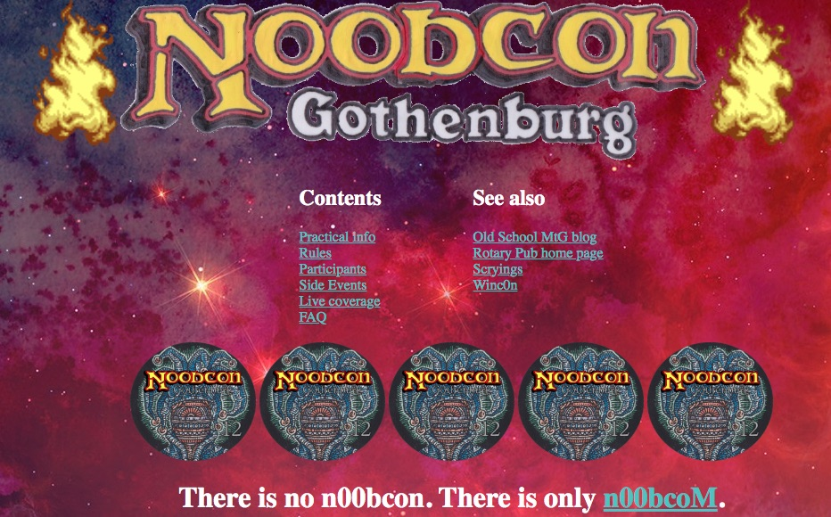
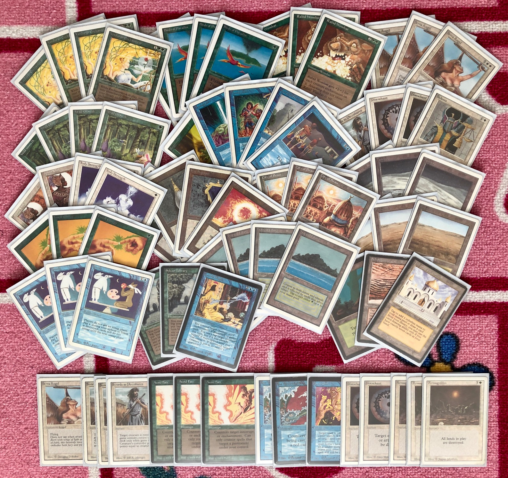
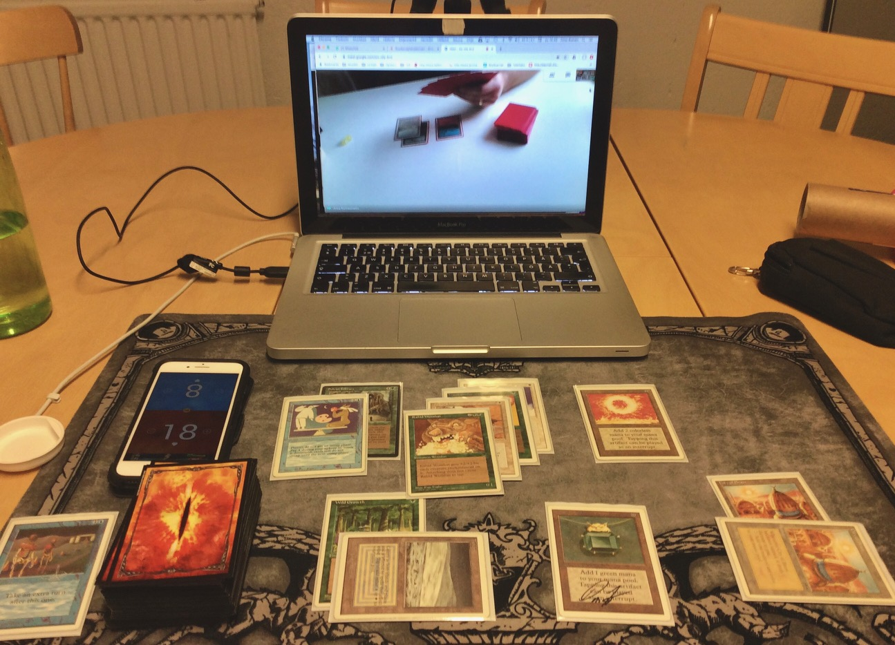
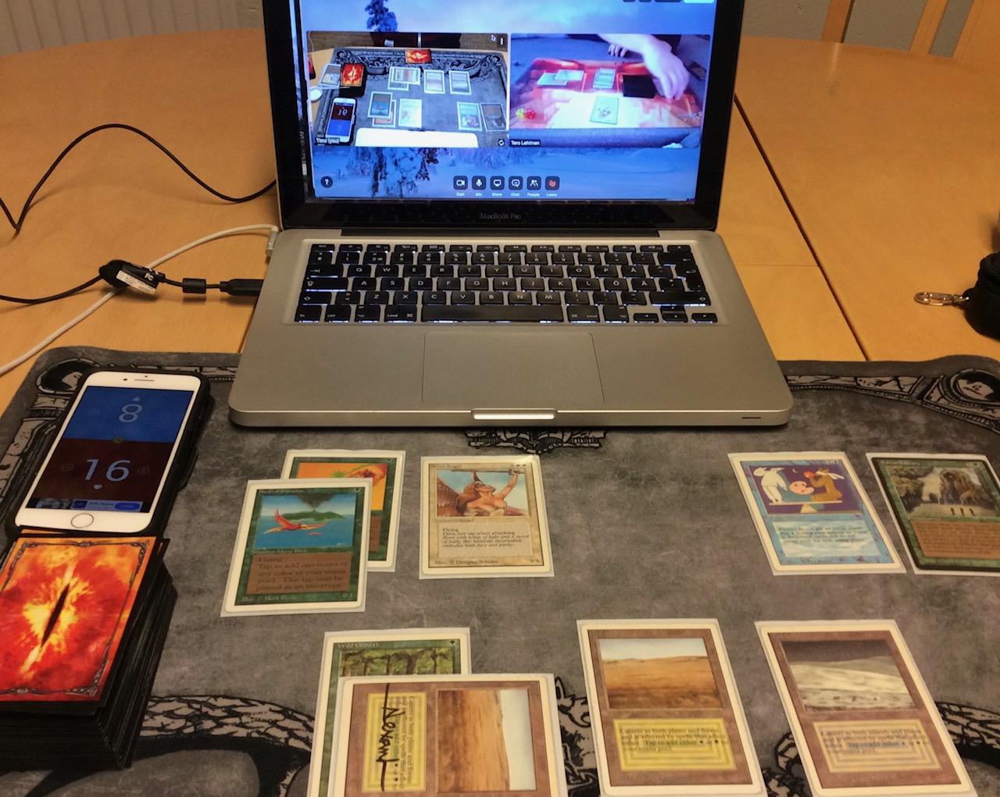

# Stranger times

These have been strange times, the past few weeks. The pandemic caused by the virus SARS-CoV-2, known as [COVID-19](https://en.wikipedia.org/wiki/Coronavirus_disease_2019), has interrupted basic functions in most of the world's countries and brought people's lives into a halt. The final impact of the disease on the world's healthcare, economics and politics remains to be discovered, possibly months or even years from now. While understanding and modeling of the epidemic and evolution of the disease is timely and very interesting (and I have thrown my share of amateurish attempts at the problem), it's not the purpose of this blog to discuss such things. There are plenty of good and up-to-date resources on the internet already devoted to the subject, such as these [three](https://medium.com/data-for-science/epidemic-modeling-101-or-why-your-covid19-exponential-fits-are-wrong-97aa50c55f8) [blog](https://medium.com/data-for-science/epidemic-modeling-102-all-covid-19-models-are-wrong-but-some-are-useful-c81202cc6ee9) [posts](https://medium.com/@tomaspueyo/coronavirus-the-hammer-and-the-dance-be9337092b56).

The obvious impact of the current state of affairs on the Old School community has been the cancellation of the N00bcon 12 and all it's side events at Göteborg. We had an absolutely wonderful time last year at the [Wizards' Tournament](../2019-04-25-wizards-tournament-2) and at the [Urborg Feast](../2019-06-12-easy-livin), and I'm sure this year would have been no less awesome.

At the moment, the only way to organize tournaments is by [teleconferencing](https://en.wikipedia.org/wiki/Teleconference). (Is that an appropriately old school term for the thing?) Luckily, we managed to get together a small group of players together for a mini tournament, which we had just yesterday, on Easter Sunday.

After putting our younger daughter to bed for a nap, I retreated downstairs to the basement of our building, where we have a hobby space with a table and a few chairs. I took my cards, laptop, wifi router, webcam and a camera stand with me and set up the play area. I was a little bit suspicious about the quality of the wifi signal there (or rather the uplink to our main router upstairs), but it turned out fine. In fact, the experience was so nice that I will definitely try to do this more often, now that I have the equipment and I know that it all works out.

# Deck

For this casual mini tournament, I wanted to try out something out of the usual tier 1 and 2 deck territory. I already had a couple of such decks that I had brewed previously. I sort of had a hunch that the other players would rather be on the spice end of the spectrum. So I decided to pick up the spiciest one of the sub-tier decks: the Stasis Enchantress.

The idea of the Enchantress deck is pretty simple: accelerate out a [Verduran Enchantress](https://gatherer.wizards.com/Pages/Card/Details.aspx?multiverseid=775) with [Birds](https://gatherer.wizards.com/pages/card/Details.aspx?multiverseid=739), Moxen, or [Wild Growth](https://gatherer.wizards.com/Pages/Card/Details.aspx?multiverseid=782), then proceed to cast further enchantments to draw cards and eventually win the game through card advantage. Obviously, since I was going to want a lot of enchantments in the deck, I also decided to play the classic [Rabid Wombat](https://gatherer.wizards.com/Pages/Card/Details.aspx?multiverseid=2834) combo!

As an alternative win condition, with all the ramp and the white spells I would include for interaction and enchantments, I would also play [Serra Angels](https://gatherer.wizards.com/Pages/Card/Details.aspx?multiverseid=868). Well, honestly, the Angels would be the main win condition, with the occasional memetic win coming via Wombat combat.

I had already realized that the deck would need the [blue](https://gatherer.wizards.com/Pages/Card/Details.aspx?multiverseid=692) [power](https://gatherer.wizards.com/Pages/Card/Details.aspx?multiverseid=728) [cards](https://gatherer.wizards.com/Pages/Card/Details.aspx?multiverseid=729), in order to be, let's admit it, fun to play. With that realization, I pondered which blue enchantment spells would be playable in the Enchantress deck. There aren't that many that are reasonably splashable. But one seemed like the perfect fit: [Stasis](https://gatherer.wizards.com/Pages/Card/Details.aspx?multiverseid=725). My main threats already were able to attack without needing the untap step, and the addition of [Instill Energy](https://gatherer.wizards.com/Pages/Card/Details.aspx?multiverseid=755) also enabled the Birds - Stasis - Instill Energy - combo, while also powering the Enchantress and the Wombat. Oh, the awesome synergy!

# Games

In addition to my Stasis Enchantress, the three other players had brought in an interesting smörgåsbord of decks. Tero had his trusty Pink Weenie, which we saw take the third place in last year's [KaamosCup](../2019-11-23-kaamoscupii). Jarno played a red-black Troll Disco, with an extra special guest star appearance by [Wall of Heat](https://gatherer.wizards.com/Pages/Card/Details.aspx?multiverseid=2851), which he had brought home as a trophy from KaamosCup. A worthy tribute indeed! Tuukka had a spicy homebrewn [Hazezon](https://gatherer.wizards.com/Pages/Card/Details.aspx?multiverseid=1656)-[Candle](https://gatherer.wizards.com/Pages/Card/Details.aspx?multiverseid=999)[Flare](https://gatherer.wizards.com/Pages/Card/Details.aspx?multiverseid=505), which he played with great skill. Delicious!

By the luck of the die, I first got to play with Jarno. In the first game, I cast an early Enchantress and got the card-draw engine rolling. Jarno put up a good fight, and in the early stages cast his Wall of Heat and later a [Sedge Troll](https://gatherer.wizards.com/Pages/Card/Details.aspx?multiverseid=817). He got a good beatdown plan going, until I managed to cast a Stasis that slowed the game down for several turns. My [Sylvan Library](https://gatherer.wizards.com/Pages/Card/Details.aspx?multiverseid=1547) supplied me with constant flow of blue mana sources until I finally managed to [Plow](https://gatherer.wizards.com/Pages/Card/Details.aspx?multiverseid=869) his Wall and eke out a victory.

In the second game, I had an early Time Walk, which put me ahead one turn despite being on the play, and Jarno never managed to catch up after I had my Stasis and Holy Spirit-linking Energized Rabid Wombat in play.

Tuukka had won his match with Tero, so he would be my next opponent. Tuukka has the habit of putting a peculiar twist on his decks, so I wasn't at all sure what to expect. I got a [Library of Alexandria](https://gatherer.wizards.com/Pages/Card/Details.aspx?multiverseid=990) down in early in the game, but Tuukka was able to kill off my Enchantress with a Fireball. He kept playing lands, and I kept drawing cards, until he cast a [Candelabra](https://gatherer.wizards.com/Pages/Card/Details.aspx?multiverseid=999) and a [Gauntlet](https://gatherer.wizards.com/Pages/Card/Details.aspx?multiverseid=612). Uh-oh. I expected another Fireball, but instead Tuukka casts [Hazezon Tamar](https://gatherer.wizards.com/Pages/Card/Details.aspx?multiverseid=1656)! I had a measly Wombat and an Enchantress in play, with very little to answer his incoming tokens, especially once he bounced Hazezon back to his hand with [Karakas](https://gatherer.wizards.com/Pages/Card/Details.aspx?multiverseid=1701). How does one even prepare for something like that! I didn't have to worry about the tokens, though, as Tuukka found a Fireball and cast that with lethal damage with the aid of his Candelabra.

In the second game, I sideboarded in the [Armageddons](https://gatherer.wizards.com/Pages/Card/Details.aspx?multiverseid=830), [Disenchants](https://gatherer.wizards.com/Pages/Card/Details.aspx?multiverseid=847) and [Blue Elemental Blasts](https://gatherer.wizards.com/Pages/Card/Details.aspx?multiverseid=694). Tuukka was able to remove most of my relevant board presence, and was churning out card advantage with a Library of his own. As a panic measure, I cast an Armageddon, saving a Library of Alexandria and a Timetwister in my hand. Tuukka killed off my Birds, so I didn't have blue mana, allowing Tuukka a couple of turns to play lands from his hand. When I finally had the opportunity to cast the Timetwister, he had a Red Elemental Blast ready. This basically sealed the result of the game, although the final blow came with a humongous Fireball a few turns later.

We still had some time, so I also played with Tero. The games were basically a race for his pink weenie deck to beat down faster than I could gain card advantage and stabilize. I won the first game after a well-timed Stasis, with my Serra Angel flying into victory. I was fairly confident with a pretty good board position in game two, but Tero pulled a rabbit out of his hat, killed his lonely [White Knight](https://gatherer.wizards.com/Pages/Card/Details.aspx?multiverseid=872) with his own [Chain Lightning](https://gatherer.wizards.com/Pages/Card/Details.aspx?multiverseid=1563) and [Balanced](https://gatherer.wizards.com/Pages/Card/Details.aspx?multiverseid=831) away my Enchantress and Serra. In the last game, I got a quick start with some fast ramp and a Serra Angel. Tero's [Maze](https://gatherer.wizards.com/Pages/Card/Details.aspx?multiverseid=1824) pacified my angel, but as soon as I found another one with my Sylvan Library, the game swung in my favor and, eventually, I took down the match.

# Thoughts

Well, the deck was certainly fun. The Enchantress represents a powerful engine, and combined with [vigilant](https://mtg.gamepedia.com/Vigilance) creatures, Stasis is a really powerful addition to the deck. From the opponents perspective, I would say that the Birds, Serras, and the Enchantresses all represent prime targets for creature removal. This of course means that sometimes it is difficult to answer all of them on time and in the correct order. Especially with Stasis, they are all able to swing the game in my favor.

The Wombat is a gimmick, of course. But can you imagine how fun it is to beat down on the opponent with a 7/9 Holy Spirit-linking Rabid Wombat from under a Stasis?

I would say that the most fun aspect of the deck is all the embedded synergy. The games can be quite varied, too. Sometimes you can play the card-advantage game, while sometimes you go the ramp-beatdown route. Or, you Stasis-lock your opponent. Or, you lose, because of, well, Enchantress.

It's not a surprise that the big players on the deck are actually the ramp cards, the blue power, and Serra Angels. So yes, it is probably just an ErhnamGeddon deck made worse by the Enchantress package. But, in my view, it is the powerful cards that allow you to play fun, but horrible, stuff like Rabid Wombat and Holy Strength in the deck and still manage to win some games.

Now, if I only could figure out how to add [Living Plane](https://gatherer.wizards.com/Pages/Card/Details.aspx?multiverseid=1533) to the deck...

# Conclusions

- Enchantress rocks!
- Old School via webcam rocks!
- Rabid Wombat... eh, nevermind.
