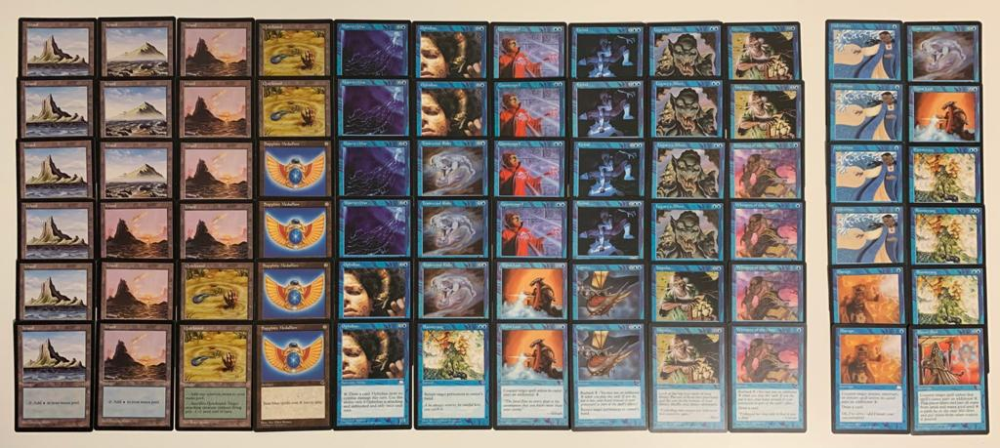
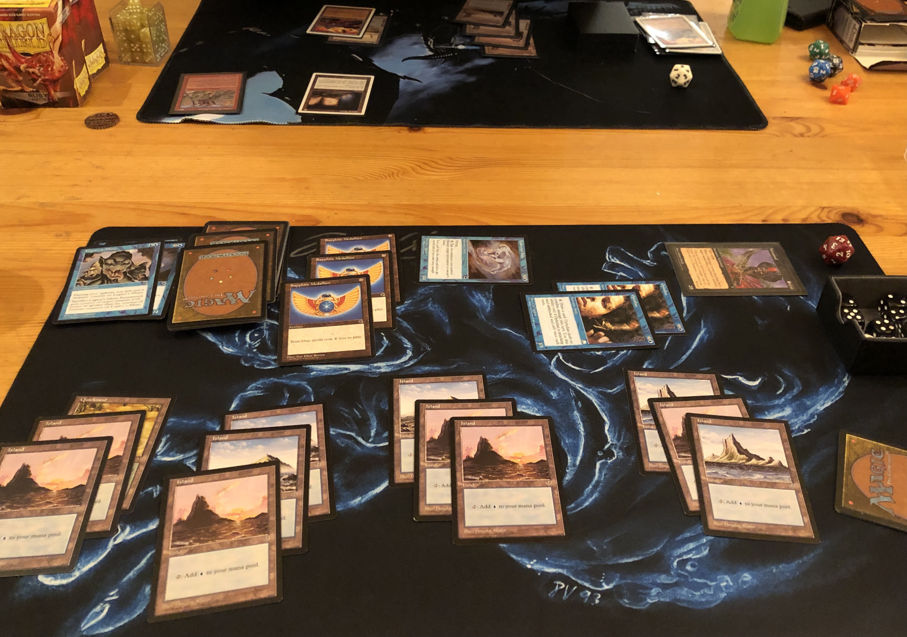
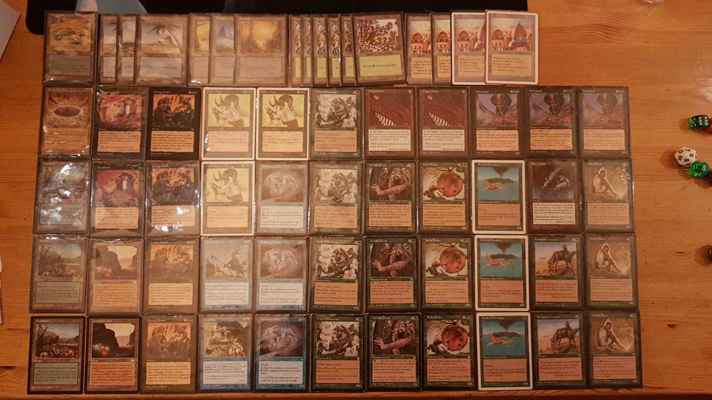
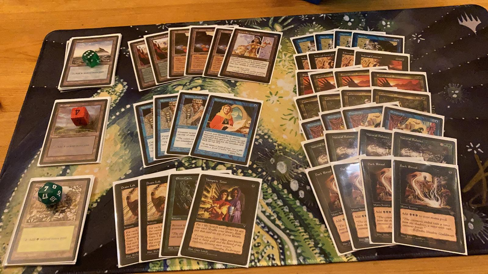
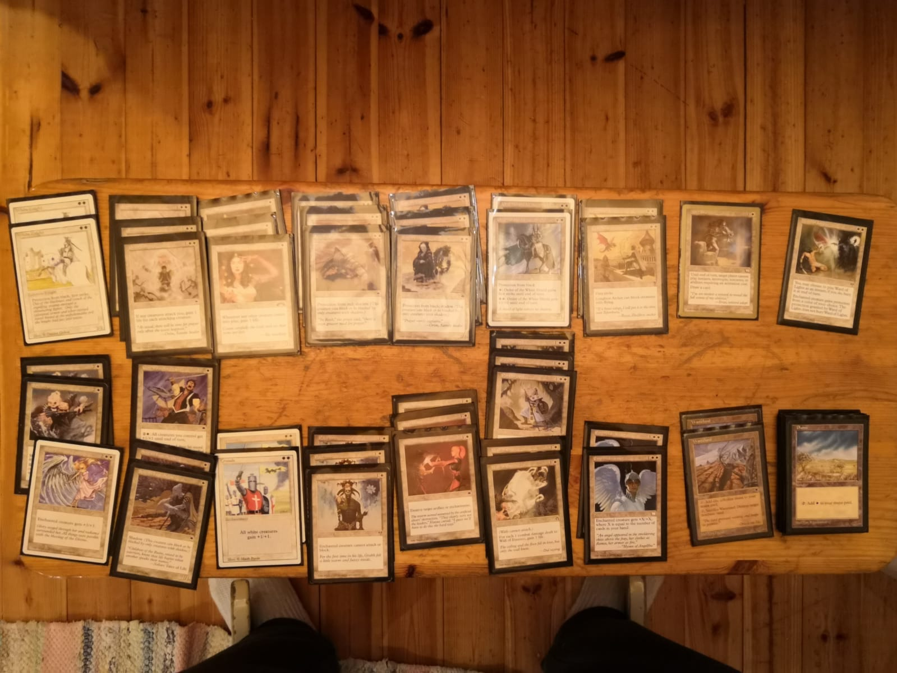
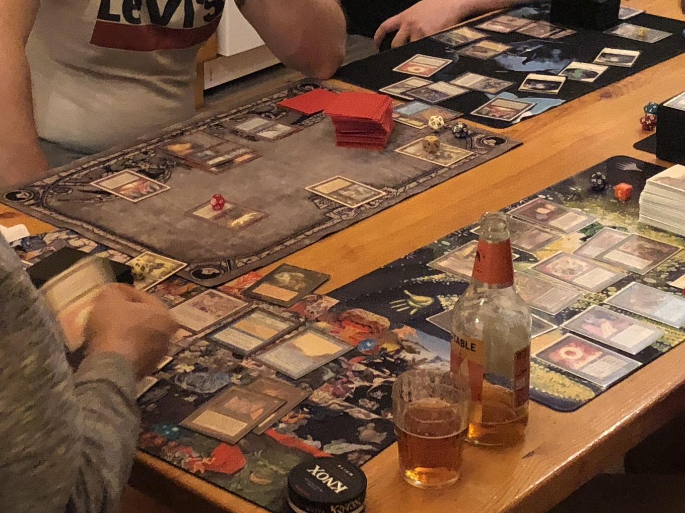

# Luhanka

In late November last year, I joined a small group of friends for a weekend of Old School Magic: the Gathering. Tero, one of the Old School aficionados at Jyväskylä, had rented a cabin near the small village of Luhanka, where we would spend the weekend playing and trading cards. I took the Friday off work to pack, prepare, and drive there from the south of Finland - it was going to be a three-hour drive to the cabin and we had a small tournament planned already for the Friday evening. At around 4 pm, I jumped into my VW and started the drive north[^1]. By the time I got to Luhanka, it was already completely dark and I managed to miss the cabin by about half a kilometer before I noticed that the GPS was yelling me to turn back. I backed up, exited the small country road to an even smaller gravel path that lead up a small hill to the cabin. I was glad that there was no snow on the ground. The ascent up the narrow and relatively steep path might have been a bit too exciting otherwise.

I parked the car next to the cabin, a safe distance away from the edge of the hill. It seemed I was the first to arrive, so I called Tero for instructions on getting inside. In short order, I got the key from its security box and went inside. The cabin was spacious, bedrooms and a common area downstairs and more sleeping space upstairs. And, of course, a sauna with a wood stove. Excellent!

I didn't have to wait long for the rest of the guys. The first to arrive was Tuukka, coming from Turku at the western coast of Finland, and the Jyväskylä crew of Tero, Jarno and Ilkka came shortly after. We settled in, made sure there was wood for the sauna and unpacked the cards. The first event of the weekend would be a mini-tournament of 97/98 Type II (or, at least, something resembling that).

# Mirage-Tempest tournament

I had prepared two decks for the format. Namely, the Pros-Bloom combo deck, and a mono blue Tradewind deck. Both are [well known archetypes](https://magic.wizards.com/en/articles/archive/magic-online/flashback-standard-gauntlets-mirage-tempest) from Mirage-Tempest standard. I never actually played during that time period (I had quit well before Weatherlight came out) so I was very interested in trying out these decks. I had goldfished the Pros-Bloom a little bit a few weeks before so I was relatively familiar with how it worked. Full-on, non-interactive, combo is not really my thing, though, so eventually I opted for the mono blue alternative. That deck can effectively play a counter-heavy tempo / control game, which is basically my comfort zone in Magic. Even though I had not played a single game with the deck, I felt pretty confident piloting it.

*The mono blue Tradewind / Forbidian deck. Quite a stock lineup, except for the 12 card sideboard (I didn't have enough period-authentic blue cards for a complete side board). In retrospect, simply adding 3 Islands to the sideboard would have been a reasonable solution to side out the Quicksands.*

We had just 5 players for this event, so we simply decided to pair everybody against everybody and see who would get the most points. So, four matches for everybody.

## Ilkka's Black-Red Reanimator

In the first match my opponent was Ilkka, who started fast, playing out some aggressive black creatures. For the first several turns I was quite sure he was playing Suicide Black. Then I saw a Sulforous Springs enter the battlefield. Naturally I thought he was splashing red for burn and played accordingly, blocking and keeping his creatures at bay with mine.

But then I was surprised by some fatties that entered his graveyard and promptly the battlefield! I had countered some of his less significant threats, assuming those were the best his deck could muster. Wrong.

Somehow I managed to get rid of Ilkka's monstrocity (probably eventually bouncing it with a Tradewind Rider). I think the game took a while but, in the end, I won with card advantage and the Tradewind-lock.

I sided in the ~~Blue Blasts~~ Hydroblasts for the next game. I was quite a bit more familiar with my opponent's deck, as well as my own, and consequently the play was a lot smoother. Ilkka did almost manage to get with a reanimation spell, but I had a Hydroblast ready for his Crimson Hellkite. If he had been able to animate his Spirit of the Night, that would have been game.  

In the first two games I got my first experiences with the Ophidian / Tradewind deck. Going into the tournament, I had thought the deck would be quite like the modern-era Delver decks, just a little bit slower. One out of two correct. It was definitely slower. By a lot. I realized I was in for some grindy games tonight.

## Jarno's Tradewind Goodstuff

I sat at the table with Jarno, whom I had met about a year ago in the 2nd Kaamos Cup. He starts out playing some lands and - a Hermit Druid. Oh, great, another reanimator deck, I think. Well, not quite...

I try to get the Ophidian & Tradewind engines going, with medium success, while Jarno plays a Dragon Mask. I'm literally thinking out loud, what the hell is going on here. Fearing for the eventual reanimation of something horrible, I let the artifact resolve. Obviously, a mistake. Jarno sets up the weirdest engine with Spike Feeder and out-grinds my deck.

Turns out Jarno is playing mostly a Hermit Druid / Tradewind Rider good stuff, with some extra weirdness thrown in. After the first game I know this is not an all-in reanimator, so I'm able to play a bit more wisely. Or, perhaps I just a bit more lucky. In any case, I eventually take the second game.

Last game, Jarno got horrendously mana screwed. He kept a sketchy hand and was unlucky to not draw more mana sources for several turns. As a result, I basically rode the Ophidian draw engine to victory. I think at the end of the game I was drawing 3 cards a turn and held a hand full of counterspells with enough mana to cast several of them in one turn. Kind of disgusting.

## Tuukka's Pros-Bloom

I knew beforehand that Tuukka was playing Pros-Bloom. I also think he knew pretty well what I was playing, too, having seen me play those other matches. I was playing quite a bit of counterspells so I hoped those would be enough to stall the game until the Tradewind engine could take over.

The first game was quite close. I don't remember the exact sequences, but I think I countered some of Tuukka's spells, although he was able to get part of the combo engine online. I think I eventually got the Tradewind into play at which point Tuukka decided that the odds were not in his favor and we moved to the next game.

For the second game, I sided out all the Legacy's Allures and one Quicksand in favor of two more counterspells and three Boomerangs. This turned out to work quite well, as I started the game with two Boomerangs in hand. Unless Tuukka had a lighting quick start, bouncing his lands with the Boomerangs in the early game would be essentially Time Walks. Indeed, I got the opportunity to cast one, then another, and a third Boomerang that I drew into. At that point I had counterspells in hand and was way ahead on board. Tuukka decided the time was better spent getting some beverages and picked up his cards.

## Tero's Mono-White Shadow

Tero was being faithful to his habits and played an aggressive white deck filled with unblockable shadow creatures. Nasty ones, those. I had only played them in a low-powered cube before, but I knew they were potentially going to be a problem. The Tradewind deck relies on stopping the small creature aggro decks with the big butts of the Tradewind Riders and Ophidians, which were of no help here.

Luckily for me, it seemed that Tero drew mostly the non-shadow part of his deck in the first game, and the few shadow creatures that hit the table I was able to halt with the Allures and Quicksands. The details of the games grew increasingly hazy, and I must admit I don't have a good recollection of what took place. I think the second game was won by an early Ophidian or two that remained unanswered long enough.

In any case, I got the win in the second game as well, with an overall record of 4-0. Not that the result matters per se but, of course, it's usually nice to play when the deck performs well.

# Sauna

After the 97-98 games, it was time for a blistering hot sauna. I don't have a sauna in the apartment at home and the public ones have been less accessible in the last year. So the sauna after the mini-tournament was the icing on the cake.

And yeah, no pictures here. Obviously.

# EDH

I was definitely ready for bed but I also couldn't resist the pre-Urza block EDH that the guys were setting up at the table. I had put together a [Merieke](https://gatherer.wizards.com/pages/card/Details.aspx?multiverseid=2733) deck, with a lot of control cards (board wipes, taxing effects, counterspells, removal) and tap/untap synergies with Merieke's ability. Since there was already support from all the untapping effects, as a main win condition I had the [Time Vault](https://gatherer.wizards.com/Pages/Card/Details.aspx?multiverseid=642) infinite turns combo, with several ways to enable untapping the Vault. The most reliable definitely being [Mind Over Matter](https://gatherer.wizards.com/Pages/Card/Details.aspx?multiverseid=6076).

Pretty much at the start of the game, the guys were giving me a bit of hard time because of the 4-0 result in the earlier games. I knew I had it coming, so I didn't mind. But I think they were starting to feel a bit bad about it and left me alone for a while. Not that I was any threat at that point, but I was able to gradually build up my board and look for the combo cards.

The finish came quite unexpectedly. Tuukka had a [Grinning Totem](https://gatherer.wizards.com/Pages/Card/Details.aspx?multiverseid=109708) in play, which he activated. He searched my deck, took, and cast my Timetwister. Him having a [Breathstealer's Crypt](https://gatherer.wizards.com/Pages/Card/Details.aspx?multiverseid=3734) in play, this was a good, if risky, move.[^2]

However, among the seven new cards I drew the Time Vault and Mind Over Matter and a tutor, which I used to grab a Black Lotus. Surprisingly, no one had an answer to that, so the game was over in one swingy turn.

# Conclusions

Whoah, what a first day at the cabin! I was planning to write about the whole weekend in one post but that was clearly too much. So, the parts about 95-96 and 93-94 will follow in the future.

But, as usual, some random closing notes:
- Thanks to Tero for organizing the event!
- 97-98 is a great format! There's so much variety in the Mirage and Tempest blocks but the cards still feel properly old school.
- Mono blue tempo is definitely my thing. That, and blue-red aggro-control, are the archetypes that I find natural to play in almost any format.
- Ophidian is broken. Really.
- End of turn, Capsize with buyback.
- Mind Over Matter. So many possibilities...

 [^1]: Not the red Beetle in the picture; that one I found next morning at a nearby farm in Luhanka while taking a stroll.
 [^2]: And even without the Crypt in play, it still would have been the right move. In my opinion, even when technically disadvantageous, casting Timetwister is always the correct play. Why? Because it's always fun!
