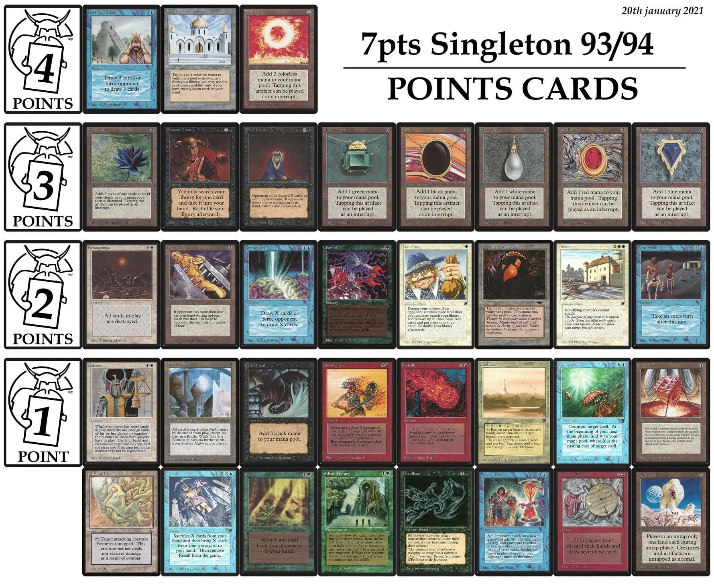
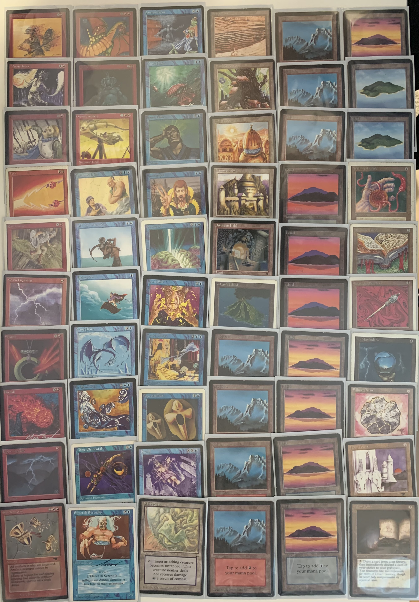
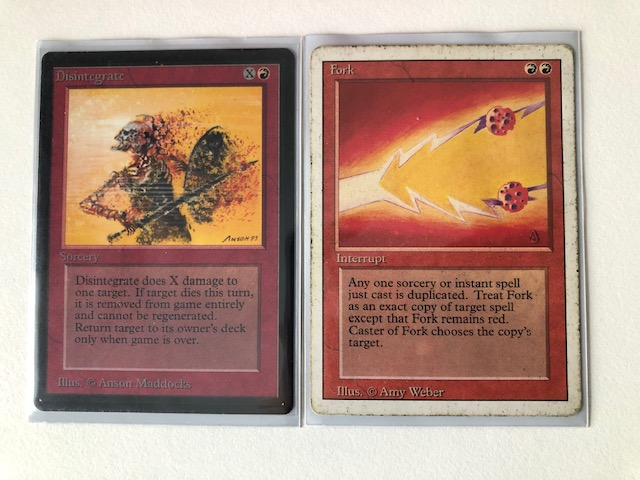
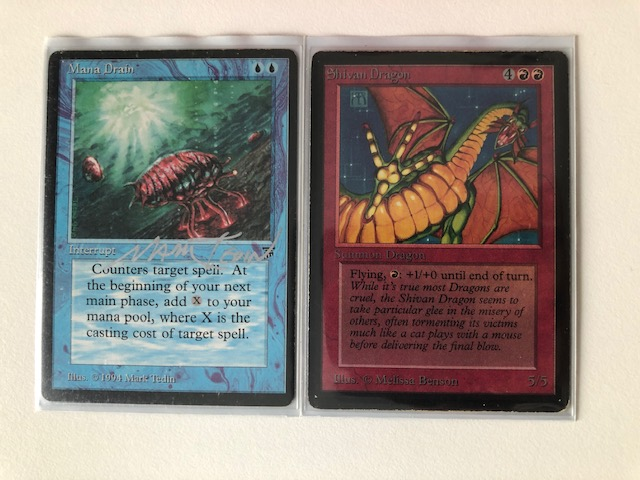
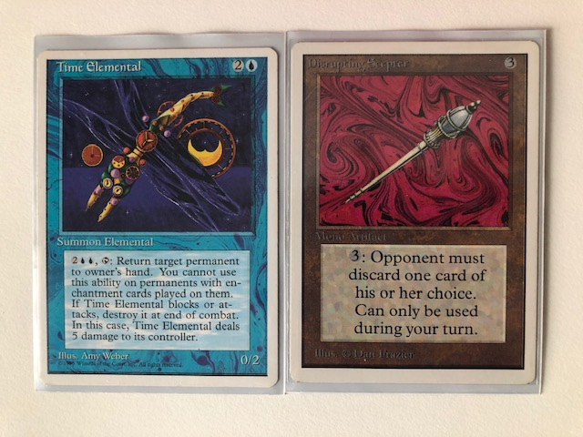
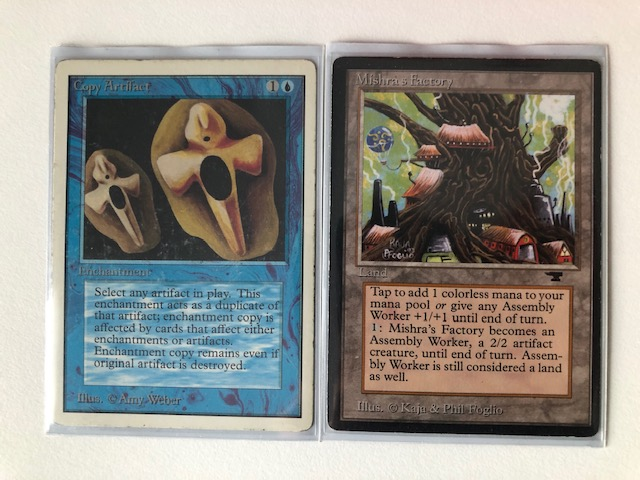
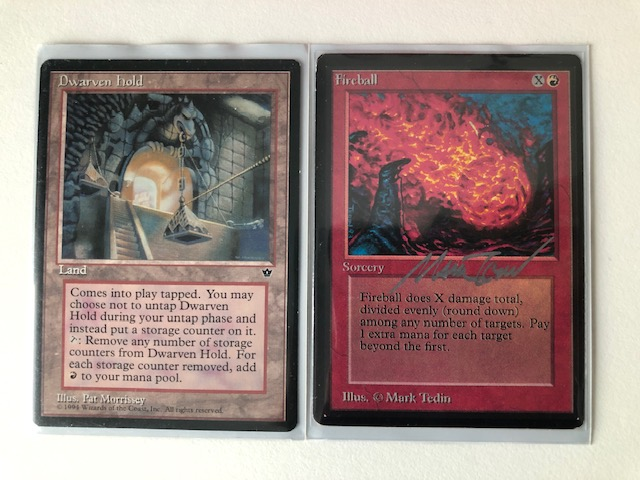

The activity of the Finnish Old School scene has really picked up lately. This is mostly thanks to active players and organizers outside the capital area. Last year, we had the [Luhanka Cup](../2021-01-30-luhanka1) and, this year, Tuukka organized the first North Star Cup webcam tournament. He has already posted his report on the new [oldschoolmtg.fi site](https://oldschoolmtg.fi/blog/north-star-cup-i2021). His write-up also includes all the deck pictures for those interested.

The tournament was a very exciting experience and a great success! First of all, it was the third time since the COVID-19 pandemic started and the first time this year that I've actually played several games of magic in row. And the first time since 1995 or 1996 that I've played regularly over several weeks. Although it was just a few games per week and over webcam, this was a delight in the groundhog days that are the current norm.

The format was a 7 point singleton Old School format, which restricts 60-card deck to singleton cards (excepting the basic lands) and enforces a point system for the most powerful cards. The points are nicely summarized in the following picture, taken from the [7pts Singleton 93/94 Old School MTG Facebook group](https://www.facebook.com/groups/523946671643800/):

I found the format really refreshing. After several years of the regular 93/94, the resctrictions opened up the brewing space and lead to variety of new game play patterns. Although, in reality, the number of ways one may assemble, for example, a blue-red control deck are rather limited by the card pool, just the fact that one has to look for the last 3-5 card slots from a suboptimal pool still makes deckbuilding interesting. In the end, I ended up with the following smörgåsbordet:

I actually finished the Swiss 4-0, with some extremely tight games. I lost in the semifinals to Jarno, who eventually took his mono black Thrull deck to the win in the finals, very fittingly for the tournament that ended on Easter Sunday[^1].

But most of all, I really enjoyed the variety the format offers. I played against very diverse players and decks and experienced different sides of my own in almost every match. The nice thing about the format is that it's typically quite slow, so you get to do interesting, memorable, flashy, and quirky things. Such as:

Fork the already sizable Disintegrate for a huge finish (check). Or Fork the opponent's Demonic Tutor, or the opponents huge Hurricane (check, check).

Mana Drain into Shivan Dragon for the finish (check).

Lock the opponent out with Time Elemental and Disrupting Scepter (check).

Run the opponent down with the Factory and its Copy (check).

Finish with a huge Fireball from a Dwarven Hold (TBD).

Occasionally, you will also get Mind Twisted and run over by your own Animated Shivan Dragon (check), killed by Pestilence (check, several times), locked out by land destruction (check), torn to bits by the Rag Man (check), and run over by obscure legends from Legends (check).

But, win or lose, it's a lot of fun!

[^1]: Trulli (cf. Thrull) in Finnish means a witch that would haunt people and farm animals, mostly in the countryside. The people and animals would have been especially vulnerable to the tricks and hexes during Easter, as the might of the trulli was the greatest in the time between the crucifiction and resurrection of Christ.
