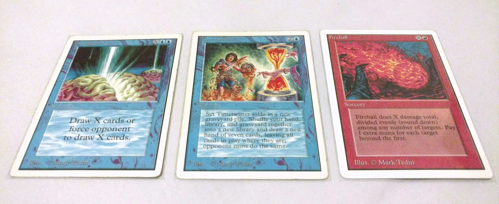

## Prologue

What is the best deck in the history of Magic? That is the question I asked [in the first post on this blog](../2018-11-23-the-lotus-and-the-wheel). In that post I investigated the winning probability of a deck from the unregulated and unbalanced childhood of Magic. The consisted solely of two cards: the [Black Lotus](http://gatherer.wizards.com/Pages/Card/Details.aspx?multiverseid=3) and the [Wheel of Fortune](http://gatherer.wizards.com/Pages/Card/Details.aspx?multiverseid=231). I did the analysis of the deck by running a large number of Monte Carlo calculations with simple heuristics to simulate the player actions, and more recently with [hypergeometric calculations](../2019-01-15-the-lotus-and_wheel_part2). I concluded that the first-turn win probability with the optimized deck was 98.818 %, and the turn 3 win probability was more then 99.8 %. So surely, the folklore from the infant time of Magic was right and this was the best deck. Case closed.

Well, not so fast. A few weeks after the first post, I happened to briefly discuss with Marc Lanigra the Timetwister-based variant of the deck. This is the deck that Stephen Menendian calls the [Twist of Fire](http://www.vintagemagic.com/blog/old-school-magic-chapter-11-the-untold-history-of-combo-in-old-school/). The deck plays about one half Black Lotuses, one half [Timetwisters](http://gatherer.wizards.com/Pages/Card/Details.aspx?multiverseid=132) and at least one [Fireball](http://gatherer.wizards.com/Pages/Card/Details.aspx?multiverseid=197). The idea is to use the Lotuses and Twisters to accumulate mana and repeatedly refill the hand until sufficient amount of mana is available to cast a game-finishing Fireball. The engine is very similar to the Wheel of Fortune variant. So it was quite obvious that the deck would have a similarly high win percentage, presumably in the high 90's. However, I was quite certain that it would be lower than with the Wheel of Fortune. Why? Because the the Lotus and Wheel is a two-card combo, but the Timetwister variant needs to find the singular Fireball in addition to repeatedly churning the draw and mana engine.

Then, Marc Lanigra mentioned that he has run simulations of the deck and got a 98 % win probability with a variant having 2 Fireballs. Marc is recognized as a person who [knows his Timetwisters](http://www.magiclibrarities.net/468-rarities-vintagelegacy-championship-oversized-unique-cards-english-cards-index.html), so I definitely had to check this out myself. And so I wrote the simulation code in Python.

The problem was that code was really slow. The inherent uncertainty in the Monte Carlo simulations made it difficult to compare the two decks with results that were so close. In order to reliably answer the question I would need to simulate a lot more games to bring the statistical uncertainty down to less than a hundredth of a percent. And my Python script was not going to do it - it was simply too slow.

With a sigh, I realized it was time to get serious with the simulation algorithm.

## Bringing out the big guns

*Tech talk warning. If you're not interested in computer simulations and code performance optimization, you can just skip this chapter and go straight to the results.*

In Monte Carlo simulations, [the statistical error typically goes down as the inverse square root of the number of simulations](https://en.wikipedia.org/wiki/Monte_Carlo_integration). So, to squeeze the error down to one tenth, I needed to run a hundred times more simulations. I also needed the simulation to be short enough so that I could explore different parameters such as deck composition (number of Fireballs, Timetwisters and Black Lotuses) and heuristics parameters (for example, whether to sacrifice the Lotus for 3 mana or keep it on the battlefield). To do this, I needed to make the simulation code faster. A lot faster.

My initial Python implementation of the simulation was based on using integer [Numpy](http://www.numpy.org/) arrays to hold the deck and hand contents, moving cards from one to the other by resizing the arrays, and individual simulations running inside a [for loop](https://en.wikipedia.org/wiki/For_loop). So, memory allocations and deallocations inside a loop. In Python. A recipe for disaster.

Rather than trying to refactor the Python code to make it faster, I decided to scrap it altogether and move to an actual high-performance language: C++ [^1]. Over the Christmas break, I rewrote the Python code in C++ and compiled it. I ran it, and the simulation was more than 20 times faster! Alright!

Of course, I didn't stop there. I turned on the compiler optimization and did a bit of [profiling](https://en.wikibooks.org/wiki/Introduction_to_Software_Engineering/Testing/Profiling), replaced the standard library implementation of the deck shuffling function with the [Fisher-Yates algorithm](https://en.wikipedia.org/wiki/Fisher%E2%80%93Yates_shuffle)[^2], swapped the [random number generator](https://en.wikipedia.org/wiki/Mersenne_Twister) (rng) with a [faster one](http://www.pcg-random.org/), and even replaced the [std::vector containers](https://en.cppreference.com/w/cpp/container/vector) with custom containers for the deck and the hand cards[^3]. Although the performance of the std::vector is OK [as long as the card addition and removal is done at the end of the container](https://baptiste-wicht.com/posts/2012/12/cpp-benchmark-vector-list-deque.html), the memory for the contents is reserved at the [heap](https://stackoverflow.com/questions/79923/what-and-where-are-the-stack-and-heap), while the custom ones I created use the [stack](https://blogs.magicjudges.org/rulestips/2011/04/last-in-first-out-how-the-stack-works/). The stack memory is typically faster to access, and in this case the performance improvement on the whole simulation was a further 20 %. Finally, I made the code run in parallel using the [multithreading functionalities](https://solarianprogrammer.com/2012/10/17/cpp-11-async-tutorial/) available in the standard library since C++11,  [std::async](https://en.cppreference.com/w/cpp/thread/async) and [std::future](https://en.cppreference.com/w/cpp/thread/future).

*Run times with the different code versions for 100 000 simulation runs in milliseconds. Measured on a mid-2012 Macbook Pro (2,5 GHz Intel dual-core i5).*

| Version | Time |
| -- | -- |
| Python | 126 000 ms |
| C++ | 5500 ms |
| + clang++ -O2 optimization | 1750 ms |
| + Fisher-Yates algorithm | 1050 ms |
| + PCG32_fast rng | 750 ms |
| + custom containers | 590 ms |
| + hyperthreading on 2 cores | 200 ms |

The run times for one hundred thousand simulations with each incremental improvement are shown in the table above. After all the improvements, the C++ code finally ran **more than 600 times faster** than the original Python simulation. Wow! Now we were back in business!

## The Twist of Fire

## The BrainTwist

*Which is the better companion to the Timetwister: Braingeyser or Fireball?*

## Conclusions

[^1]: Yes, while C++ is the crown prince in high-performance computing, C is the king and Fortran the old emperor. But I've grown to dislike C in contrast to C++ in terms of usability, and I see enough Fortran in my day job not to touch it for fun.

[^2]: Daniel Lemire has an interesting [blog post](https://lemire.me/blog/2016/10/10/a-case-study-in-the-performance-cost-of-abstraction-cs-stdshuffle/) on the performance of the C++'s std::shuffle.

[^3]: The custom containers were basically statically allocated arrays wrapped inside a class that handles the book-keeping and re-implements the std::vector's emplace_back, pop_back, erase, and shuffle functions. An interesting realization was that the hand container does not care about the order the cards, so removing elements from that container can be done very efficiently.
