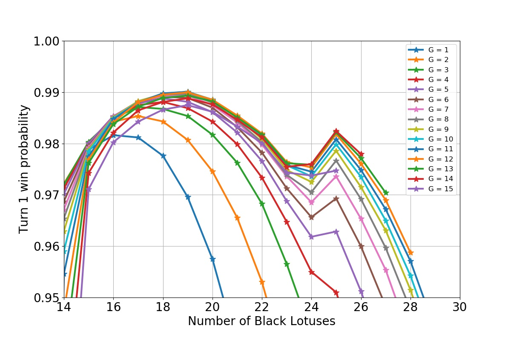
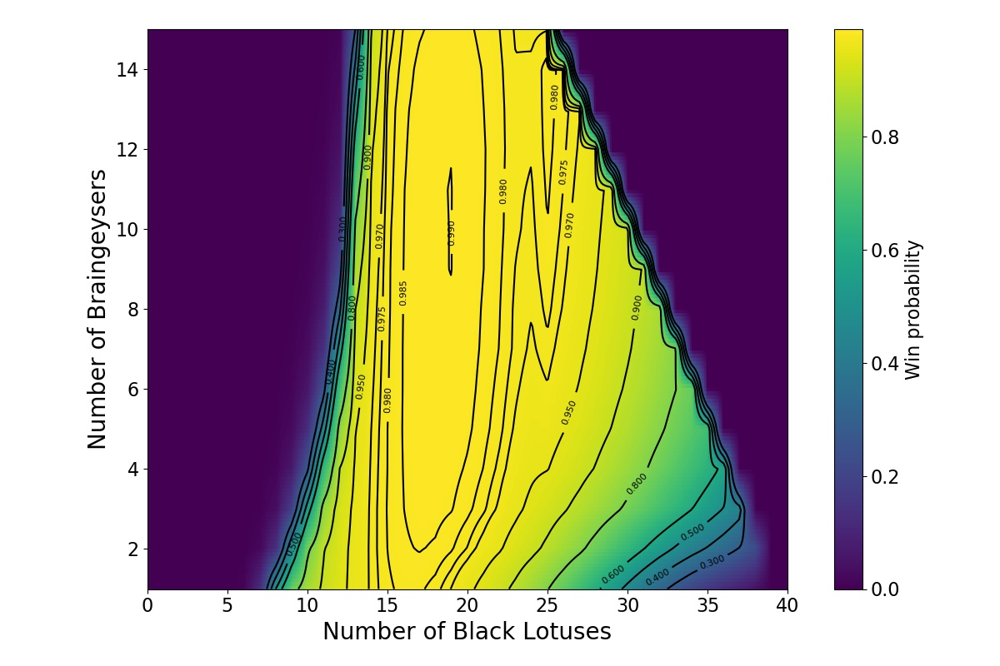
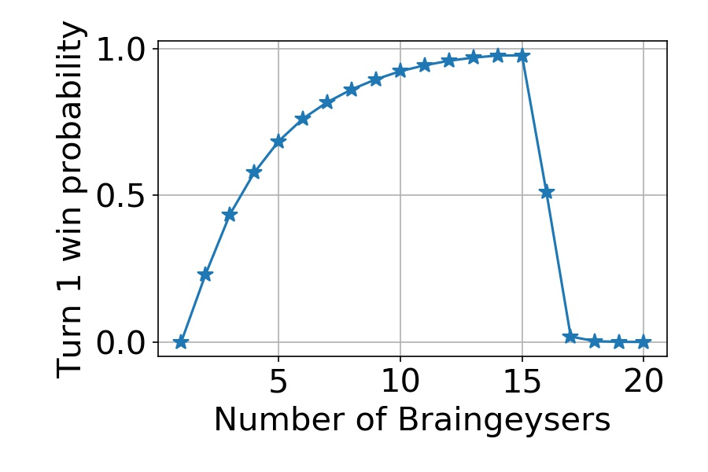
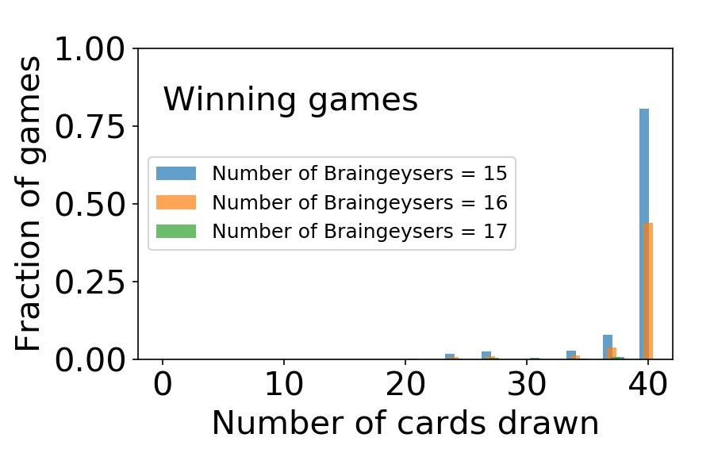
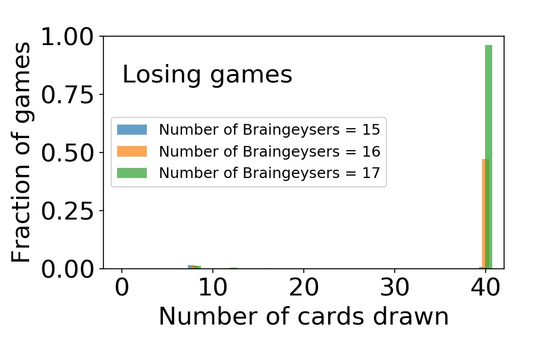
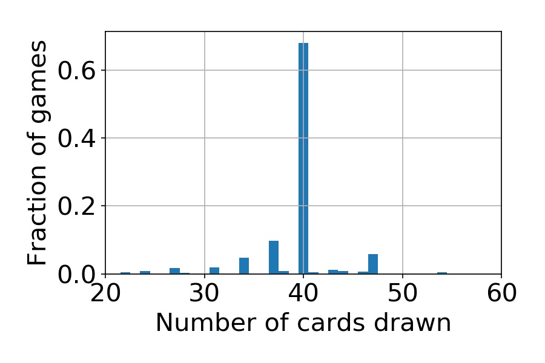
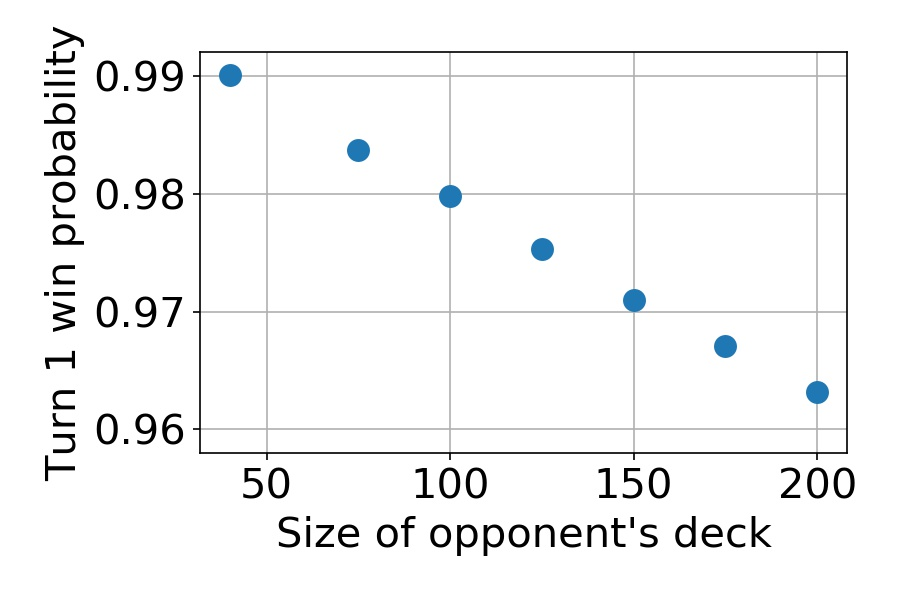

## Background

The three decks that have often been mentioned as the most oppressing and powerful in the very early, wild days of Magic: the Gathering are the [Big Wheel, Twist of Fire, and BrainTwist](http://www.eternalcentral.com/tag/history-of-vintage/). The first is based on the [Black Lotus](http://gatherer.wizards.com/Pages/Card/Details.aspx?multiverseid=3) and [Wheel of Fortune](http://gatherer.wizards.com/Pages/Card/Details.aspx?multiverseid=231) mana and draw engine, while the latter two replace the Wheel of Fortune with [Timetwister](http://gatherer.wizards.com/Pages/Card/Details.aspx?multiverseid=132). In earlier posts on this blog, I have analyzed the [Wheel deck](../2019-01-15-the-lotus-and-the-wheel-part2) and the [Fireball](http://gatherer.wizards.com/Pages/Card/Details.aspx?multiverseid=197) variant, the [Twist of Fire](../2019-0121-the-twist-of-fire). The analyses confirmed that both decks are indeed completely broken, reaching a ridiculous turn one win percentage of about 99 %, with the latter having a slightly higher win probability and also being much more robust with respect to the opponent's deck choice.

[According to Stephen Menendian](http://www.vintagemagic.com/blog/old-school-magic-chapter-11-the-untold-history-of-combo-in-old-school/), the Timetwister deck that uses Fireball as the win condition later evolved into the BrainTwist deck. Here, the Fireball is replaced by the Braingeyser, a card that allows the caster to either draw cards or force the opponent to draw cards, the number depending on the amount on mana used to cast the spell. Contrary to the gigantic Fireball, which would reduce the opponent's life total to zero, the Braingeyser is used to deplete the opponent's deck. In Magic, this also leads to the opponent's loss as, according to the [rules](https://magic.wizards.com/en/articles/archive/original-magic-rulebook-2004-12-25), a player loses if he is unable to draw a card from his deck. In addition to presenting the win condition, the Braingeyser also functions as a draw engine. This will make it less likely that the deck stalls in the middle of the loop. However, the amount of mana required to cast the final, lethal spell, is also higher: 35 vs 21.[^1] Therefore it's not immediately obvious which one is the better choice, the Fireball or the Braingeyser.

## The simulation model

To get an answer for the question, I took the same C++ simulation code I had used earlier for [the Fireball variant](../2019-01-21-the-twist-of-fire) and modified it to simulate the Braingeyser. As an aside, I found a way to further boost the performance of the code. While searching for more information about random number generation, I happened to find [this paper](https://arxiv.org/pdf/1805.10941.pdf) by Daniel Lemire on the efficiency of sampling an integer on a given interval, and after some digging, [this detailed post](http://www.pcg-random.org/posts/bounded-rands.html) by Melissa O'Neill. Especially the blog post is very hands-on and practical, I highly recommend reading it. But to make the long story short, the C++11 standard library implementation of the integer sampling is embarrassingly inefficient. O'Neill recommends the algorithm developed by Lemire and provides a C++ implementation to go with it. I hoped that for the Timetwister simulations, which use most of the processing power on deck shuffling, this new algorithm would make a significant improvement on the simulation time.

So, I swapped in the custom Lemire-O'Neill algorithm and, lo-and-behold, the simulation time instantly dropped by further 50 %. Together with all the prior improvements, the C++ code is now running about 1200 times faster than the original Python code on my laptop.

But, on to the actual simulation algorithm. The basics are very similar to the [Twist of Fire simulations](../2019-01-21-the-twist-of-fire). Some modifications were necessary to exploit the ability of the Braingeyser to function both as a game finisher, as well as a draw engine. Therefore I tweaked the heuristics of casting the different spells a little bit. Again, I cannot guarantee that what I implemented is an optimal algorithm to play the spells, but here's what the assumptions and heuristics looked like in the end:

1. The deck consists of 40 cards in total. There can be any number of Black Lotuses, Timetwisters and Braingeysers, granted that their total number is 40.
2. The opponent is playing a 40-card deck.
3. The game begins with drawing 8 cards.
4. All the Black Lotuses in hand are played and sacrificed for 3 blue mana. This is also done every time new cards are drawn.
5. Win condition is checked: if there is a Braingeyser in hand and enough mana available, to cast it for X = 33 or more, the game is won.
6. After playing and sacrificing the Lotuses, a Braingeyser is played if possible. If there is no Timetwister in hand, the Braingeyser is played with full available mana.
7. If, in addition to the Braingeyser, there also a Timetwister in hand, a choice is made. If the available mana exceeds an adjustable threshold, the Braingeyser is played. Even in this case, 3 mana are left in the pool to make sure the Timetwister can be cast even if no Black Lotuses are drawn with the Braingeyser. If the available mana is less than the set threshold value, the Braingeyser is not played.
8. After no more Braingeysers are cast, a Timetwister is played.
9. Steps 4. - 8. are repeated until the game is won or continuing is not possible either due to running out of mana or not drawing a new Timetwister or Braingeyser.

Whew, the algorithm is starting to get complicated. In the simulations, I scanned the threshold for casting the Braingeyser in step 7 over a range of values, starting from 0 to 24. The optimal value was found to be 12, so this is what I will use in the results shown below.[^2]

## Results

I again ran the simulation with enough statistically independent samples to push the Monte Carlo error down to 1/1000 of a percent, and even lower near the global optimum. The main results are shown in the figures below, with the most significant one being:

**The optimal deck has 19 Black Lotuses, 10 Timetwisters, and 11 Braingeysers. The turn one win probability with that deck is at least (99.0118 +/- 0.0001) %.**

So, the win probability goes over 99 %, but does not quite reach that of the Fireball version (99.0193 %). What is more interesting, though, is that the optimal deck has a total of 11 Braingeysers and only 10 Timetwisters, contrasted to 2 Fireballs and 18 Timetwisters of the optimal Fireball deck. This shows the power of the Braingeyser to function as part of the engine in addition to its role as a finisher.

*The turn 1 win probability with various deck compositions. G indicates the number of Braingeysers in the deck.*

*The turn 1 win probability with various deck compositions, visualized with iso-probability contours.*

Another very interesting feature is the secondary maximum that occurs when the deck has exactly 25 Black Lotuses (see the figures above). At first I thought this must be an error in the simulation, but it turns out it is actually a real feature. To find out how it arises, let's look at what happens when all the Timetwisters are removed from the deck and replaced by Braingeysers.

### Twisterless BrainTwist

While the Twist of Fire beats the Braintwist by a meager 0.0075 % in turn one win probability, the Twister-less versions are a completely different matter. The turn one win probability with the [Fireballs and Lotuses]((../2019-01-21-the-twist-of-fire)) was about 43 %, at most. However, with the Braingeyser, the probability goes all the way up to 97 %. This maximum is at 15 Braingeysers and 25 Black Lotuses, as shown below.

*The turn 1 win probability without Timetwister, using just Black Lotuses and Braingeysers.*

What is also striking, is that if one then replaces just one Black Lotus with a Braingeyser, the win probability plummets to about 50 %. Replace one more, and the probability is almost zero. How does that happen?

To see what is going on, let's look at the number of cards drawn during the game. This is illustrated in the two histograms below. The first one shows the data for games that were won, while the latter shows the games that were lost. The data are shown for the decks with 15, 16, and 17 Braingeysers (and correspondingly, 25, 24, and 23 Black Lotuses).

First of all, in both figures, the highest bar is at 40 cards drawn. This number means that the whole deck has been drawn before the game was won or lost. This is true for the vast majority of games, irrespective of the number of Braingeysers. However, with 15 Braingeysers, drawing the whole deck almost always translates into a win (very high bar in the first figure, a tiny one in the second). With 16, the odds of winning are almost 50-50, and with 17 Braingeysers, the odds are almost negligibly, even if the whole deck was drawn.

There is actually a very simple explanation for this. First, assume that in the end the whole deck has been drawn. The minimum amount of Braingeysers that need to be cast to achieve this is 2; the first one cast with 7 Black Lotuses to draw 19 cards, then the second one drawing the rest. The amount of mana required to do this is:

deck size - number of cards in starting hand + fixed mana costs = 40 - 8 + 4 = 36.

In addition to this 36 mana, one needs 35 more to deck the opponent. So, a total of 36 + 35 = 71 mana. This is equal to the mana available from 24 Black Lotuses. It's no wonder then, that the win probability drops to zero when the number of Black Lotuses goes to 23. There are simply not enough Black Lotuses in the whole deck to win the game!

*The histogram of cards drawn on turn 1 in a game with the Twisterless BrainTwist. Sampled over winning games.*

*The histogram of cards drawn on turn 1 in a game with the Twisterless BrainTwist. Sampled over losing games.*

### Back to BrainTwist

Now, having learned how the Twisterless BrainTwist deck operates, we may finally understand the origin of the secondary maximum in the win probability curve of the BrainTwist deck. The maximum occurs when the number of Black Lotuses is 25. This is the number when it is possible, and in fact quite probable, to win the game by simply drawing the whole deck and then use all the available mana to finish the game by decking the opponent.

To show that this really is the case, the card draw histogram for the BrainTwist deck with 25 Lotuses (at the secondary maximum) is shown below. Although there are other avenues to victory, the probability to draw exactly 40 cards is much higher than anything else.

*The histogram of cards drawn on turn 1 in a game with the BrainTwist deck, with 25 Black Lotuses and 10 Braingeysers. Sampled over winning games.*

Finally, just to show the robustness of the BrainTwist deck against the size of the opponent's deck, I ran simulations with different win criteria, increasing the amount of required mana to to match the increased deck size. In each case, I used the same deck composition that gave the optimal win probability against the 40 card deck. The winning probability decreases with the increasing deck size, but only very slowly. Therefore playing a bigger deck is not a valid strategy against the BrainTwist deck.

*The BrainTwist turn 1 win probability against various deck sizes.*

## Conclusion

Assuming an opponent that is playing a deck with exactly 40 cards, the optimal BrainTwist deck has 19 Black Lotuses, 10 Timetwisters, and 11 Braingeysers. The turn one win probability is then at least 99.0118 %. The size of the opponent's deck has only a weak effect on the win probability.

Whether the BrainTwist is an improvement over the Twist of Fire deck, remains a bit unclear. The win percentages are basically identical. I think the question boils down to whether one variant can be more easily [interrupted](https://magic.wizards.com/en/articles/archive/rules-interrupted-2002-07-03) by an opponent having taken their turn first. This is basically a [metagame](https://mtg.gamepedia.com/Metagame) choice: the Fireball can be foiled by a [Blue Elemental Blast](http://gatherer.wizards.com/Pages/Card/Details.aspx?multiverseid=97) or a [COP: Red](http://gatherer.wizards.com/Pages/Card/Details.aspx?multiverseid=243). Braingeyser, on the other hand, can be countered by a [Red Elemental Blast](http://gatherer.wizards.com/Pages/Card/Details.aspx?multiverseid=217). Unless, of course, you read the card very literally, [in which case it cannot](https://magic.wizards.com/en/articles/archive/arcana/alpha-red-elemental-blast-2004-03-30).

In any case, I think it's quite amusing to see that even after all the optimization, the final percentage points will be won by weighing out the opponent's most probable deck choice. It is also possible that one of the decks, the Twist of Fire or the BrainTwist is inherently more robust to counters than the other, perhaps through a slight change in the strategy or heuristics. That question is certainly beyond the scope of this analysis, but if you have an opinion on this matter, please do leave a comment below!

### Footnotes

[^1]: Here I am again assuming that the opponent is playing a 40-card deck. This is in a sense a best case scenario, but also the most probable one. Contrary to the Lotus and Wheel deck, the Braintwist does not immediately lose if the opponent wields a bigger deck. But it will make winning slightly more difficult.

[^2]: 12 was the value that together with optimizing the Lotus - Twister - Geyser - ratio gave the global maximum turn one win probability. For any given (suboptimal) choice of the card ratios, the locally optimal value for the threshold could be different from the globally optimal one (that is, 12).
