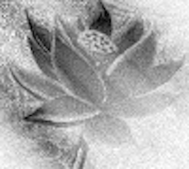
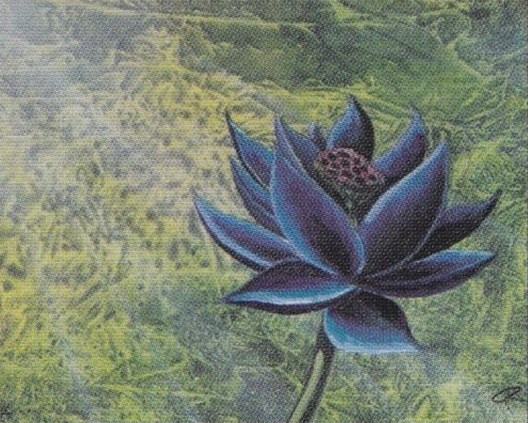
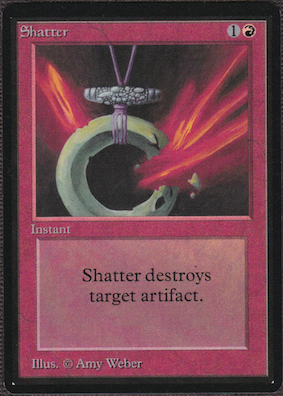
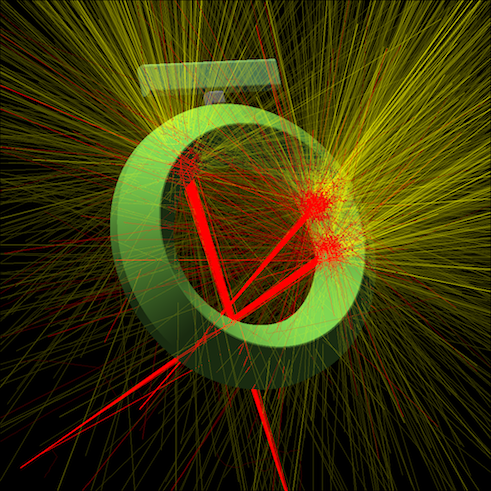

## The art of Magic the Gathering

As much as Magic the Gathering is about the games, strategies, and chasing down the rare collectables, an indispensable part of Magic's appeal has always been the the flavor and the stories weaved into the cards. Since the beginning, the cards' artwork has been a crucial part of the games appeal and has inspired the imagination of several generations of players. Drawing from the imagery of [fantasy literature](https://en.wikipedia.org/wiki/The_Lord_of_the_Rings), [role playing games](https://en.wikipedia.org/wiki/Dungeons_%26_Dragons), and [comic books][1], the cards are filled with illustrations of [wizards](http://gatherer.wizards.com/Pages/Card/Details.aspx?multiverseid=121) casting their [spells](http://gatherer.wizards.com/Pages/Card/Details.aspx?multiverseid=197), [heroes](http://gatherer.wizards.com/Pages/Card/Details.aspx?multiverseid=260) and [monsters](http://gatherer.wizards.com/Pages/Card/Details.aspx?multiverseid=117), [angels](http://gatherer.wizards.com/Pages/Card/Details.aspx?multiverseid=270), [demons](http://gatherer.wizards.com/Pages/Card/Details.aspx?multiverseid=70), [dragons](http://gatherer.wizards.com/Pages/Card/Details.aspx?multiverseid=222) and [undead](http://gatherer.wizards.com/Pages/Card/Details.aspx?multiverseid=62), [treasures](http://gatherer.wizards.com/Pages/Card/Details.aspx?multiverseid=40) and [mythical locales](http://gatherer.wizards.com/Pages/Card/Details.aspx?multiverseid=985).

In the early days of Wizards of the Coast, the company was small and had very limited resources. To acquire the artwork for the 295 cards comprising the first set, the company, with Jesper Myrfors as the art director, set out to hire a group of talented but unknown artists from the local arts college. During the first years, the artists were given a fair amount creative freedom, as evidenced by the variety of different art styles present in the early Magic sets. While this freedom may have led to variation in quality, some of the most highly appreciated and iconic pieces of Magic art were created by this early group of artists. Similarly indisputable is the variation in the artists' personal style, which makes the art in early sets both recognizable and memorable and, for many, the pinnacle of Magic: the Gathering art. Indeed, the original paintings of contemporary card arts often are sold for thousands of dollars, while the original works from the early years command easily tenfold prices. Recently, the original art for the Black Lotus by the late Christopher Rush showed up for sale on a Facebook group, with a price tag of 6.5 million dollars!

The appreciation of the Magic art is shared by many of the Old School players, something I can definitely relate to. While I have never had the opportunity to possess any of the original Magic artwork, I do enjoy the look and feel of the old cards. Apart from the cards themselves, a relatively inexpensive way to appreciate the art and give something back to the artists are [artist proofs](http://oldschool-mtg.blogspot.com/2018/07/artist-proofs.html), in particular when customized by the artists themselves. For me, this is a relatively new venture, but one that seems to approach collecting from a completely different perspective. Rather than chasing down the increasingly rare cards from 1993 - which at times seems almost vulgar due to the price volatility and the click-and-buy mentality of modern [online](ebay.com) [marketplaces](magiccardmarket.eu) - the artist proofs and alters allows one to experience new facets of the art, while still rooted on a familiar grounds.

## Geeking out

Of course, this wouldn't be a post on Quantitatively Old School, if I merely discussed my admiration of the Magic the Gathering art. So let's get a little bit technical, and turn the geekiness knobs [up to eleven](https://www.youtube.com/watch?v=uMSV4OteqBE).

Perhaps you have noticed the small logo of the blog that appears on the page banner. I am talking about this one:

That is of course the Black Lotus, the card that so far has dominated the [posts](../2018-11-23-the-lotus-and-the-wheel) [on](../2019-01-15-the-lotus-and-the-wheel-part2) [this](../2019-01-21-the-twist-of-fire) [blog](../2019-02-11-the-braintwist). The more recognizable form of the picture is (obviously!) the one painted by the great Christopher Rush:

When I was working on creating the blog at the end of last summer, I wanted to craft a logo that was recognizable for an MTG enthusiast but that would also somehow capture the techy spirit of the blog. Quite quickly I settled on using some form of the Black Lotus as the logo. I considered running it through some image processing filters but the whole idea seemed kind of bland. Then I thought of something a bit different.

For many years, I have been working on computer simulations in various fields of physics. One of the areas has been Monte Carlo simulations and their application to radiation transport physics. This is something that is done, for example, as part of treating cancer with [radiation therapy](https://en.wikipedia.org/wiki/External_beam_radiotherapy), in high energy physics and [radiation detector modeling](http://atlas-computing.web.cern.ch/atlas-computing/packages/simulation/geant4/geant4.html) and in radiation shielding calculations. So I thought, why not re-interpret the Black Lotus art through an energy-deposition map, calculated by a simplified radiation transport Monte Carlo simulation. Indeed, why not.

So, in short, I quickly wrote a [Monte Carlo code that does radiation transport in two dimensions](../attachments/2D_MC_transport.py) with completely bogus physics[^1] and quite an inefficient computational speed. But it did what I needed it to do. I took a grey-scale version of the Black Lotus art and interpreted the pixel value as a material density. Then I directed a couple of particle beams at the underlying image, [scoring](https://www.aapm.org/meetings/06ss/documents/kawrakow_MonteCarlo_color.pdf) the deposited energy for each pixel. The re-constructed the image based on the energy deposition. It was nice in the way that fiddling around with the "physics" parameters allowed me to adjust the blurring, graininess, and grey-scale gradients in the final image. All of this could have been done more easily with Python's image manipulation libraries, but that wasn't really the point.

So that's how the blog logo came to be.

One of my personal favorite peaces of Magic artwork is the [Shatter](http://gatherer.wizards.com/Pages/Card/Details.aspx?multiverseid=221), by Amy Weber. In general I really like her artwork and style (as you may have guessed), but shatter is such a classic card.

Some months ago I got the idea to re-imagine that piece of art by physics simulations. There's a really nice and easy to simulation code, the [EGSnrc](https://nrc-cnrc.github.io/EGSnrc/) that was perfect for the task. To be fair, I should mention that EGS is actually serious simulation package that is used professionally, for example, in radiation detector design and medical radiotherapy, and is considered by many as the gold-standard in that field. It calculates the transport of highly energetic photons, electrons and positrons in various materials, taking into account all the actual physics with very high accuracy. Although I am just using EGS here as a glorified ray-tracer to play around with and produce some images, it is actually a lot more than that.

With EGS, I tried to emulate the general shape of the artifact being shattered, without going into too many details in the ornaments. Keeping it simple, I still wanted to do something special, so I made the ring out of gold (that's the material you need to specify in the simulation), the mid-piece out of lead and the top-piece out of gold. Then I specified that there are three electron beams, 20 [megaelecton-volts (MeV)](https://en.wikipedia.org/wiki/Electronvolt) in energy, aimed at various positions on the object. Then I let EGS do its magic, and this is what came out - an ancient artifact bombarded by red electron beams, glowing in explosions of golden light:[^2]

## Conclusions

Not much to conclude, except that I hope you enjoyed reading this somewhat silly and different kind of blog post. If not, rest assured that there will be more quantitativeness and less qualitativeness in the upcoming posts.

### Footnotes

[^1]: Isotropic scattering in 2D with only a single energy, and absorption with zero secondary particles. Bogus, because I'm not aware of any real particles that would actually behave like this. Perhaps there is an analogue in solid state physics, seismology, or in some other field that I'm completely ignorant of.

[^2]: Yes, the colors are for visualization purposes. Everybody with more than a few skill points invested in Googling knows that [electrons are colourless](https://physicamechanica.wordpress.com/2014/01/09/what-colour-are-electrons/). Also the photons produced at those energies would be invisible to the human eye.

[1]: https://en.wikipedia.org/wiki/Conan_the_Barbarian_(comics)
