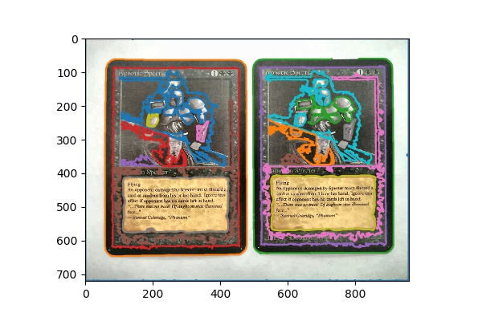
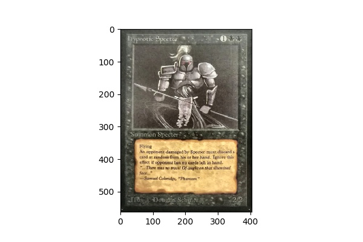
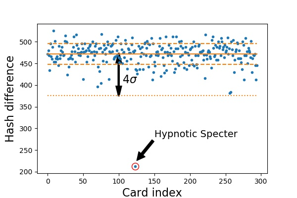

# How to detect and recognize MTG cards with Python?

\\[C_\\textrm{all} = {60 \\choose 7} = 386206920, \\]

*Original image.*

*Histogram adjusted image.*

*Contoured image.*

*Bounding quadrilateral inserted.*

*Segmented card candidate.*

*Perceptive hash differences to all Alpha cards.*

*Finally, the recognized Hypnotic Spectres.*

## Other examples

